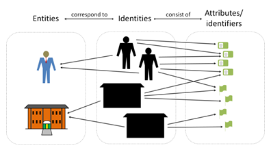
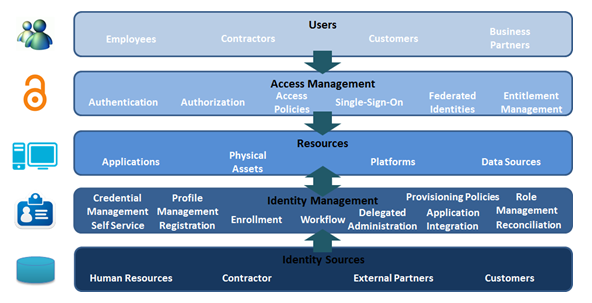
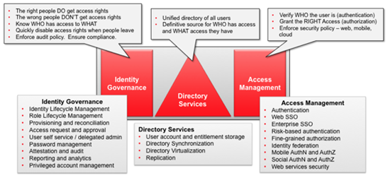
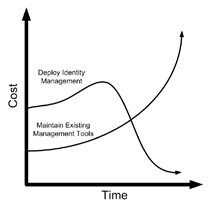

# Description 

Identity and Access Management is the ability to manage digital identities and specify how they are used to access resources. Two terms are used interchangeably in the area of identity and access management – Identity Management (IdM) and Identity and Access Management (IAM) – falling under the umbrella of IT Security.

Wikipedia definition: In [computing](http://en.wikipedia.org/wiki/Computing){:target="_blank"}, identity management (IdM) describes the management of individual [principals](http://en.wikipedia.org/wiki/Digital_identity){:target="_blank"}, their [authentication, authorization](http://en.wikipedia.org/wiki/Access_control){:target="_blank"}, and privileges within or across system and enterprise boundaries with the goal of increasing security and productivity while decreasing cost, downtime and repetitive tasks.

# Overview

  

Identity and Access Management is a core infrastructure capability and is one of the most important components of an organization’s security infrastructure. There are numerous challenges to handle, among them are

*   Compliance regulations and legislation
*   Financial well-being (cost savings) and business requirements (e.g. efficiency)
*   Security and risk

Conceptual view of identity

Information about users is controlled through identity management, authenticating the identity of the users as well as information and actions they are authorized to access/perform. Typically, descriptive information about the user, how and by whom it can be accessed and modified is also managed.

Identity and Access Management are tightly coupled by the governance and consumption of identity data, where identities correspond to entities, as well as consists of attributes or identifiers. Users access resources with credentials managed through ID sources.

Components of Identity and Access Management

**Architecture and Identity and Access Management**

The protection of enterprise information assets is critical to improve and sustain the business, which is one of the core security aspects of architecture (as well as a key enabler for segregation of duties and RACI). Identity and Access Management can be broken down into three distinct capabilities

1.  Identity Governance – the ability in making sure the right people are granted the right access rights, making sure the wrong ones are not and managing the lifecycle through organization structure, processes and enabling technology
2.  Directory Services – the ability in enforcing access rights, within specified policy, when users attempt to access a desired application, system or platform
3.  Access Management – the ability to provide ways to control storage of identity information about users and access rights

Capabilities of Identity and Access Management

**Enterprise Architecture**

Enterprise architects will be a major contributor of the general security policies and ultimately being a guideline for IAM.

**Solution Architecture**

Solution architects will likely encounter IAM in terms of how the solution is designed with regards to security aspects as well as roles and responsibilities.

**Business Architecture**

Business architects will together with information and infrastructure architects design the setup for segregation of duties and access to business applications.

**Information Architecture**

Information architects address information exposure and information security through access management in terms of usage, information storage and retrieval, transformation and transmission. They are concerned with understanding and analyzing risks which impact the overall use of information in the enterprise.

**Infrastructure Architecture**

The infrastructure architects will setup data center, network, storage and IT operational aspects of access management such as platform for Directory Services. They will develop the IAM infrastructure architecture to offset technology capital risk exposure as well as network security.

**Software Architecture**

The software architects take information security aspects into account such as use of software systems and resilience.

# Proven Practices

There are numerous business drivers that IAM needs to address, e.g. regulatory compliance, efficiency, costs savings and security. In order to create business value, the architecture needs to be designed to address these drivers and their root-cause. The typical architecture reflected in the IT environment usually involves the occurrence of multiple identity stores, redundant data synchronization and replication, multiple administration points, and users authenticating to each specific application.

It is the responsibility of the architecture team to ensure the baseline to achieve business goals towards business strategy, IT strategy and overall execution against goals. Therefore, the architect must balance the need of delivery on execution, the management of stakeholder expectations and ownership, the technology to accommodate IAM and the overall IAM setup through governance, design and sustenance. It is crucial for the architects to assess business needs to analyze and model business requirements and what this entails for IAM and its solution.

**Benefits of IAM and Architecture**

The initial cost of implementing an IAM solution is high compared to maintaining existing processes and tools. However, over a period of time the cost of maintaining existing tools will increase, while having an implemented IAM solution will reduce costs and be a platform for other cost savings initiatives.

By integrating architecture into Identity and Access Management, the organization will gain the following benefits:

Cost of deploying IAM solutions versus managing existing tools

1.  Adherence to regulatory compliance (SOX, PCI, GLBAA, HIPAA etc.) reflecting a strategic initiative and process intensive focus
2.  Efficiencies by eliminating productivity loss and excessive administration Points
3.  Cost savings in terms of e.g. password resets and centralized reporting/attestation
4.  Increased security through e.g. de-provisioning accounts (rogue users) and cost versus protected resources

# Sub-Capabilities

  

## **Identity Governance**

Defining the governance for the right people to have the right access, know who has access to what, enforce policy and ensure compliance.

*   **Iasa Certification Level** **Learning Objective** **CITA- Foundation** The Learner shall be able to outline the process for user requests and approval
*   The Learner shall be able to outline password and privileged access management
*   **CITA – Associate** The Learner shall be able to describe the contents of identity lifecycle management
*   The Learner shall be able to describe the contents of role lifecycle management
*   The Learner will have practical exposure to user requests, approval, password management, privileged access management and provisioning and reconciliation
*   **CITA – Specialist** The Learner shall have work experience with user requests, approval, password management, privileged access management and provisioning and reconciliation
*   The Learner shall be able to demonstrate reporting and analytics with regards to identity governance
*   The Learner shall have coaching experience of other junior architects in defining identity governance guidelines and principles
*   **CITA – Professional** The Learner demonstrates knowledge and experience in defining, designing CITA – Professional and implementing identity governance from best practice on an enterprise regardless of industry and performing risk assessments
*   The Learner demonstrates knowledge and experience in defining, designing and implementing identity governance for different key business factors (computer, mobile and other devices)
*   The Learner demonstrates experience of identity governance in a complex IT and business environment from privacy, digital certificate and defining policies to infrastructure and enforcing

## **Directory Services**

Understand, define and enforce access rights when users attempt to access desired applications, systems and platforms.

*   **Iasa Certification Level** **Learning Objective** **CITA- Foundation** The Learner understands the basic functions and concepts of a directory and directory services
*   **CITA – Associate** The Learner understands the concepts of user account and entitlement storage
*   The Learner understands the concepts of directory synchronization and virtualization
*   **CITA – Specialist** The Learner has experience in defining user account and entitlement storage
*   The Learner has experience in defining directory synchronization, virtualization and replication
*   The Learner has experience in setting up a directory
*   **CITA – Professional** The Learner demonstrates knowledge and experience in different methods in setting up a directory and other directory services depending on the business situation and requirements
*   The Learner demonstrates knowledge and experience with mentoring in directory services

## **Access Management**

Defining and providing ways to control storage of identity information and access rights through enforcing security policy, authentication and authorization.

*   **Iasa Certification Level** **Learning Objective** **CITA- Foundation** The Learner understands the basic concepts for user authentication and authorization
*   **CITA – Associate** The Learner is able to show understanding of different methods of managing authentication and authorization
*   The Learner is able to describe the different types security and access policies
*   **CITA – Specialist** The Learner has experience in constructing and setting up security and access policies
*   The Learner has experience in entitlement management and defining a baseline for setting up user roles
*   The Learner has experience of regulatory compliance (e.g. SOX, PCI) and can setup the technology infrastructure with regards to access management (e.g. RSA tokens, CA system)
*   **CITA – Professional** The Learner demonstrates knowledge and experience in defining security policies and setting up a solution with regards to single-sign-on, federated identities, authentication, authorization and access policies
*   The Learner demonstrates knowledge and experience with techniques in setting up a solution depending on business requirements (e.g. stock market versus banking & finance, computer versus other devise etc.)
*   The Learner demonstrates knowledge and experience with mentoring in setting up of access management initiatives

# Resources

  

## **Articles:**

[https://msdn.microsoft.com/en-us/library/aa480030.aspx](https://msdn.microsoft.com/en-us/library/aa480030.aspx){:target="_blank"}

[Identity and Access Management – Capability Model](http://www.discoveringidentity.com/2013/03/08/identity-and-access-management-capability-model/){:target="_blank"}

## **Blogs/Webcasts/News/Reference Resources:**

Spasovski, Martin. OAuth 2.0: Identity and Access Management Patterns. Packt Publishing, 2013. Print.

Osmanoglu, Ertem. Identity and Access Management: Business Performance through Connected Intelligence. Syngress, Elsevier Inc, 2014. Print.

Benantar, Messaoud. Access Control Systems: Security, Identity Management and Trust Models. Springer, 2006. Print.

Sharman, Raj. Das Smith, Sanjukta. Gupta, Manish. Digital Identity and Access Management: Technologies and Frameworks. IGI Global, 2012. Print.

Links, Corbin H. IAM Success Tips: Volume III: Identity Access Management and Architecture Design, Volume 3. CreateSpace Independent Publishing Platform, 2009. Print.

## **Training:**

The Identity Management Institute, Center for Identity Governance, provides specialized training to educate the target audience about identity risks, responsibilities, governance and policies as well as requirements and guidelines.

[Home](https://identitymanagementinstitute.org/){:target="_blank"}

Gartner organizes different symposiums to deliver strategic insights on IAM as well as the latest tactics in IAM architecture to deliver security, agility and greater business value.

http://www.gartner.com/

## **Certifications:**

There are numerous certifications within the IAM capability area to provide credibility, knowledge and confidence to provide the best possible services, guidelines and solutions. The Identity Management Institute, Center for Identity Governance, provides the most comprehensive certifications ranging from data protection to identity and technology management.

http://www.identitymanagementinstitute.org/

# Author

**Farzad Ahmed**
**IT Consultant – Gartner**

Farzad Ahmed has a firm background in IT Governance within the private and public sector with focus on Enterprise Architecture, business intelligence, business development and total quality management. His current position as Management Consultant for Gartner, focuses on ensuring that IT delivers value to the business and supports their goals, visions and objectives through effective governance, architecture, risk management and portfolio management. In other words, making the IT organization a strategic business partner. Farzad worked formerly as a Management Consultant for PwC where he defined requirements and defined solutions, which he still does.

Farzad Ahmed holds a Master of Science in Electrical Engineering from the Royal Institute of Technology in Stockholm, Sweden, and holds a certification from IASA as well as other industry organizations.