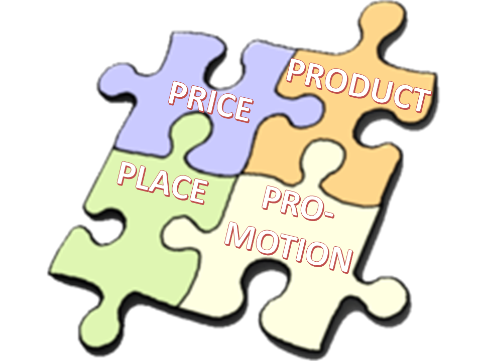
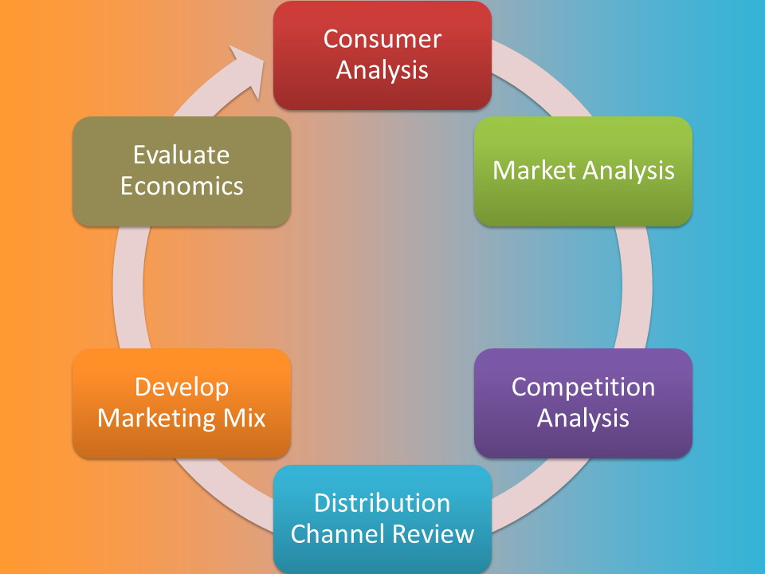
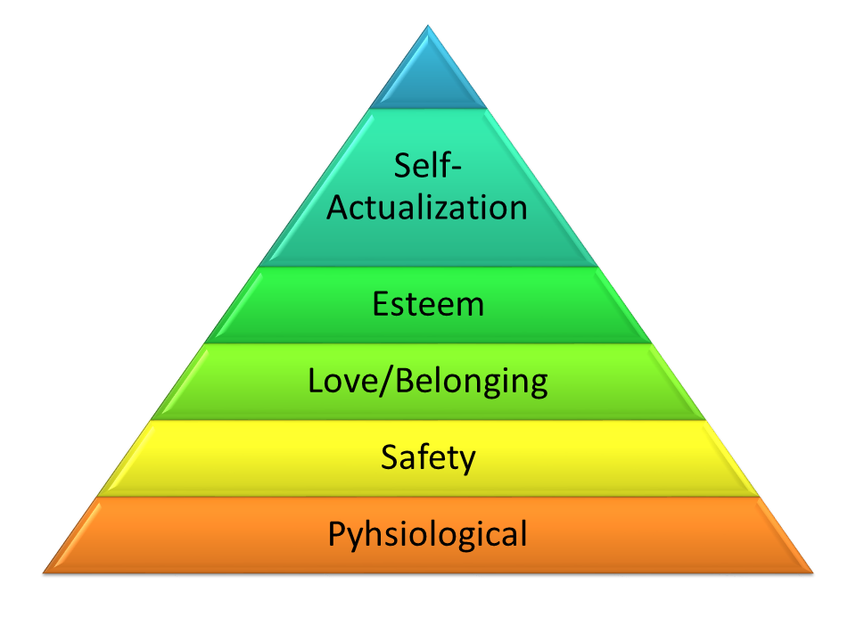
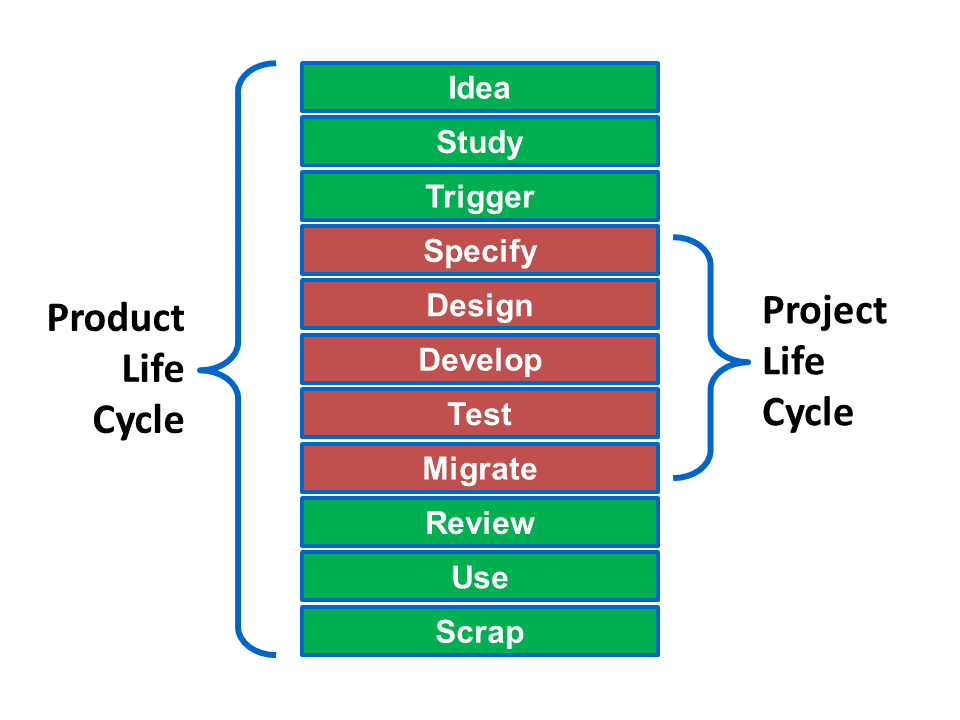

# Description

Business Fundamentals are the basic skills required to address the different aspects of running an organization. This includes understanding of broad and generic business structures and functions that apply to any organization. Prerequisites to this are People Management, Organizational Design, Human Resources, Financial Management, Micro and Macro-Economics, Global Trends, Marketing and Sales Strategy, R & D, Production, Quality Control and Fulfilment.

Fundamental comprehension of the business is key to effective architecture. Architects that understand the business will be more informed to shape solutions and position IT to deliver better value to the business.

Imagine visting a doctor for a medical check-up. What are the signs of health and wellbeing he/she would look for? Would he/she rely on only one or a few? Similarly, Business Fundamentals provides insight to the health of organisations and where vulnerabilities lie. They are early indicators of future problems and/or opportunities. By training architects to comprehend these, they will be in a better position to guide the transformation of the business to the desired future state. This will direct the selection and prioritization of projects required. Without a grasp of Business Fundamentals, it is possible the organization could be pursuing initiatives that are “barking up the wrong tree” or irrelevant. With it, projects can be better tailored to address business problems or seize opportunities because true measures of success have been identified.

# Existing Definitions

  

**Fulfilment** also known as Order Fulfilment is the end-to-end process from entertaining a customer enquiry to delivering a product and/or service to the said customer.

**Human Resources** can be defined in two ways. Firstly, as the workforce or _human capital_ or an organization.  Secondly, as the _business function_ within the organization that is tasked with managing the workforce e.g. HR Department.

**Micro & Macroeconomics:** Microeconomics studies the behaviour of individuals and small impacting organizations in making decisions on the allocation of limited resources. It applies to markets where good or services are bought and sold. Macroeconomics, on the other hand, involves the sum total of economic activity and deals with issues such as growth, inflation and unemployment.

**Organizational Design** has been [defined in Wikipedia](https://en.wikipedia.org/wiki/Organizational_architecture), as the process of reshaping organization structure and roles, or it can more effectively be defined as the alignment of structure, process, rewards, metrics and talent with the strategy of the business.

**Figure:** The Galbraith Star Model of Organizational Design

**People Management** is about making the most of human capital in an organization. This includes inspiring, motivating, guiding and disciplining members of the team individually and collectively. Dealing with different personalities can be a complex process which is why the skills from the _human dynamics_ pillar are crucial for success in this area.

**STEEPLE Factors** are the environmental factors bearing on the organization namely Social, Technological, Economic, Environmental, Political, Legal and Ethical.

# Overview

  

## Why does an architect need this skill?

Because architecture is about delivering value to the business. Valuable solutions enhance the business either by solving problems or positioning the business to capture opportunities. Architects who possess these skills are better able to recognize opportunities, engage meaningfully with business stakeholders and guide transformations to successful outcomes.

## Common tasks involved in this skill?

Business Fundamentals is a substantial topic encompassing several areas. Grasping the fundamentals of “the business” requires:

*   understanding the internal environment of how the entity is organized – the hierarchy of stakeholders, who the decision makers are and what decisions they make, their goals and motivations and the interdependencies between them
*   modelling the internal processes within the organization at an appropriate level of detail
*   conducting research on the external environment influencing the entity such as STEEPLE factors, and the industry it operates in
*   identifying primary drivers that shape the organization – the success factors of a government department (citizen satisfaction), are different from a bank (reduced risk per customer), a supermarket (profit per customer) or a charity (number of families helped out of poverty). What adds to or diminishes the value of the organization?
*   use of accounting building blocks to establish a picture of the financial landscape

## What is their ownership in this skill?

Architects are typically consumers of Business Fundamentals developed by business functions such as Finance, Strategic Planning, Marketing, Sales, Business Owners, Process Owners and external business research organizations.

## Name an example of how an architect would use this in daily activities?

1.  Identify primary drivers that shape the organization
2.  Create an organizational chart of the entity beginning with key stakeholders
3.  Identify goals and KPIs of stakeholders that closely address the primary drivers of the organization
4.  Focus on those goals and KPIs that technology is able to impact the greatest
5.  Engage stakeholders of those goals and KPIs to define a desired target state
6.  Employ a capability based planning methodology to translate business aspirations to a program/portfolio that will realize the transformation

## Describe why an architect should be involved in this skill at a corporate level

Organizational priorities are seasonal. At times it is cost-saving and at other times needing to invest to gain a competitive edge. Together with the perennial need to reduce cost, other drivers are to improve service, efficiency, availability, innovation, quality etc. An architect cannot work on the assumption that all these priorities should be treated equally as the organization exists in a dynamic playing field constantly in flux. He/she has to get a pulse on the organization and its environment.

In an ideal world, the business functions would feed this information to the architect team in well-written and clear documentation. In reality, the architects have to document much of this themselves, relying on the close rapport they have developed with key stakeholders and their ability to ask the right questions in the right way. It would be best for architects to be present during corporate brainstorming sessions and have access to corporate information so they can form a firsthand picture of the business direction as a lot of key information can be lost from secondary sources.

## Primary push back and/or challenges for architects

Challenges to achieving this come from within and outside the architect team. Business Fundamentals was not part of their formal training so there will be a learning curve involved. Business stakeholders are not used to architects speaking business – architects have traditionally been left out of such discussions. Worse still, some business stakeholders may even resent the intrusion. This may take some time to change but the momentum is building – businesses are beginning to embrace architects who deliver value. Architects need to be ready for this.

## How would a stakeholder engage an architect for assistance utilizing this skill?

Architects should be able to visualize and articulate an organisation using generic business structures and functions. They are familiar with the drivers that shape the business and the indicators of organizational health. This will require a working knowledge of:

1.  Management (general)
2.  Marketing and Sales
3.  Financial Management (both strategy and accounting)
4.  Operations
5.  Human Resources
6.  Product Management

All resources of an organization should be focused on improving these fundamental business capabilities. Each Technology Feature should contribute to a Business Value and vice versa. Without adequate knowledge of Business Fundamentals, there is a danger of delivering technology that falls short of business needs and/or unsupported business goals.

**Figure**: Bi-directional traeability between Technology and Business Value

Equipped with these insights, the architect is required to engage with the business leadership to identify the Business Fundamentals requiring improvement. A traceability is then established to the deliverables after which the architect works with the technology teams to ensure their appropriateness. An example of this is illustrated in the figure above.

The traditional model of IT delivering systems as per requirements defined by business is increasingly being replaced by pro-active architects who are able to realize valuable technology-driven strategies. Architects need to understand Business Fundamentals so as to engage meaningfully with the business teams and avoid being relegated to the role of mere order taker.

An Architect needs to be familiar with generic organization structures to understand how business entities are organized according to type of business and segment. These structures could be leveraged to accelerate the transformation or guide the design. Identifying the type of business and segment can be used to set realistic expectations for improvement by benchmarking against comparison companies in a similar category. Key drivers for the business, when taken into account early in the architecture lifecycle help ensure the sustainability of organization goals in line with market forces.

Experience has shown billions of dollars have been wasted by the high percentage (more than 50%) of failed IT projects due to business-technology misalignment. Reasons for this include miscommunication and lack of context to technology solutions. By having “business literate” architects, they effectively circumvent these hurdles to engage business in their own language. The more business savvy the architect, the more proactive role they will be able to take on during such engagements rather than depending solely on business to translate business needs to technical features.

# Proven Practices

  

*   Early engagement with business functions before projects are requested to acquaint oneself with the processes and pains of key business stakeholders
*   Able to articulate significant pain points and opportunities on a corporate level and for each business unit
*   Apply industry reference models such as value chain analysis, Porter’s Five Forces model or STEEPLE to gain insight to Business Fundamentals
*   Undergo a mini-MBA
*   Follow information sources on industry beyond technology e.g. trade publications, business journals.
*   Develop domain knowledge through knowledge sharing with business or business glossaries

# Sub-Capabilities

  

### **Management (General)**

Although there are many definitions of management, the role of management within any organization is basically to:

*   steer the organization to achieve its vision and mission
*   make team members productive and accomplish valuable goals
*   handle the impact the organization has on its environment and its responsibilities to society

Architects need a to understand the management role to better work with other managers in the organization. Organizations operate in an environment of constant change. Each industry is unique and needs to be understood in depth. Competitive scenarios, price-demand relationship, product lifecycles etc are characteristics that vary greatly from one industry to another. Managers have to take cognizance of the rapidly evolving role and nature of information, changing demographics, new ways of doing business, fresh paradigms etc.

In addition to these external factors, the internal hierarchy of the organization informs the architect who the influential stakeholders are and what shapes priorities and KPIs.

Aside from understanding how the organization is managed, architects need management skills too. Some of these are:

*   Decision Making
*   Team Building
*   Communicating Effectively
*   Controlling the Business
*   Budgeting
*   Utilizing Information
*   Fostering Innovation and Entrepreneurship

These place heavy demands on the individual which is why it is crucial that he/she master the arts of managing oneself and his/her boss. Personal Renewal is key to an effective manager as burnout can very subtly degrade performance. The manager has to understand the continuing education required and be disciplined in passionately pursuing this.

*   **Iasa Certification Level** **Learning Objective** **CITA- Foundation** Learner will be able tolocate and describe the Vision and Mission Statement of the organization
*   locate and describe the overall goals of the organization and the goals of the individual business units
*   locate and describe the internal structure of the organization
*   list the important management skills
*   **CITA – Associate** Learner will be able toclassify the organization by industry type
*   infer the motivations of stakeholders by their respective locations in the organizational hierarchy
*   illustrate any organization using the templates already learnt
*   **CITA – Specialist** Learner will be able todeconstruct the vision and mission statement into goals
*   organize corporate goals, business unit goals and team goals into traceable relationships
*   outline a checklist of steps to take in evaluating the business capabilities of an organization
*   report on the pain points facing the organization based on an analysis of business fundamentals
*   **CITA – Professional** Learner will be able todevise target organizational structures or new capabilities to leapfrog organizational performance
*   devise a transformation plan that will address pain points facing the organization
*   advertise the value of architects engaging in business fundamentals and/or generate a media product for this purpose

### **Marketing and Sales**

**Marketing** – It is a fallacy to think the “best” product will sell itself. For one, the definition of “best” or “good” is highly subjective issue in most cases. Secondly, product quality and features are only part of the factors contributing to increased demand.

Experts of marketing have long held that success of a product or service is contingent on an optimal _marketing mix_. 

Within this mix are the four interdependent P’s of **P**rice, **P**roduct, **P**lace and **P**romotion. Arriving at this mix is usually after having traversed detailed analysis of the consumer, market, competition, distribution channels and economics. 

This is an iterative process made more complex by the inter-dependent nature of the 4P’s.

**Sales** – Although the disciplines of marketing and sales are closely related, they are distinct functions. The Sales Process are those activities from lead generation to receiving the customer order. The dynamics of the process vary greatly from one organization to another and architects need to appreciate and understand the challenges faced by their colleagues in sales.

Lead generation is akin to mining. A sales lead can originate from a variety of sources and the challenge would be to find the few of quality among the many poor prospects. Architects can support by applying technology to enhance this process. Examples of this include mobility, analytics and social media.

Knowledge is crucial to the success of salespeople – knowledge about the economy, industry, organization and product. The same information needs to be presented in different ways at different stages of the sales process. Some of these steps will require access to classified information. How can customers be given access to such information without compromising corporate policies on information security?

Customer Relationship Management is more than just record-keeping – it should inject excitement into the entire salesperson-customer interaction. Someone once said, “Customers don’t buy a product or a service. They buy a good feeling.” Architects need to brainstorm together with salespeople how to enhance the customer experience before the purchase decision is made.

Monitoring of sales performance is a key activity among salespeople and their superiors. The use of charts, statistics, drilldowns and rollups can greatly enhance this task. Salespeople are often motivated by sales targets such as:

*   volume of sales
*   profit margins
*   number of customers sold to
*   percentage of sales derived from new products
*   reduction in number of complaints due to overselling

Closing the sale is another area where architects can make a difference. How can this be simplified? Some companies have transformed this from a mundane formality to an elegant art form. Salespeople have a narrow window of opportunity between the prospect saying “Yes” and changing his/her mind. This should not be bogged down with excessive forms and data collection to increase the conversion rate.

Sales is not confined to direct selling(selling in person). Unattended sales channels such as website, kiosk or vending machine also require architect skills to enhance the user experience, simplify processes, protect privacy and remove wastages.

*   **Iasa Certification Level** **Learning Objective** **CITA- Foundation** Learner will be able todescribe the 4P’s of the Marketing Mix
*   list the steps in the Marketing Strategy process
*   list the steps in the Sales process
*   **CITA – Associate** Learner will be able toillustrate the concept of the Marketing Mix for a given product/service
*   brainstorm how technology can enhance the Marketing Strategy and Marketing Mix
*   compare and contrast differences between sales and marketing
*   **CITA – Specialist** Learner will be able todeconstruct a given scenario and organize the relevant pieces of information for consumption by the appropriate step(s) in the Marketing Strategy Process.
*   compare the Marketing Mixes of two competing products and give an opinion on the strategy employed in each
*   analyze a given sales process and evaluate where technology can add value
*   **CITA – Professional** Learner will be able toconstruct a Technology Strategy to support a Marketing Strategy
*   construct a Technology Strategy to support a Sales Strategy

### **Financial Management**

Financial Management is concerned with the following areas:

*   Business Investment – selecting assets the firm should own or projects the business should invest in
*   Financing – sourcing for funds to pay for those investments
*   Business Structure – whether proprietorship, partnership or corporation
*   Accounting – communicating financial information about a business entity to stakeholders using financial statements

**Business Investment**

There are always more options than funds allow so a financial manager’s team will evaluate investments, prioritize them and recommend a portfolio of investments. This activity is known as _capital budgeting_.

Architects sometimes wonder why technology proposals are shot down even though they return a profit. They need to understand some investors are not as passionate about technology as they are and evaluate projects purely on financial merit. Architects should be familiar with valuation techniques such as calculating _Nett Present Value_s and _Discounted Cash Flow_s.

Risk is inherent in every business activity and is the flipside to the expected benefits. Apart from mitigating actions, architects must be aware of the impact risks could have on the business and technology strategies. Risks can originate from _systematic_, _unsystematic_/_unique_ and market forces.

**Financing**

Funding for investments is usually derived from bonds, equity, derivatives and loans from creditors. The mix of such sources of funds is known as the _capital structure_ of the business. Architects would do well to take cognizance of such instruments and of their timings. For example, an upcoming bond maturation could temporarily impact the availability of funds for projects.

**Business Structure**

Businesses are structured differently and the architect needs to acquaint himself/herself with the differences between proprietorships, partnerships and corporations.

Architects who understand the different reasons behind Mergers and Acquisitions (business diversification, economies of scale, intellectual property, asset base expansion etc) will be in a better position to enhance the outcome of the M&A exercise.

**Accounting**

Accounting helps us to quantify how much an organization owns, how well it is performing and to analyse sources of income and cost down to very low levels of granularity.

An overview of accounting will take the architect through the following concepts:

*   accounting concepts such as the entity, cash and accrual accounting, objectivity, conservatism, going concern, consistency and materiality
*   financial statements which are the balance sheet, the profit and loss statement as well as the statement of cashflows
*   managerial accounting which is used to diagnose and control performance using variances
*   cost accounting which includes activity based costing
*   **Iasa Certification Level** **Learning Objective** **CITA- Foundation** Learner will be able toExplain what Financial Management is and why every organization requires it
*   Explain what is Capital Budgeting, Capital Structure, Nett Present Value and Discounted Cash Flow
*   Recognize a proprietorship, partnership or corporation when presented
*   Describe and recognize the three financial statements
*   **CITA – Associate** Learner will be able toCalculate the DCF of a hypothetical investment using the NPV
*   Carry out capital budgeting using an investment prioritization method
*   Construct fresh financial statements using those of the previous year and a string of transactions
*   **CITA – Specialist** Learner will be able toEvaluate the financial merits of at least two competing investments
*   Evaluate risk to business and technology strategies for a given scenario
*   Analyse financial performance using Du Pont chart, price and volume variances
*   **CITA – Professional** Learner will be able toSynthesize technology strategies to enhance M & A outcomes given at least two different M & A scenarios
*   Devise a checklist for reporting the financial management status of an organization
*   Construct an approach to derive accurate costing using activity based costing

  

### **Operations**

Operations is the raison détre (the reason or justification for existence) of a business. It is concerned with the **manufacture of products** and the **delivery of services** to customers. It is a complex combination of activities that can greatly benefit from the contribution of skilled IT architects. There are reports of spectacular successes with equally great failures. While the intent of this section is to develop architects and not engineers, IT architects would do well to understand this area well.

**Manufacture of Products**

Manufacturing involves the following areas:

*   Scaling – how much can be produced/delivered?
*   Scheduling – timing and coordinating the required activities
*   Stock – optimizing the amount of inventory
*   Standardization – consistency within acceptable tolerances
*   Steering – does the output meet expectations?

Scaling involves improving processes, troubleshooting bottlenecks and using techniques such as linear programming to find “sweet spots”.

Scheduling plans tasks so they can be efficiently planned, coordinated and performed. Architects who understand terms such as Critical Path Method, PERT, slack time and Queueing Theory would be in a better position to help schedulers be more effective.

Inventory decisions are some of the most difficult because of the diverse stakeholder interests in play. Because long delivery times increase the likelihood of losing a sale to a competitor and decrease customer satisfaction, salespeople would love to have more product in stock. Finance sees inventory as tying up cashflow and a lost opportunity for funds that could be better utilized elsewhere. Inventory buildups are sometimes the consequence of longer production runs as they are deemed more efficient. The optimization of these seemingly opposing tensions is known as Supply Chain Management. Inventory Flow Diagrams show the value add of the operation process as raw materials are converted to semi-finished goods and then to finished ones.

Of course, there are good reasons for holding inventory such as

*   minimize production delays
*   comply with supplier minimum order quantities
*   buffer for unexpected market demand
*   as a hedge against expected price volatility

The sweet spot of balancing inventory ordering costs with carrying costs is known as Economic Order Quantity. Architects need to understand how this is derived, how Materials Resource Planning controls inventories and how MRP fits within ERP (Enterprise Resource Planning).

Standardization deals with benchmarking and control to meet customer expectations. Methods such as Statistical Process Control help us to distinguish acceptable output variations from unacceptable ones.

In an era of ever-shortening cycle times, IT architects can help accelerate the conversion of a new idea to an improved product or a new one would greatly add value to the organization.

Apart from the supply chain, another critical process that can benefit from better integration, streamlining of data is Customer Relationship Management addressing the areas of product development, sales, providing a superior customer experience, retaining and winning back customers as well as targeting and marketing.

**Delivery of Services**

The global economy is growing increasingly service-based which means architects will have to familiarise themselves with the components critical to service delivery which include:

*   Capacity Management – having the right number of right people with the right skills and tools
*   Service Continuity and Availability Management – managing the uptime of the service through peaks and troughs of demand
*   Change Management – migrating the organization, customers and suppliers from a baseline to a target architecture
*   Resolution Management – both problem and incident management
*   Supplier Management – controlling supplier dependencies through the use of contracts and SLAs
*   Customer Relationship Management – optimising the customer interface to ensure excellent customer service and satisfaction
*   **Iasa Certification Level** **Learning Objective** **CITA- Foundation** Learner will be able to:Explain the 5 S’s of Operations
*   Explain the 6 M’s of Capacity
*   Name the reasons for holding inventory
*   Recall the critical components of service delivery
*   **CITA – Associate** Learner will be able to:Use Linear Programming to locate operational sweet spots
*   Apply the Critical Path Method to locate bottlenecks and “crash” a project
*   Apply Queueing Theory to solve a real world problem
*   Simulate the workings of service delivery components in a hypothetical organization
*   **CITA – Specialist** Learner will be able to:Analyze given statistical process data to evaluate its acceptability within tolerances
*   Prove to a hypothetical set of stakeholders how technology can improve capacity planning in a given organization
*   Classify the different concerns of each stakeholder for a given inventory management scenario
*   Recommend how the components of service delivery would collaborate in a given list of scenarios
*   **CITA – Professional** Learner will be able to:Write a justification to the different stakeholders of Inventory Management explaining the rationale of your Inventory Management Technology Strategy and its implications or tradeoffs they will need to accept
*   Hypothesize how technology can be applied to facilitate JIT manufacturing
*   Imagine how consumer demand and preferences can be tracked and integrated into corporate information systems for a given organization
*   Develop a generic service delivery architecture for a given organization covering the four specializations

### **Human Resources**

While _Human Resources_ refers to the collective group of individuals within an organization, _Human Capital_ is more narrowly focused on the useful knowledge these individuals have that can be used to enhance the value chain of the organization. _Human Resource Management_ is tasked with maximizing employee performance to meet business goals.

The primary activities of a Human Resource function include:

*   Recruitment
*   Training and Development
*   Remuneration and Rewards
*   Performance Appraisal
*   Industrial Relations

Recruitment is not just hiring the right people – the process has to be stringent enough to prevent the wrong people from joining the team. This can be a challenge because a well written resume could have been doctored or authored by someone else other than the candidate. A poorly written one just shows the applicant doesn’t have impressive writing skills. Recruiters are sometimes faced with piles of applications. It can be difficult to maintain objectivity throughout the process as mental energy begins to wane. Online recruitment agencies have developed sophisticated tools to reduce the tedium of the process so resumes can be filtered, sorted, reviewed, approved and stored within a single environment. Architects can contribute to this process by creating algorithms to simplify the selection process, enhance the workflow through seamless and easy-to-use systems and tighter integration with third-party systems such as employee database and email notification systems.

Training and Development is a crucial part of the Human Resource Management function because it continually improves the human capital with new skills and knowledge for improved productivity and performance. Training is best conducted after a superior has conducted a _training needs analysis_ of his team. Modern methods of training recognize some people learn better by doing, some by hearing and some by watching. Technology can inject variety and excitement into the training process through the use of multimedia and gamification. Online delivery channels allow self-paced learning which is an viable option when learners’ busy schedules interrupt classroom sessions.

Remuneration and Rewards is about motivating employees to perform and retaining good talent. Giving them more money doesn’t always work as Abraham Maslow postulated in his hierarchy of human needs. One way that Human resource managers can provide the right reward to their employees is to use profiling systems where each employee is evaluated on a series of criteria to identify the right match.

Performance Appraisals are a powerful means of developing human capital as they reinforce positive behaviour and discourage the negative. Three-sixty appraisals can be helpful as they examine employee performance from the different perspectives of superiors, peers and subordinates. Technology can enhance the appraisal by shielding the identity of the appraiser, online appraisals, review loops, video conferencing etc

The management of human capital in an organization is subject to scrutiny by external parties namely the government and labour unions. Regulators monitor for conformance to labour laws and often require submission of reports to demonstrate this. Automation of this process would save precious manhours. Technology can develop early warning systems help prevent accidents in the factory, reducing government fines for such incidents and elevate the status of the organization as a caring employer.

*   **Iasa Certification Level** **Learning Objective** **CITA- Foundation** Learner will be able to:Recall the parts of the HR lifecycle
*   Provide examples of different ways employees can be trained
*   Explain the meaning of industrial relations
*   Outline the objectives of a Performance Appraisal
*   **CITA – Associate** Learner will be able to:Relate how the hierarchy of needs impacts the selection of rewards to employees
*   Identify the challenges an organization faces in the various stages of the Recruitment
*   Identify the needs of effective Training and Development programmes
*   **CITA – Specialist** Learner will be able to:Discover how technology can enhance Training and Development
*   Discover how technology can enhance the Recruitment process
*   Evaluate some common employee performance problems with possible solutions
*   **CITA – Professional** Learner will be able to:Formulate an experimental approach to Training and Development
*   Hypothesize how technology could be used to enhance the image of an organization as an admired employer
*   Model a way to hire the most qualified candidate

### **Product Management**

This is the function of the organization that is tasked with developing differentiated new products as it is widely acknowledged a product delivering unique benefits is the key driver of success and profitability.

Product Management consists of the development aspect (inward focused activities) and the marketing aspect (outward focused).

Activities included under the development aspect are:

*   Identifying new product candidates
*   Defining product requirements
*   Determine business case and feasibility
*   Scoping and defining new products at high level
*   Evangelizing new products within the company
*   Building product roadmaps
*   Working to a critical path and ensuring all products are produced on schedule
*   Ensuring products are within optimal price margins and up to specifications
*   Managing the Product Lifecycle
*   Product differentiation
*   Product planning

while those under the marketing aspect are:

*   Product positioning and outbound messaging
*   Promoting the product externally with the media, customers and partners
*   Conduct customer feedback and enabling (pre-production or beta software)
*   Bringing new products to the market
*   Monitoring the competition
*   Promotional material management

The Product Lifecycle is the series of activities from the birth of the product idea until the product has reached the end of its useful life.

The process begins when someone gets an **idea** for a new product. Not all ideas are accepted – each is **studied** to assess its merit. Those deemed promising are marked for further development by **triggering** a project that will produce the product. At the beginning of this project, the **specifications** will be determined which become targets the **design** needs to comply with. The product is then **developed** and **tested** before production goes live by **migrating** the production line to the manufacture of this new product.

**Reviews** are conducted to optimise and improve the product further throughout its **use**\-life. When the product is deemed to have reached the end of its relevance to the market, it is **scrapped.**

*   **Iasa Certification Level** **Learning Objective** **CITA- Foundation** The Learner will be able to:Differentiate between development and marketing activities from a given list
*   Summarise what is performed during each step of the Product Lifecycle
*   Explain the importance of product differentiation
*   **CITA – Associate** The Learner will be able to:Simulate what activities and outcomes might have taken place in the Product Lifecycle of a product they are familiar with
*   Demonstrate how technology could enhance Product Development
*   Illustrate Product Positioning using a few products in the same category but different price range
*   **CITA – Specialist** The Learner will be able to:Debate on the strengths of two competing products eg IOS vs Android devices and dissect the underlying reasons why these have been developed differently
*   Analyse who are the stakeholders that Product Management has to collaborate with within the organization
*   Evaluate how pricing affects the attractiveness of different products
*   **CITA – Professional** The Learner will be able to:Synthesize a Business Architecture (people and processes) for Product Management
*   Synthesize a Data Architecture (information structure and flows) for Product Management
*   Synthesize an Application Architecture (Information System Services) for Product Management

# Related Capabilities

  

*   Business Technology Strategy
*   Strategy Development and Rationalization
*   Industry Analysis
*   IT Environment
*   Change Management
*   Knowledge Management
*   Decision Support
*   Business Architecture
*   Business Management
*   Business Strategy
*   Financial Methods
*   Technology Strategy and Innovation
*   Leading Organizational Change
*   Information Architecture
*   Business Intelligence and Data Warehousing
*   Engagement Model
*   Processes and Lifecycles

# Resources

  

### **Articles:** 

### **Books:** 

*   The Ten-Day MBA 4th Edition by Steven A. Silbiger ISBN978-0-08-219957-7
*   Management by Peter Drucker ISBN 978-0-06-125266-2
*   Finance Basics Secrets by Stuart Warner ISBN 978-0-00-732809-3
*   Selling to Win by Richard Denny ISBN 978-0-74-943328-4

### **Blogs/Webcasts/News/Reference Resources:** 

*   IASA ITABoK

### **Certifications/Training:** 

*   IASA Business Technology Strategy

# Author

  

### **Lyndon D’Oliveiro**

### **Enterprise Architect Mentor & Secretary of IASA Malaysia Chapter**

Lyndon is a Business-Tech Hybrid. His career has seen him perform in Sales, Marketing and Technical Support, operate a datacentre, lead a team of developers, project managers and mentor Enterprise/IT Architects.

Often curious, his experience of working in Business and Technology functions has given him a deep insight to many of the challenges faced by organisations today. He is passionate about bridging the Business-Technology divide and has been training Enterprise Architects since 2012.

Among his achievements are:

*   Trained close to 1000 IT professionals in Malaysia, Singapore, Indonesia, Hong Kong and New Zealand through ATD Learning Architecture Courses since 2012
*   Certified trainer for TOGAF 9.1, COBIT 5, IASA CITA-A
*   Co-inventor of a high-security feature used in millions of electronic passports (US Patent Application #20100245034)
*   Team leader that delivered the world’s first passport replacement kiosk in 2004
*   Team lead for ISO 20000 certification in 2008 & 2009
*   Project Manager of Passport Malaysia 2004 to 2008 (PRINCE2)
*   Developed an Enterprise Architecture for Product Management capability in 2010
*   Top performing salesman 1992 to 1996
*   Consultant to governments in Malaysia, Thailand, Vietnam, Egypt and the Gambia on electronic Passport/ID card
*   Member of EA Community of Practice established by MAMPU, Prime Minister’s Department of Malaysia in 2013