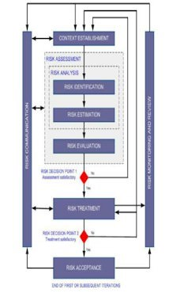
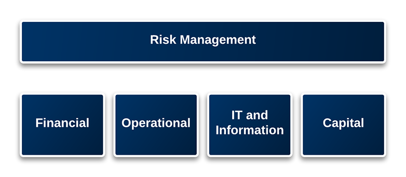

# Description

Risk Management for an architect is an ongoing effort to offset occurrences which would jeopardize or negatively impact the value generated from a project, program or set of activities. Risk management includes any and all activities which identify and help to lessen these occurrences. Because there is an element of risk in any action taken by a company or it's employees it is most often handled through an internal group responsible for the management of all corporate risk (enterprise risk management) even for smaller companies, not just those which impact the architect. However, due to the unique context, scope and activities of architecture, at the enterprise, program and project levels, architects have a significant impact on risk management activities.

Wikipedia Definition: Risk management is the identification, assessment, and prioritization of [risks](http://en.wikipedia.org/wiki/Risk){:target="_blank"} (defined in [ISO 31000](http://en.wikipedia.org/wiki/ISO_31000){:target="_blank"} as the effect of uncertainty on objectives) followed by coordinated and economical application of resources to minimize, monitor, and control the probability and/or impact of unfortunate events[[1]](http://en.wikipedia.org/wiki/Risk_management#cite_note-Risk_Management_pg._46-1){:target="_blank"} or to maximize the realization of opportunities.

# Overview

Enterprise risk management (ERM) allows an organization to effectively deal with risks that threaten business opportunities and development. There are numerous types of risk that must be accounted for:

-   Financial and Market Risk -- Risks associated with loss of capital, market exposure and the use of financial instruments
-   Operational Risk -- Risks associated with operating a company such as supply chain or manufacturing risks
-   Compliance Risk -- Risks associated with lack of compliance to regulations
-   IT and Information Security Risk -- Risk associated with information technology and the use of information

Additional types of risk exist in companies. Identifying applicable risk types is one of the first tasks of an enterprise risk management function.

# Proven Practices

Architecture addresses business value, business strategy, IT strategy and overall execution against goals. It is the responsibility of the architecture team to ensure that appropriate risk identification, analysis and mitigation opportunities are delivered to the appropriate stakeholders and to address those risks for which architects are uniquely qualified. As in other capability areas the architect must balance the need of delivery on execution, the management of stakeholder expectations and ownership, and the communication of risk details. The architect will deal with many types of risk as well as many delivery areas of impact. These areas of impact can be characterized as strategic, tactical and operational risks which describes the scope and level of impact.

**3.1 Benefits of Risk Management and Architecture**

By integrating architecture into risk management planning and executions the organization will gain the following benefits:

1.  Increase in risk identification and avoidance due to better visibility of risks in both business and technical settings
2.  Lowered risk occurrence through more effective decision making
3.  More objective handling of risk mitigation through strategy and execution through increased understanding of risk impacts

# Sub-Capabilities

## 4.1 Risk Management Organization

The risk management organization regardless of formality, is the area of the business associated with risk strategy, risk identification, risk analysis and risk mitigation as well as ongoing monitoring and control of risks. The goal of risk management is to reduce the probability and impact of risk to the organization or initiative.

Architects will work with the risk management organization will complete the following elements to be used across the enterprise:

1.  Risk type and classification schemes to be used in strategic planning and execution.
2.  Risk analysis templates for use in the enterprise architecture engagement model.
3.  Risk management plan templates for use in PMO activities.

Enterprise architecture input and decision making for EA owned risks (technical and business)

| **Iasa Certification Level** | **Learning Objective** |
| :-: | :-: |
| **CITA- Foundation** |

-   Awareness of risk management operational structures
-   Define a risk management organization

 |
| **CITA -- Associate** |

-   Support and participate in risk management organization activities.
-   Awareness and collaboration with risk operations staff.
-   Awareness and application of risk operation requirements.

 |
| **CITA -- Specialist** |

-   Leadership in project risk management and value activities.
-   Implement all risk management operations policies.
-   Establish project level risk tolerance and requirements.

 |
| **CITA -- Professional** |

-   Enterprise level risk management integration.
-   Aid in establishment of enterprise risk management.
-   Development of risk personnel and policies related to architecture.

 |

## 4.2 Risk Identification

Risk identification involves the skills necessary to identify risks and their associated impact and probability of occurrence. There are numerous tools useful in this skill. SWOT analysis, stakeholder interviews, bottom up analysis and top down analysis are very common. As the architect gains experience they will be able to lead risk identification activities within their current focus areas.

| **Iasa Certification Level** | **Learning Objective** |
| :-: | :-: |
| **CITA- Foundation** |

-   Understand risk classification scheme.
-   Awareness of risk identification tools and techniques.

 |
| **CITA -- Associate** |

-   Participate in risk identification activities.
-   Identify areas of risk exposure in an organization.
-   Interact with stakeholders to elicit risk areas.

 |
| **CITA -- Specialist** |

-   Lead risk identification activities at the project level.
-   Catalog and characterize risks associated with project impacts.
-   Communicate and lead stakeholder analysis of risks.

 |
| **CITA -- Professional** |

-   Lead enterprise level risk management integration with architect engagement model.
-   Identify major risks in future business and technical strategy.
-   Lead executive level stakeholder identification of risk.

 |

## 4.4 Risk Mitigation

Risk mitigation is the process of addressing identified risks. The risk organization should have managerial support for it's risk mitigation threshold and policy. Risk mitigation strategies break down into four primary types:

1.  Risk Acceptance -- This translates to the agreement to accept a risk while continuing forward with the business or technical strategy.
2.  Risk Avoidance -- This involves changing a business or technical strategy to avoid or eliminate the risk completely. This sometimes creates additional risks that have lower impact or probability of occurrence.
3.  Risk Mitigation -- This translates to the reduction of the probability or impact of a risk such as adding new servers to mitigate performance risks upon deployment or selecting a backup parts supplier in case the primary supplier is unable to meet demand.
4.  Risk Transfer -- This involves transferring all or a part of a risk to a third party such as an insurance provider.

| **Iasa Certification Level** | **Learning Objective** |
| :-: | :-: |
| **CITA- Foundation** |

-   Understand risk mitigation types
-   Define risk mitigation techniques in multiple scenarios

 |
| **CITA -- Associate** |

-   Apply risk mitigation techniques to project level scope.
-   Identify areas for risk mitigation and the most effective approach.

 |
| **CITA -- Specialist** |

-   Take responsibility for risk mitigation techniques on project scoped activities.
-   Lead project teams and stakeholder to appropriately address risks.

 |
| **CITA -- Professional** |

-   Lead enterprise level risk mitigation activities within architecture initiatives.
-   Address critical enterprise class risks within technical and business activities.

 |

## Risks Assessment

Risk assessment is the most critical area of architecture overlap and execution in average organizations. As the architects have critical analysis tools to understand the components of risk and the associated impacts.

Risk Categorization

| Probability/Impact | 1 | 2 | 3 | 4 | 5 |
| 80-100% | Low | Medium | High | Extreme | Extreme |
| 60-80% | Minimal | Low | Medium | High | Extreme |
| 40-60% | Minimal | Low | Medium | High | High |
| 20-40% | Minimal | Low | Low | Medium | High |
| 0-20% | Minimal | Minimal | Low | Medium | High |

**4.3.1 Risk Formula**

Risk = Probability of risk occurrence x Impact of exposure or negative consequence

| **Iasa Certification Level** | **Learning Objective** |
| :-: | :-: |
| **CITA- Foundation** |

-   Define and differentiate between primary concepts in risk assessment such as business impact analysis, risk profiles, risk probability
-   Understand critical risk analysis tools and techniques

 |
| **CITA -- Associate** |

-   Support risk analysis methods
-   Identify risk impacts for project level impacts

 |
| **CITA -- Specialist** |

-   Analyze total risk exposure
-   Lead stakeholder communication in risk analysis

 |
| **CITA -- Professional** |

-   Develop architectural analysis tools within EA strategies for risk analysis
-   Estimate risk exposure for major business and technical strategies
-   Lead executive risk analysis sessions to address risk types and impacts.

 |

# Related Capabilities

-   related capabilities...

# Resources

5 Resources

**5.1 Templates:**

[Vendor Risk Assessment Guide](http://cdn2.hubspot.net/hub/37288/file-1849675513-pdf/docs/SettingTheStandard.Evantix_Template_Final.pdf?t=1422557772630){:target="_blank"}

**5.2 Articles:**

-  [http://en.wikipedia.org/wiki/Risk_management](http://en.wikipedia.org/wiki/Risk_management){:target="_blank"}
-  [https://dianechristina.wordpress.com/2010/02/05/dissecting-the-anatomy-of-iso-31000/](https://dianechristina.wordpress.com/2010/02/05/dissecting-the-anatomy-of-iso-31000/){:target="_blank"}

**5.3 Books**

-   Enterprise Risk Management

Works Cited

"Coso." *Home*. Web. 02 Feb. 2015. [http://www.coso.org/](http://www.coso.org/){:target="_blank"}.

Fairbanks, George. *Just Enough Software Architecture: A Risk-driven Approach*. Boulder, CO: Marshall & Brainerd, 2010. Print.

Grebmer, Andreas Von. *Information and IT Risk Management in a Nutshell: A Pragmatic Approach to Information Security*. Norderstedt: on Demand, 2007. Print.

Olson, David L. *Enterprise Risk Management*. S.l.: World Scientific, 2015. Print.

# Author

## Paul Preiss CEO
*Iasa Global*

During his tenure at Iasa, Paul has taken it from a single user group with 50 members to an influential global organization with over 80,000 in its professional network. He orchestrated the development of dozens of chapters and leaders in over 50 countries. He brought Iasa to the forefront of the architect profession and employs staff around the world in the growth of the organization. He led the development of the Iasa Board of Education, the Certified IT Architect Professional (CITA-P), the Iasa skills curriculum and is actively working with universities, governments and other professional bodies to stabilize the profession of IT architecture.

Prior to Iasa, Paul was the Director of Engineering and Chief Architect of a large digital asset management company. His global experience stems from the time he spent in Japan as the Chief Architect in Dell Pan Asia. He has worked for some of the largest companies and on many of the largest projects ever delivered including projects for DHL, Sears, IBM, and others. Paul has a bachelor's degree in Japanese from the University of Texas at Austin.
