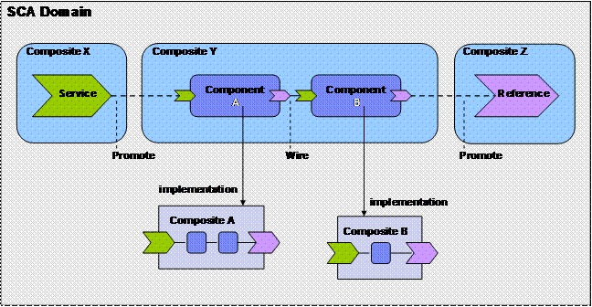
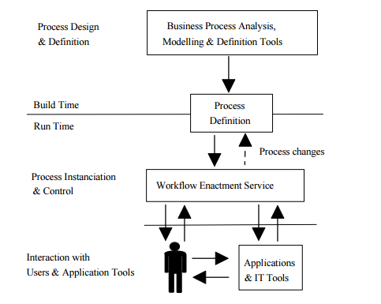
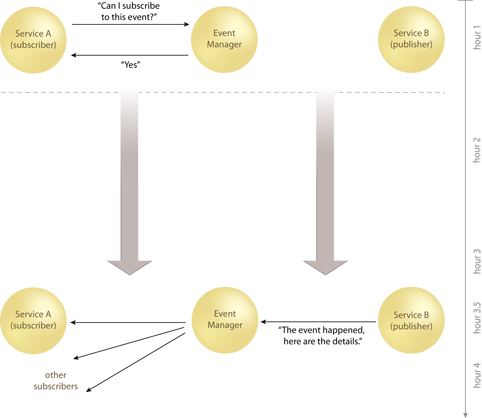

Description
===========

All business and IT architecture have three critical components mainly Services, Workflow and Messaging, which comes under Software Architecture. But, not necessarily all business architectures cover all the aspects of Services, Workflow and Messaging, it actually depends upon the business model and various business drivers you are using to achieve the goal.

Architects are expected to be able to recognize all the major components of the process, in defining the Service Component, Designing the Workflow and implementing the various Messaging protocols. It is important that framework must be able to define people, process, technology, and information channels based on the problem in-hand. We can define the Services and the people required to manage the same.

Overview
========

While developing an organization's service model, an architect must define the top level business functions first. Once the business functions are defined, they are further sectioned into services that represent the processes and activities needed to manage the assets of an organization in their various states.

One example is the separation of the business function "Manage Orders" into services such as "Create Order", "Fulfill Order", "Ship Order", "Invoice Order" and "Cancel/Update Order."

Defining Service description/specification

In order to define the service description or specification.  It should consists of:

1.  A plain and detailed narrative definition supported by a low-level process model. It must be clearly narrated with the information about the service that facilitates service mediation and consistency checking of an enterprise architecture.
2.  A set of performance indicators that address measures and performance parameters, such as availability (when should members of the organization be able to perform the functions), duration (how long should it take to perform the function), rate (how often will the function be performed over a period of time), etc.
3.  A link to the organization's information model showing what information the service owns (creates, reads, updates, and deletes) and which information it references that is owned by other services.

State of Services

Services can be stateless and stateful. Stateless services can be services like data aggregation services. Stateful services are used for executing business logic.

The Service Architecture should be design keeping in mind the below building blocks:

-   Service Contract
-   Message Processing Logic (mostly used in web-service related architectures)
-   Service Component (core service logic)

### **Service Component Architecture (SCA)**

To Understand why SCA? It is first important to know what SCA? Service Component Architecture (SCA) is a set of specifications which describe a model for building applications and systems using a Service-Oriented Architecture (SOA). SCA extends and complements prior approaches to implementing services, and SCA builds on open standards such as Web services.

SCA is based on the idea that business function is provided as a series of services, which are assembled together to create solutions that serve a particular business need. These composite applications can contain both new services created specifically for the application and also business function from existing systems and applications, reused as part of the composition. SCA provides a model both for the composition of services and for the creation of service components, including the reuse of existing application function within SCA compositions.

### **Designing Workflow**

Workflow? Workflow is fundamentally about the organization of work. It is a set of activities that coordinate people and / or software. Communicating this organization to humans and automated processes is the value-add that workflow provides to our solutions. Workflow may consist of other workflows (each of which may consist of aggregated services). The workflow model encourages reuse and agility, leading to more flexible business processes.

While Designing Workflow Architect may use two mode either a Textual or Graphical, it is also known as PDL (Process Definition Language) it is very simple language similar to structure language like English. Workflow can basically be defined by three parameters

-   Input description: the information, material and energy required to complete the step
-   transformation rules, algorithms, which may be carried out by associated human roles or machines, or a combination
-   Output description: the information, material and energy produced by the step and provided as input to downstream steps.

**Workflow Lifecycle:** An individual business process may have a life cycle ranging from minutes to days (or even months), depending upon its complexity and the duration of the various constituent activities. Such systems may be implemented in A variety of ways, use a wide variety of IT and communications infrastructure and operate in an environment Ranging from small local workgroup to inter-enterprise.

### **Workflow Reference Model**

**Building the Messaging Architecture**
---------------------------------------

It is foremost important that the design of Messaging Architecture is such that the messaging framework must be capable of supporting the publish-and-subscribe MEP (Message Exchange Pattern) and associated complex event processing and tracking. One of the problems with the distributed systems built today is that they are fragile. As one part of the system slows down, the effect tends to ripple out and cripple the entire system. One of the primary design goals of ESB should be to eliminate that, the guideline should be available to developers to write code that is robust in production environments. That robustness prevents data loss under failure conditions.

To make effective use of ESB, it is important to understand the distributed systems architecture. If you are designing your system according to the principles as per the pattern it will make your life a lot easier.

The communications pattern that enables robustness is one-way messaging, also known as "fire and forget". Since the amount of time it can take to communicate with another machine across the network is both unknown and unbounded, communications are based on a store-and-forward model.

**Message Exchange Pattern**

-   Datagram
-   Request-response
-   Duplex
-   Datagram with sessions
-   Request-response with sessions
-   Duplex with sessions

Messaging pattern is important part of the ESB in the SOA architecture, an enterprise service bus (ESB) being a model used for designing and implementing communication between mutually interacting software applications in a service-oriented architecture (SOA).  How the Message?

-   How the Monitoring and control routing of message can be exchange between services
-   How to resolve contention between communicating service components
-   How to control deployment and versioning of services
-   How to Marshal use of redundant services
-   How to cater for commodity services like event handling, data transformation and mapping, message and event queuing and sequencing, security or exception handling and protocol conversion
-   How to enforce proper quality of communication service

The three basic message exchange patterns mostly followed are datagram, request-response, and duplex.

Proven Practices
================

-   SCA elements to be designed and divided in logical groups for better manageability.
-   Develop an architecture that can Masks the complexity of heterogeneous technology
-   Services invocation must be independent of the state of other services and each service invocation has all the required information from one request to another.
-   While designing the Architecture Operation Metrics must be considered and Key Business Performance Indicators like Application Usage, Cost Reduction, Functional Re-use, Quality of Service, Revenue-generated and Security KPIs
-   There are several strategies to enable the process of modernizing applications using SOA. Enterprises need to select one or more strategies and evaluate against these strategies during the process. The key strategies are service enablement, language conversion, re-architect, and re-hosting of applications.
-   Establish common design methods and processes. The architecture must be linked to business value so uniformity for the sake of uniformity doesn't add value.
-   Review current governance structure and extend it to cover the people (stakeholders, employees, etc.), technologies (legacy, SOA, etc.), financial implications, and processes impacted by the evolution
-   SCA component interactions must be well-defined with a widely supported standard and must be chosen open standard communication.
-   The implementation meets the specified Service-Level Agreement (SLA and the systems can be migrated or replaced by other technology, without affecting the services.
-   Develop a repository where design artefacts can be shared, discovered and reused by architects. This helps deliver value by allowing architects to discover and reuse content, or actively collaborate on the development of new Services, Workflow or Messaging.
-   Subject matter experts need to be involved in all stages of development they can be both Functional expert and technical expert to ensure unique process is discovered for each of the services.
-   The key challenge is also to identify the appropriate approach required for each project and selling to the stakeholders, even when they hold a different view.

Methods and Processes
=====================

Design requires the use of techniques, tools, patterns, methodologies, and a host of other tools to assist in providing predictable, repeatable success. There is both art and science in architecture, but leveraging methods and processes will help architects be effective at designing solutions

| **Iasa Certification Level** | **Learning Objective** |
| :-: | :-: |
| **CITA- Foundation** |

-   Learner will be able to understand the fundamental of process for Services, Workflow and Messaging
-   Learner will be able to know the SCA (Service Component Architecture).
-   Learner will be able to name the various types of design methods and processes used by the current organization and understand what they are used for.

 |
| **CITA -- Associate** |

-   Learner will be able to understand the fundamental of process for Services, Workflow and Messaging
-   Learner will be able to use a number of design methods and processes
-   Learner will be able to explain the signs of poor design
-   Learner will be able to design SCA (Service Component Architecture).
-   Learner will be able to design the Workflow.
-   Learner will be able to implement the Messaging Architecture
-   Learner will be able to explain how an architect applies design patterns and common design principles in the design process.

 |
| **CITA -- Specialist** |

-   Learner will be able to explain SCA (Service Component Architecture).
-   Learner will be able to define and design the Workflow across business
-   Learner will be able to articulate the value of good design process to business stakeholders.
-   Learner will be able to design and Implement the Workflow.
-   Learner will be able to implement the Messaging Architecture
-   Learner will be able to explain how to design for Services, Workflow and Utilize the Messaging Pattern.
-   Learner will be able to explain how to focus on design simplicity and still meets customer's needs.

 |
| **CITA -- Professional** |

-   Learner will be able to drive the introduction of new design methods and processes into the organization
-   Learner will be able to mentor team for designing of Service Architecture, Workflow Implementation and Utilizing the Messaging Pattern.
-   Learner will be able to act as a mentor for the design methods and processes
-   Learner will be able to measure or control the design quality on the project.

 |

Resources
=========

### **Blogs/Webcasts/News/Reference Resources:**

*Images are sourced from google

<http://www.wfmc.org/>

<https://en.wikipedia.org/>

<https://msdn.microsoft.com>

<https://en.wikipedia.org/wiki/Messaging_pattern>

<http://soapatterns.org/design_patterns/event_driven_messaging>

<https://en.wikipedia.org/wiki/Enterprise_service_bus>

<https://www.opengroup.org/>

Author
======

## **Pankaj Dev**
**Lead MECOMS, Product Development -- Ferranti Computer Systems**

