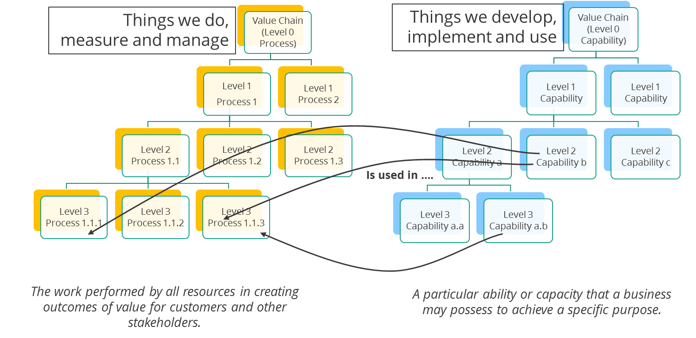
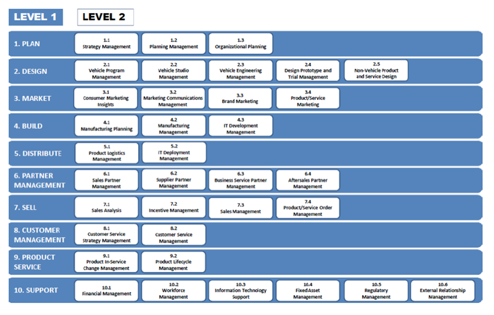
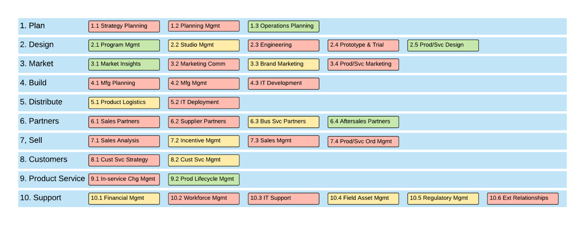
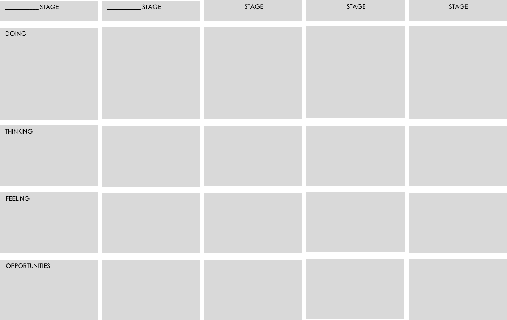

# Why do we need to think Business Capabilities?

In today's rapidly changing business landscape, innovation is essential for survival. It has become a Business As Usual (BAU) activity that cannot be left to a separate team. Many organizations operate in industries where customer loyalty is fleeting and tastes are constantly evolving. Innovation requires the ability to identify where change needs to occur, determine the changes that must be made, and implement those changes smoothly. Every aspect of a business is susceptible to change, and identifying what needs to be changed necessitates linking back to the organization's arsenal of knowledge, skills, and tools. Although some changes to business processes might only require process adjustments, most require new knowledge, skills, or tools to be acquired or developed. An organization's ability to do something is represented by the combination of its knowledge, skills, and tools, which work in the same way as an individual's capabilities.

For instance, the ability to throw and catch a baseball necessitates knowledge of what to do and how to do it, as well as repeated practice and the use of suitable tools. Knowledge of how to position oneself to catch a ball is merely information until one has practiced enough to become proficient. The transformation of knowledge into skill usually occurs through repetition. A mitt, as a tool, makes catching a ball much easier than not using one.

Capturing a customer order is a capability that every organization should possess. However, the form that this capability takes may differ from one organization to the next, and even within an organization's various contexts. Knowledge of capturing an order may involve understanding the kinds of information required to uniquely identify the customer, the products they want to purchase, and the shipping destination. It could also involve determining whether the customer can pay for the order at the moment or in the future. The differences in process account for the variations, but they all represent the same capability.

In a local hardware store, the employee only needs to know the name of the customer and a basic description of what they want in order to accept the order and move on to the next step of fulfilling it.

However, in a larger business with multiple locations, a more rigorous approach may be required to identify a specific customer, especially if there are customers with the same name. Additionally, the order capture process may need to identify where items are sourced from and whether they are in stock at a particular location.

For online businesses, or any business with a website, the order capture process can be quite sophisticated, requiring customers to identify themselves and the items they wish to purchase. This often involves specialized tools and skills to ensure efficiency.

Overall, the need to think about business capabilities arises because they are often the key factor in changing business outcomes. In order to meet the needs of the market, businesses may need to learn new skills or adopt new practices, all of which involve building or modifying business capabilities.

## What is a Business Capability?

The need for a business capability is understood by many in the business world. To define a business capability, the following points make it clear:

- **Definition :** A business capability refers to a specific ability or capacity that a business can possess or exchange to achieve a specific purpose or outcome.

- **What comprises a capability:** A business capability consists of a set of knowledge, skills, and tools that support the accomplishing of the objectives of the capability.

- **How** **doesn't matter :** In a particular context, the way a business function is achieved and the processes involved in executing the function don't matter as much as the externally visible behaviour and the expected level of performance.

- **What matters :** The properties of a capability and its expected level of performance are what matter externally.

- **How capabilities relate to processes:** Capabilities are used in processes to execute one or more activities in the process, as illustrated in Figure 1.

- **Measures :** A business capability will have inherent performance characteristics that can be measured, such as capacity, activity cost, and defect rate. These measures are used to determine when investments need to be made to improve the capability.

 

> Figure 1. The relationship between capabilities and processes.

## Business Capability Models

Models of the set of business capabilities are typically presented in a hierarchical structure that becomes more specific as one moves down a branch. There are various ways to organize this hierarchy, such as functional decomposition, shared characteristics, subway routes on the process map, level of investment required, and maturity. The most common approach is by function, but the chosen scheme should be based on the reason for presenting the model and the intended audience. Level of investment and maturity are the bases for many "heat maps" seen in business architecture. In a heat map, capabilities are color-coded green, yellow, or red to represent their position on an ordinal scale where green indicates less investment and more maturity, and red indicates more investment and less maturity. There is a debate about the usefulness of the heat map due to its confusing meaning, but they remain widely used.

> Figure 2 Sample capability model.

> Figure 3. Sample capability heat map.

## Identifying Business Capabilities

In a given industry, all participants share a common capability model that is determined by the demands of the industry. This commonality allows for the creation of industry-specific models, such as eTOM for the telecom industry or the capability models published by APQC. While the industry sets the required capabilities, it does not determine which capabilities are most important for a company's success. Perry, Stott, and Smallwood provide guidance on identifying core capabilities based on a business's focus on product, customer, or technology. In addition to core capabilities, there are value-added direct support, essential indirect support, and non-essential indirect support capabilities. Perry, Stott, and Smallwood recommend stopping all non-essential indirect support activities, leaving value-added and essential support capabilities.

The Business Architecture Guild provides another method to find capabilities through its BIZBoK. The Guild's method creates a business domain class model and applies CRUD functionality to identify capabilities. However, the Guild method is not sufficient for business architecture.

To find the most important capabilities for a company's strategy, there are two main methods: using an industry standard model or following the guidance of Perry, Stott, and Smallwood. Companies that do not fit neatly into the product, customer, or technology categories, such as retail stores or consumer service businesses, should focus on capabilities that directly contribute to delivering the customer experience. This can be achieved by building stakeholder experience maps, identifying touchpoints, and determining value-delivering and supporting capabilities.

{:target="_blank"}

> Figure 4. Customer journey map template.

Identify Touch Points and Value-Delivering Capabilities

- A touch point is a point of interaction on an experience map

- Each touch point is a business service provided by a capability
  (usually as used in a process)

- These are your value-delivering capabilities

- These capabilities are supported by other capabilities, sometimes
  with time or other types of dependencies

## Identifying and Managing Supporting Capabilities

The easiest way to identify supporting capabilities is by utilizing an Ishikawa or fishbone diagram (Figure 5). This diagram, which is borrowed from root cause analysis, works well for the problem at hand. Each core capability identified from the experience touchpoints becomes the primary arrow for a separate fishbone diagram. From that arrow, the capabilities that are required, either prerequisites or in real-time, are added to the diagram (identified as "Primary cause" arrows in Figure 5). Capabilities identified this way are direct support capabilities, which are dependent on indirect support capabilities identified by the secondary arrows ("Secondary cause" arrows in Figure 5).

This exercise can be repeated for other groups of stakeholders, including suppliers, employees, investors, and regulators (and the communities they represent). The diagrams for all the core capabilities for all groups of stakeholders, taken together, comprise the entire set of capabilities (core, direct support, and indirect support) needed for this business.

Many capabilities, especially indirect support, may appear on more than one diagram. This is an indication of shared capabilities and provides clues as to how they can be organized and managed.

> Figure 5. Ishikawa or Fishbone diagram.

Table 1 shows two characteristics of support capabilities that help
determine how they should be organized and managed. Support
capabilities, either direct or indirect, can be proprietary or generic.
Proprietary work needs to be owned (executed internally) or licensed and
carefully managed.

|              | **Proprietary**                                                          | **Generic**                                                        |
| ------------ | ------------------------------------------------------------------------ | ------------------------------------------------------------------ |
| **Direct**   | Provide – do it yourself                                                 | Broker – develop on-going access to the best capabilities possible |
| **Indirect** | Maintain – manage internal capability to meet cost and quality standards | Contract out – monitor to ensure compliance                        |

Table 1. Managing support capabilities.

In the context of assessing the impact of change, the author explains various approaches to managing and developing support capabilities. Providing support capabilities involves owning and developing them, while maintaining them means that they can be owned without necessarily improving them. Brokering them refers to outsourcing work while monitoring compliance, and outsourcing capabilities involves entering into a contractual relationship with a supplier without paying much attention to it except for compliance monitoring.

## Assessing the Impact of Change

Architects have the responsibility of determining the scope of a change and identifying the capabilities likely to be affected by it. A technique called "red-lining," borrowed from building architecture, can be used to achieve this. The architect takes the capability model and uses a red marker to indicate those capabilities likely to be impacted by a change, which results in a clearly defined scope of change. To determine the set of capabilities that may need to change, the architect starts with the goals in the financial perspective of the strategy map and assesses what needs to happen differently in the customer perspective.

Then, focusing on the processes that deliver customer touchpoints, and the capabilities those processes use, the architect identifies the processes that directly impact the touchpoints that need to change and how those changes might be made. Changes to customer experience require changes to processes that deliver that experience, and often to the underlying capabilities. For each capability identified this way, the architect looks at the current performance measures and assesses whether the current level of performance is sufficient to influence customer behavior enough to meet the new goals.

It may be that a capability is insufficient to meet goals even though it might not directly influence the customer behavior that needs to change. For example, the capability to accept and process an order may need more capacity as customers are encouraged to order more online. The architect identifies the capacity measures that are or will be insufficient and determines the minimum value they need to become. Then, the architect determines the changes to each affected capacity required to achieve the new measures. The collective set of changes becomes an improvement project or program, depending on its size.

## Measuring Capabilities

Capabilities can be measured for both inputs and outputs. They can also be dev

# References

1. Goldratt, Eliyahu M. and Jeff Cox, The Goal: A Process of Ongoing
   Improvement, North River Press, Great Barrington, MA: 1984.

2. Whitmire, Scott A. “It’s Time to Kill the Heat Map”, March 19, 2019, accessed August 10, 2020, [https://scottwhitmire.wordpress.com/2019/03/19/its-time-to-kill-the-heat-map/](https://scottwhitmire.wordpress.com/2019/03/19/its-time-to-kill-the-heat-map/){:target="_blank"}

3. APQC's [Process Classification Framework® (PCF) ] [https://www.apqc.org/process-performance-management/process-frameworks](https://www.apqc.org/process-performance-management/process-frameworks){:target="_blank"} is a taxonomy of business processes that allows organizations to      objectively track and compare their performance internally and externally with organizations from any industry. It also forms the basis for a variety of projects related to business processes [https://www.apqc.org/resource-library/resource-listing/apqc-process-classification-framework-pcf-cross-industry-excel-7](https://www.apqc.org/resource-library/resource-listing/apqc-process-classification-framework-pcf-cross-industry-excel-7){:target="_blank"}.

4. Perry, Stott, and Smallwood, Real-Time Strategy: Improvising Team-Based Planning for a Fast-Changing World, New York, NY: Wiley, 1993.

BTABoK 3.0 by [IASA](https://iasaglobal.org/) is licensed under a [Creative Commons Attribution-NonCommercial 4.0 International License](http://creativecommons.org/licenses/by-nc/4.0/). Based on a work at [https://btabok.iasaglobal.org/](https://btabok.iasaglobal.org/)
