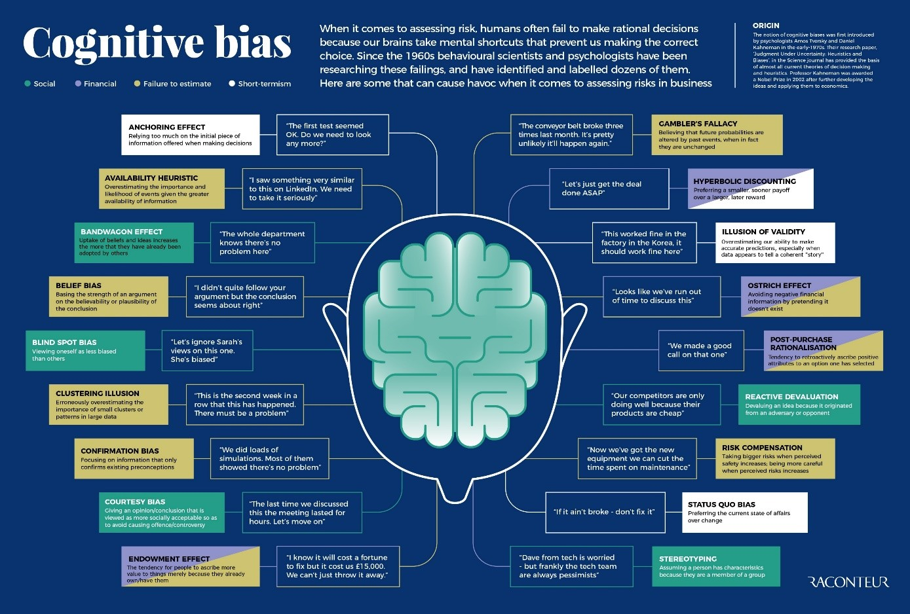
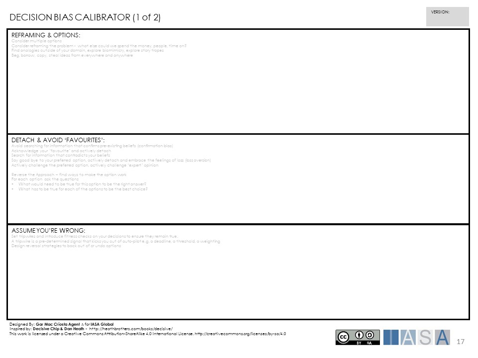
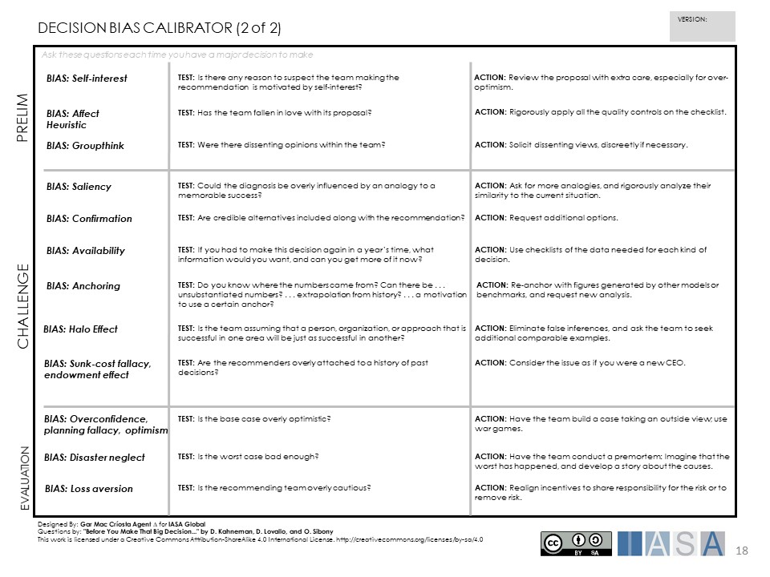
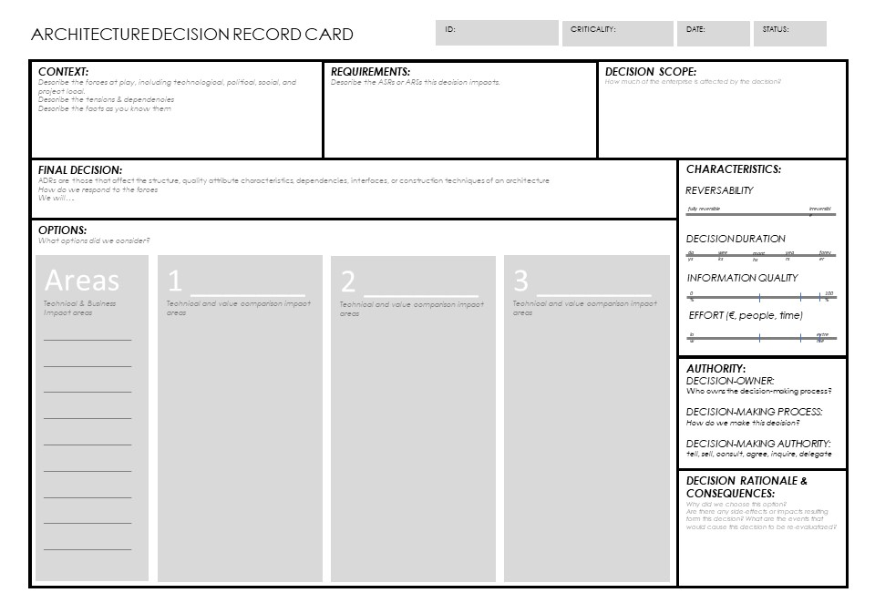
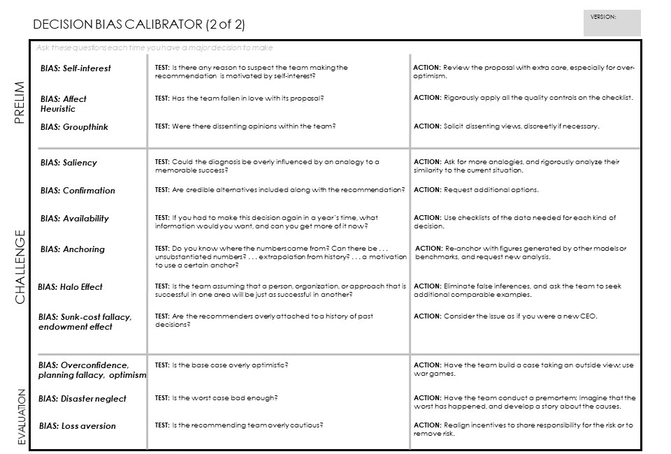

"Making good decisions is a crucial skill at every level."

Peter Drucker

Architecturally Significant Decisions
=====================================

Architecturally significant decisions (ASDs) are "the stuff that matters" as Martin Fowler describes it. They describe the scope and boundaries of a decision that will have significant impact on the outcomes of a particular piece of work or the organization as a whole.

An ASD should be motivated by previous and similar works. The goal of the ASD is to make decisions explicit, easy to track and link to requirements, design reasoning and outcomes.

Guidance
--------

Architectural decisions are at the root of our practice but they are often hard to spot. The vast majority of decisions get processed at the team level and do not apply architectural thinking or have an architect involved at all. This approach can be a benefit in agile organizations if managed and communicated effectively.

Engagement Principle: Bottom up decision making is a benefit or a [risk](https://btabok.iasaglobal.org/btabok_3/risk-methods/). Ensure all teams are trained on decision characteristics that impact its formality

Envision an enterprise or company, then imagine all the teams in the organization working in parallel on changes, remember to add in maintenance teams and operations teams doing 'keep the lights running' work. Now if you set the decision level of architectural significance at $20,000 (this will vary by organization) in impact or cost, how many of those decisions are made with a basic tradeoff analysis? This is the fundamental world of architectural decisions and ultimately the outcomes of these decisions lead the organization to the benefits or failures of architecture.

### Manage the Scope of Decisions Carefully

Decisions have an impact radius that can be much larger than many think. By understanding decision scope you can determine appropriate characteristics of the decision, its [velocity](https://btabok.iasaglobal.org/btabok_3/digital-outcome-model/velocity/) and its type. Determining a decisions scope and impact is essential to ensuring that appropriate decision tools are used.

| **Scope** | **Decision Management** |
| --- | --- |
| **[Ecosystem](https://btabok.iasaglobal.org/btabok_3/digital-outcome-model/ecosystem/)** | These decisions will impact not only the enterprise but its entire ecosystem as well. A governments choice of procurement requirements for vendors or standards for banking are examples. An enterprise choosing to enforce standards on its customers or suppliers are others. |
| **Enterprise** | Decisions which impact the entire enterprise. Choice of ERP, cloud strategy, or similar. These are slightly different from standards or guardrails which guide decisions at a lower level. |
| [**Value Stream**](https://btabok.iasaglobal.org/btabok_3/value-model/value-streams/) | Those decisions which impact an entire value stream for a company. |
| **Solution** | A solution level decision impacts multiple services and products and supports a value stream. |
| **Product/Service** | Decisions which are limited to impact on a specific product or service but which do not impact neighboring products or services. |
| **Module** | Decisions for a sub-component of a system. |

### Manage Decisions Effectively Across the Enterprise

To effectively manage decisions, the architecture team should put in place a decision management process early in its [lifecycle](https://btabok.iasaglobal.org/btabok_3/architecture-lifecycle/), by making critical investments into how the [organization](https://btabok.iasaglobal.org/btabok_3/people-model/organization/) is going to process decision point in the architecture engagement model. During the engagement methodology update and the engagement principles definition, the team will decide what levels of decisions must be exposed in the repository and their limits in duration, quality and effort. These principles will guide the decision methods for the entire team until the next methodology update.  There are numerous decision methods and theories in the marketplace in making better decisions. The goal of the architecture decision repository is to ensure that decisions are made clearly, with appropriate tools and with respect for traceability.

### A Decision Management Method/Process

1.  As a team identify critical levels of and types of decisions as well as their complexity or scope of impact.
2.  Identify which of these decisions the team has the ability to be proactively involved in (able to work towards the decision in a multi-functional environment.
3.  Identify decisions which the team cannot (time, access, scope) be proactively involved.
4.  Identify critical [stakeholders](https://btabok.iasaglobal.org/btabok_3/stakeholders/) as a part of the [extended team](https://btabok.iasaglobal.org/btabok_3/people-model/extended-team/) involved in the architecture lifecycle who may be mentored into rigorous decision methods.
5.  Create a set of [engagement model](https://btabok.iasaglobal.org/btabok_3/engagement/) principles to address each of these situations based on the outcomes the team would like to achieve.
6.  Revisit during engagement method update.

Figure 1 Architecture Traceability

Use the architecture decision record card as a way to identify option categories and comparisons for framework decisions. The cards can be used on all but the most complex decision categories. To use the card download the PowerPoint file and a) if using alone simply fill out the card with the decision context, linkage to requirements, and other fields, or b) print at canvas size and use sticky notes with a team to brainstorm decision categories and other fields.

### Decisions Come with Cognitive Biases

All decisions are vulnerable to human failings and weaknesses, which is why it is so important to make them clearly and with as many objective tools possible. Cognitive biases represent the ways in which human biases impact decisions. The team, product owner, all the way to executive should be intimately familiar with biases as they are generally the root of bad decisions.

Figure 3 Cognitive Bias -- <https://www.raconteur.net/infographics/cognitive-bias>

To re-enforce a decision and to ensure it is as free of bias as possible, use the decision bias calibrator card to understand and reframe the decision away from biases.

### Decisions and their Characteristics and Methods

Decisions can be implemented in numerous ways and have many characteristics. While this article includes all of them, normally only one or two are used except for the biggest decisions. These techniques are further expanded in the [Value Methods](https://btabok.iasaglobal.org/btabok_3/value-methods/) article.

| **Method** | **Decision Management** | **Characteristics** |
| --- | --- | --- |
| **Budgeted Evaluation** | The most sophisticated form of decision where a team is assigned to research the decision and make a determination. | Reversibility -- near impossible;\
Duration -- long;\
Information Quality -- high;\
Effort -- very high;\
Scope -- enterprise, ecosystem; |
| **Bake-off** | Take three of the scenarios, tools and services and implement something smaller in all of them. Compare them using other methods based on the results. | Reversibility -- near impossible;\
Duration -- long;\
Information Quality -- high;\
Effort -- very high;\
Scope -- enterprise, value stream, product; |
| **Cost Benefit Analysis** | Valuation is used to do a cost/benefit analysis of a set of options and is mostly used for product purchases or framework evaluations. | Reversibility, duration and information quality -- medium; Effort -- medium;\
Scope product/value stream; |
| **Scoring** | Scoring is a numerical method for doing trade-off analysis based on expert/team opinion of options. Each option is scored on a scale or a weighted scale and the totals drive the outcomes. | Reversibility, duration and IQ -- low to medium;\
Effort -- medium;\
Scope -- product, team; |
| **Opinion** | Little to no decision criteria is used on the decision but an expert or team opinion is used. | Reversibility, duration and IQ -- very low;\
Effort -- very low;\
Scope -- module or code; |

As the organization begins to manage decisions more effectively there will be types of decisions the architecture team chooses to ignore and styles that become comfortable. Use the minimum decision tools necessary to get to a 70-80% assurance and move on.

### Use Other Decision Techniques

There are many other decision techniques which can be applied to these methods and tools. SWOT analysis can be used to identify the strengths and weaknesses of a particular group or method.

### Decisions and the Extended Team

The extended team needs to be explicitly brought into the decision making process. Critical decision points and methods should be agreed beforehand. For example does a decision require a team signoff if it is very large? Decision boards and delegation poker are great tools for team decision processes.

If a large extended team is used as most large agile programs attempt, the extended team needs to be trained to recognize ASDs and mentored regularly with architecture consults. This method is in place whenever there are more than 3-5 teams without an assigned architect at the CITA-Professional level or above. The following techniques can make teams function effectively with a high penetration of architects to developers:

1.  The 1 to 3 ratio is effective in project based work, where up to 3 projects are assigned 1 solution architect. However these projects cannot become huge as a single architect cannot be proactive on more than 1 large project.
2.  The 1 to 5 ratio is effective in teams/product based work where up to 5 teams are assigned to 1 solution architect. The architect remains proactive in each of these cases.

#### You Are the Technical Product Owner

In the end if a decision impacts one of the 4 critical factors (value, complexity, structural integrity, stakeholders), the architect must take every precaution to ensure the decision is made with the rigor it needs. You are functioning as a technical product owner and need to ensure the maximum value tradeoff has been completed to ensure outcomes for the enterprise and customer.

#### The Team Should Be Bought In

The team is not the architect but the architect should do everything in their power to ensure the team understands why a certain decision is the way it is. This means communicating early and communicating often. It also is best to include the team on any decision as it is being made and to filter in their feedback in a visible way.

### Decisions in the Lifecycle

Duration, Reversibility and Authority

It is important to understand when the best time is to make a decision, it might be tempting to try and lock down everything before you even start to cut any code, However if there is one thing that agile has taught us, it is to keep our options open for as long as possible. You only want to commit to a course of action when you must or when you have a good reason to.

As you progress through a project you learn more, you become smarter so you must wait and wait and wait until the conditions are met and it's the right time to commit. This does not mean that you don't think about the options, it is critical to understand the impact of the various options you have to understand how late you can leave them without incurring significant waste. Also, the decisions come into focus as you narrow down the options, you can usually cast aside one or 2 of the outlandish options very early on and this helps create clarity, as you learn more other options may be discarded. So early in the project you only have to understand if there is a solution, not exactly what it is. For example: I know this can be done there are 3 tools that can do it I don't need to choose which one yet. I will have a greater understanding of the user stories and quality attributes so I can make the best choice

In summary:

-   Keep as many options open for as long as possible
-   Commit when you must or when you have a good reason to

**Because:**

-   Later you are smarter, you know more
-   Wait to make decisions... and wait... and wait... until conditions are met.

This is the Last Responsible Moment to make the decision, Glenn Ballard and Todd Zabelle introduced the concept of "last responsible moment" as a foundational principle of lean project management and set based design. They define it as "the point in time at which there is no longer sufficient lead time to realize [an] alternative [design]."

#### Decisions Tend to Cascade

One decision tends to lead to another. However, it is distinctly important to consider how one impacts another and whether that deserves its own independent tradeoff analysis. Having an HTML front end generally necessitates a web server, but which one and how will it impact the other elements and structural integrity of your architecture? Decision cascades are a means by which some decisions get covered up and cause systemic problems later. As the organization gets more experience making decisions first order objects, these cascades tend to get halted around elements that have deep structural or business outcomes.

#### Decisions Affect the Enterprise

There are numerous sources of decisions which are often controlled by architectural scope. The main areas of decisions which both constrain and originate from solutions, are enterprise, program, solution and release. Architects should be aware of the principles that are in place in these scopes but should also be consistently looking for decisions which impact these scopes.

To effectively deal with decision scopes a number of different techniques should be in considered in the architect engagement model.

1.  Architecture decision records can be used for all significant solution level decisions.
2.  A process of architectural analysis will assist in ensuring solution decisions adhere to architecture principles.
3.  A program level architecture community can manage architectural decisions and how they cascade through the program. This community would regularly review and discuss architectural roadmaps and changes brought about by solution decisions.
4.  A decision repository can make architecture decisions easier to review and discuss.
5.  A chief architect program responsible for essential technical services and business capabilities will aid in outcomes related to principles within those areas.
6.  Architects should actively participate in the governance aspects of the organization.

### Decision Registries and the Repository

All key decisions should be tracked against a repository of some sort which is easy to find and easy to trace. The architecture repository is the general place for decision registers though many simpler tools may be used. Many teams simply fill out a decision record and post it to their wiki to track any key architectural decisions. This method can be very fast but tends to be difficult the larger the number of teams. The architect should ensure there is a discoverable decision registry for every project they are working on.

#### Decisions and Organizational Dynamics

Many cascading decisions are driven from decisions made for other reasons or by stakeholders with significant power in the organization. Use solid stakeholder management tools to help ensure that decisions are made effectively.

These decisions may deeply impact architecture level decisions. It is important to be aware of decision ownership and ensure that the appropriate decision maker has all of the evidence and any recommendation from the architecture team.

Engagement Principle: The architect is first responsible to the enterprise and then the stakeholder.

Many of these decisions can be influenced using appropriate human dynamics competencies. The architect team should attempt to influence these decisions until they are made and then apply the principle of 'disagree and commit'.

Tools and Techniques
--------------------

The following tools and techniques can be useful in managing architecture decisions.

### Architecture Decision Record

### Decision Bias Calibrator

References
==========

<https://personal.utdallas.edu/~chung/SA/zz-Impreso-architecture_decisions-tyree-05.pdf>

<http://thinkrelevance.com/blog/2011/11/15/documenting-architecture-decisions>

<https://dzone.com/articles/lean-tools-last-responsible>

BTABoK 3.0 by [IASA](https://iasaglobal.org/) is licensed under a [Creative Commons Attribution-NonCommercial 4.0 International License](http://creativecommons.org/licenses/by-nc/4.0/). Based on a work at <https://btabok.iasaglobal.org/>