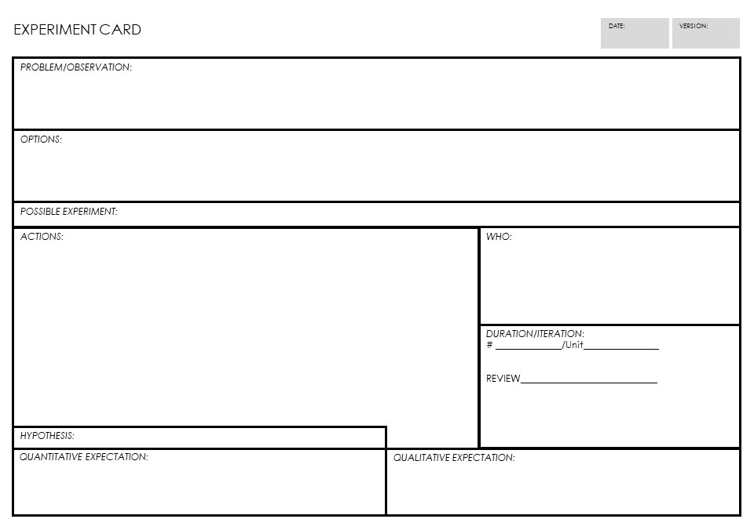
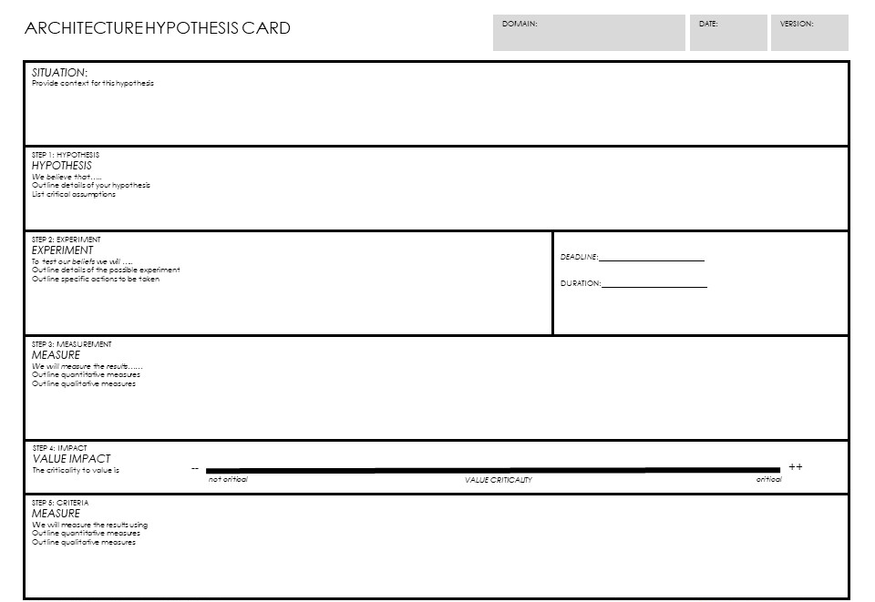

Experiments Our success at Amazon is a function of how many experiments we do per year, per month, per week, per day.

Jeff Bezos

What are Experiments
====================

"noun: experiment

A scientific procedure undertaken to make a discovery, test a hypothesis, or demonstrate a known fact. " -- dictionary.com

Experiments are the means to try new things to achieve an outcome. They are the vehicle of innovation and the means by which humans understand correlation and ultimately causality. Experimentation underlies the fabric of science and business and is the primary source of the change engine that is represented in the investment planning and lifecycles.

Experimentation is a complex topic especially in relation to Scope. Running experiments should be on-going, what is called continuous experimentation. There is much work being done on continuous experiementation as the final step between continuing-integration and continuous-delivery as well as what a modern continuous experimentation technology delivery group should embrace. This form of experimentation, product centric and most often for large web applications is not as common in smaller or medium sized architecture practices but shows up in the larger technology-led companies quite often.

The BTABoK suggests that like Agility experimentation is a comprehensive method that can be used in multiple contexts such as new business ideas and new financing methods. Even new ways of running meetings can be experiments. For example, many organizations tried out Amazons way of running meetings (read any relevant material at the beginning of the meeting) after hearing about it.

Why Do We Need Experimentation
==============================

Experimentation and especially continuous experimentation provides a kind of running metrics dashboard and forces the architect and organization to think in terms of product measures which directly impact value. Taken more abstractly this provides exactly the kind of thinking and work that is inherent in successful architecture teams.

Experimentation Approach
========================

Experimenation can be very lightweight in most companies but it provides the perfect vehicle for creating a measurement culture and for trying new ideas. Experiments allow the organization unearth risks and find increased Value and fits within both regulated and innovative business models. In some companies experiments provide the primary method for any new feature, product or even program. This kind of culture takes time to develop but underlies the entire BTABoK where outcomes are the primary method for determining success. Instead of spending days, weeks or months discussing criteria for success experimentation allows the practice to expand actual working knowledge and unearth the 'unknown unknowns'.

The experiment card can be used to design experiments for a team or group or for the individual. Starting with observations, problems or opportunities, the team brainstorms options which might impact the opportunity. They select one of the options as a possible experiment and create a set of actions to test it, including a hypothesis and possible qualitative and quantitative measure which can be evaluated agains actual results.

Requirements and Business Cases are Also Just Experiments
---------------------------------------------------------

The notion that an experiment is just a change highlights the opportunities to grow architectural thinking in an organization. Experimenters have found that in reality all changes can be treated as experiments. A requirement is just a request for a change, someone thinks is going to work. Group enough requirements together and assign both cost and benefits and a business case emerges. If the outcomes of these changes are predicted using hypothesis of both quantitative and qualitative expectations and then measured as a part of the change, then all change planning is experimentation. This is how many of the large software vendors treat their products and websites and traditional enterprises can learn a great deal from this kind of thinking, tooling and working.

Think Like an Architect at a Technoloyg Vendor
----------------------------------------------

In his book on Popcorn Flow, Claudio Perrone says, 'if change is hard, make it continuous". Lead product designers and architects at Microsoft state that "continuous experimentation is the natural final outcome of CI/CD pipelines." This is obvious at large software based businesses like Microsoft but is impacting all businesses in the digital space as product continue to be more connected, technology-driven and product centric. Based on evidence from surveys and analysis of marketplaces architects must begin to understand the underlying mechanisms of measurement, value methods and experimentation.

"If You Know the Answer, it's not an Experiment" -- Jeff Bezos
-------------------------------------------------------------

Experiments are not about confirmation of biases but authentic testing of a hypothesis. The difference is in the expected outcomes and embracing negative outcomes as ways of learning. The goal of experimentation and innovation in general is to find changes that create real outcomes. If the organization assumes that a single individual has the answer or that a particular direction is guaranteed to work it stifles the creativity needed to find optimum solutions. Architects should always use testing methods to determine not if changes worked or not, but by how much or how little they changed a known variable.

Strategy is an Experiment That Works Out
----------------------------------------

Much is said about strategy both good and bad. However, strategy is at its core a set of steps and tactics to achieve a desired position in the marketplace or a desired set of objectives. Good strategy is related to good investments which create outcomes in People, Process, Customers/Beneficiaries, and Outcomes. This means that the best strategy is ultimately a large experiment (many small experiments coordinated), to achieve these positions.

There is Significant Overlap in Design Thinking, Experiments, and Innovation
----------------------------------------------------------------------------

Design and design thinking, experiments and innovation can become synonymous if not taken with extreme care to delineate between critical elements. Experimentation is a set of methods and techniques that are separate from design thinking methods and innovation methods. In some theoretical sense these differences are one of scope and process. However there are critical differences. The BTABoK makes the following distinctions.

-   Experimentation is a simulation of scientific methods. It can be run by an invidual, a team or as a continuous process. Experimentation is the actual implementation of a feature, fuction or technique and the measurement of the results. For the architecture practice this is a method to implement Innovation. It requires a hypothesis, a set of expected results, execution and measurement.
-   Design thinking is a set of tools to get an individual or team focused on coming up with hypothesis.
-   Innovation is a continuous event at all levels of scope both inside and outside an organization. Innovation is also a mindset, process and cultural activity of an organization. Innovation as a process is implemented using experimentation at an organization level.

Keep experiment scope small
---------------------------

One of the most common pieces of advice to from authoritative sources is to keep the scope of an experiment small. This for multiple reasons. Big experiments often take too many veriables into account and thus create large failure opportunities without clear cause. For example, at one retail website tested multiple features all at once in a larger rollout but found it was difficult to tell what changes were responsible for which behavior. When they moved to a more incremental approach they were able to understand assumptions and validate them explicitly. Also keeping experiments small allows them to fit into an agile lifecycle significantly easier while reducing risk. Experiments can be chained or connected to determine larger outcomes, which is the basis for the business case as an experiment.

Scope refers specifically to the Scope and Context article. One writer on experimentation, Thomas Schissler, listed the following to descript small experiments:

1.  Number of people affected
2.  Number of people involved
3.  Time to run the experiment and gather results
4.  Effort needed to conduct the experiment
5.  Risk of creating unwanted effects and recover from them

These are basic building blocks of scope and complexity. Shissler conitinues,"The smaller your experiments are, the more you can perform and the more frequently you can learn and use these learnings to shape the next steps. So, if you get some resistance to conduct an experiment, think how you can make it smaller."

Strategies for Experiments
==========================

An architecture practice can implement any number of types of experiments. They can be run only by the team or by a wider group. Generally experiments remain small until sufficient maturity can be reached.

Types of Experiments
--------------------

The BTABoK suggests the following types of experiments.

| **Type of Experiment** | **Description** | **Types of Measures** |
| **Customer** | Customer experiments are those involving customer engagement, journeys and ecosystems. | Customer engagement, customer sentiment, brand recognition, jobs to be done. |
| **Product** | Product experiments change features, access and other elements of a product. | Feature release utilization, product objectives and measures. |
| **Operations** | Operational experiments are those that change capabilities, services and processes of an organization. | Operation efficiency, efficacy  and employee satisfaction. Lead times, value stream outcomes. |
| **Stakeholders** | Stakeholder experiments are those that change the way stakeholders are managed. | Stakeholder sentiment, cultural outcomes, mindset and trusted advisor relationships. |
| **Engagement Model** | Engagement model experiments are those that change the way the architects interact with the organization through deliverables, lifecycle, role or tools. | Architecture maturity, successful architecture engagements, stakeholder sentiment, architecture practice size and ratio. |
| **Technology Operations** | Technology operations experiments are those that change the way technology is delivered to the organization and its customers. | Technology delivery, velocity, agility, safety and support. Quality attributes. |
| **Measurement** | Measurement experiments are those that change how the organization understands its success and value. | Accuracy and timeliness. Culture, collaboration and mindset. Decisions, value management and technical debt. |
| **Technology Structure** | Structural experiments include changes to services, partnerships, infrastructure or similar technology platforms, components and services. | Structural complexity, quality attributes and technical debt. Architecture analysis effectiveness. |

Using Hypotheses
----------------

To generate hypothesis and to develop a possible experiment use the Architecture Hypothesis Card.

References and Further Reading
==============================

https://www.sciencedirect.com/science/article/abs/pii/S0164121217301474#:~:text=Continuous%20experimentation%2C%20as%20an%20experiment,the%20success%20of%20the%20software.

https://se.ewi.tudelft.nl/ai4fintech/tracks/05_continuous_experimentation.html

https://blog.acolyer.org/2017/09/29/the-evolution-of-continuous-experimentation-in-software-product-development/

https://link.springer.com/chapter/10.1007/978-3-319-91602-6_20

> [DevOps: From Continuous Delivery to Continuous Experimentation](https://cloudacademy.com/blog/devops-from-continuous-delivery-to-continuous-experimentation/){:target="_blank"}

https://www.scrum.org/resources/blog/7-tips-how-create-culture-continual-experimentation-and-learning-and-how-overcome

> [Private Workshop: Continuous Innovation & Change with PopcornFlow](https://agilesensei.com/popcornflow/){:target="_blank"}

BTABoK 3.0 by [IASA](https://iasaglobal.org/) is licensed under a [Creative Commons Attribution-NonCommercial 4.0 International License](http://creativecommons.org/licenses/by-nc/4.0/). Based on a work at [https://btabok.iasaglobal.org/](https://btabok.iasaglobal.org/)