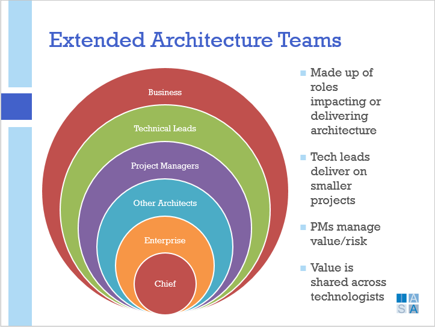
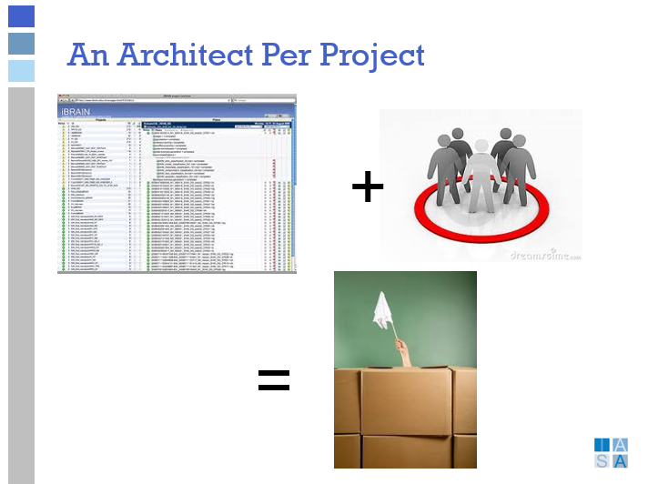

Extended Team
=============

An extended team is the development of architecture practice and delivery outside of a titled architecture team. The extended team develops from utilizing other roles within the AT and business practice to fully cover the architecture and technology strategy direction.

Figure 1 Roles Involved In Extended Teams

Why It Matters
==============

For an organization to successfully mature it's architecture capability, the concepts and value of the architecture practice must be stabilized and well understood. While an extended team model allows for better coverage of the enterprise, decentralized decision making, just in time architecture, self-directing teams, and partner role empowerment, with too small or too unknown an architecture team it devolves quickly into confusion and political infighting. Is the architecture decided by the agile team? By the infrastructure team? By the business? In addition there is no replacing the skills of an experienced architect to handle value management, investment prioritization and strategy in both the planning and the execution sections of the [lifecycle](architecture_lifecycle.md){:target="_blank"}.

Themes and Challenges
=====================

Extended team's arise in many organizations up from the lack of enough architects to cover a full project and capability portfolio. Many if not most organizations use the extended team model, especially early in the [architecture maturity model](../top_menu/maturity_model_m.md){:target="_blank"}. In these organizations for example the development leads and agile teams often decide on which technology to invest in for the project. This creates locally optimized output which often overlaps or even duplicates other investments in the organization sometimes resulting massive duplication of effort, overly complicated systems, and poor investment decisions. In addition, most development teams lack the business skills to accurately calculate what is or isn't best for the organization. Other extended team roles face similar challenges. The PMO will often prioritize business projects according to business objectives decided by individuals with little technology depth leaving many essential components out of the [roadmap](roadmap.md){:target="_blank"}. Thus, using the extended team model often requires significantly higher maturity to be successful.

Figure 2 Architect Per Project is Difficult

Decentralized Decision Making
-----------------------------

Organizations that want to be effective and grow continue to move decision making closer to the edge of the enterprise. This allows for quicker response times to market changes and for decisions being better aligned with customer and employee needs. However, it also often comes at the cost of traditional enterprise level accountability, reporting, optimization which are essential for board level visibility and decision making. The extended team model allows for partners within other aspects of the business and technology delivery organizations to acquire the architecture skills they need through training, mentoring and experience to achieve both objectives.

Coverage and the Enterprise
---------------------------

[Coverage](coverage.md){:target="_blank"} in the engagement model refers to the enterprise ability to make informed and valuable decisions in terms of its investment in business and technology. Its goal is that every significant investment in product, technology or process would have architectural decisions with traceability through the decision-making process.

Just-In-Time Architecture
-------------------------

Just in time architecture is the practice of putting architecturally relevant decisions to the latest moment possible and to do so with just enough objective evidence of their value to allow for high-speed delivery of systems and change. Just in time architecture is driven by practiced and experienced architects being assigned full time to any project or product as a part of the team and responsible for value and technology strategy direction. (Note: this must be handled carefully in very large architecture practices with multiple specialists and large projects).

Partner Role Empowerment
------------------------

A truly mature architecture program results in empowerment for other business and technology roles instead of competition. The practice fulfills the niche of value management, technology value ownership and innovation and delivery focus with depth in digital strategy and delivery which by and large does not exist in organizations in a systematic and highly experienced way. The architecture team then does not attempt to oversee, govern or full the roles of other professionals but takes on a new role of business technology strategist deployed throughout the enterprise, with direct business and technology relationships.

Practices
=========

The architecture practice must grow it's overall engagement model maturity for the enterprise to reach a state of true agility and digital expertise. Thus it is essential that the architect function be populated with skilled professionals preferably titled and certified and interacting with the organization in flexible ways. To achieve this the practice must grow an understanding of the differences amongst architects and other professionals and clearly define role interactions

Approaches to the Extended Team
-------------------------------

Building an extended team starts with the architect practitioners themselves.

### Building Credibility

The architecture practice must treat the extended team as a part of the team and build credibility and consensus within the organization. If phrases like, "Well *they* aren't *really* architects.." are common in the practice, the team needs to identify the leaders and train and mentor them effectively. Without credibility in the eyes of both business and technology stakeholders there may be hidden or open animosity towards the practice.

### Build Stuff and Own Stuff, Don't Govern Stuff

Many architecture practices in extended teams have taken on the role of governance, reviewer and in positive situations mentors. However, these teams always suffer from lack of value recognition and a lack of clear understanding of their contribution to the enterprise. Architecture is a creative function not an oversight process. The team must focus on innovation and delivery and allow for other roles to sink or swim with their decisions. Focus the team on building and areas where clear ownership of value can be achieved and avoid governance and review roles as much as possible.

### Building a Yes Culture Backed By Value Methods

Architects in extended team models find themselves saying no to their organizations quite often. This mostly comes from a situation in which the architects realize some aspects of poor decision making with not traceability or transparency. However, architect teams in this role seldom achieve significant growth in maturity and recognition as they are seen as roadblocks to success instead of valuable contributors and owners of change. The team must focus on places they can say yes to the organization and then back those programs with all of their energy an time. Once full value recognition and credibility have been established along with solid value management techniques and other mature aspects of the engagement model, the team can take a more balanced view of investment and prioritization.

### The Architect and Agile Teams During Delivery

[Agile](agility.md){:target="_blank"} and architecture are more than naturally compatible once certain criteria are met. Agile patterns provide for quick time to market, self-empowered teams, decisions at the edges and many more benefits. However, without the architect as a part of the team they can lead to siloed delivery, sub-optimized value creation, feature focus, and duplication in the extreme. The criteria which must be met for a valuable agile architecture practice:

1.  All teams understand the value of architecture in delivery
2.  Architects are deeply connected to delivery
3.  Agile leaders are trained in critical architecture skills
4.  Product/project assignment of architects is clear
5.  Strong mentoring/partnering models exist between agile leaders and architects
6.  Architecture responsibility and investment is established in the engagmenet model
7.  Engagement model has reached a minimum of level 2

Following the principle of Up and Out Instead of Down and In, the solution architecture practice specifically should be directly involved in as much delivery as possible as decided by the engagement model team relating to portfolio. Architecture is NOT Above Other Roles, describes the principle that architects have a different function and purpose than other roles in strategy and delivery. Therefore in extended team engagement models the architecture responsibility must be fully covered by other roles with enough skill to fulfill the function.

Steps to Running an ET Engagement Model
---------------------------------------

To be successful your organization should follow these steps

1.  Define the extended [roles](roles.md){:target="_blank"} explicitly
2.  Define role in the SALC (Arch Life Cycle) explicitly
3.  Educate and mentor and extended team on critical skills
4.  Constantly include and build relationships extended team
5.  Communicate successes of the extended team
6.  Provide long-term opportunities for ET members to become architects

Role Interactions
-----------------

| **Role** | **Interaction Points** | **ET Skill Focus** |
| --- | --- | --- |
| **Development** | Structural Impact and Analysis, Business Model Impact, Investment Planning, Roadmap,

Innovation, Disruption, Design Tradeoff, Traceability, ASR

 | Valuation, Investment Prioritization and Planning, Presentation, Leadership, Writing, Design Patterns, Traceability, Views And Viewpoints |
| **Infrastructure Operations** | Structural Impact and Analysis, Business Model Impact, Investment Planning, Roadmap,

Innovation, Disruption, Design Tradeoff, Traceability, ASR

 | Valuation, Investment Prioritization and Planning, Leadership, Presentation, Writing, Design Patterns, Traceability, Views And Viewpoints |
| **Business Analysis** | ASR, Business Case, Innovation, Disruption, Traceability | Valuation, Investment Prioritization and Planning, Design Patterns, Traceability, IT Environment |
| **Project/Product Management** | ASR, Business Case, Innovation, Disruption, Traceability | Design Patterns, Traceability, IT Environment, Design, Quality Attributes |
| **Business** | ASR, Business Case, Innovation, Disruption, Traceability | Valuation, Investment Prioritization and Planning, Design Patterns, Traceability, IT Environment |

BTABoK 3.0 by [IASA](https://iasaglobal.org/) is licensed under a [Creative Commons Attribution-NonCommercial 4.0 International License](http://creativecommons.org/licenses/by-nc/4.0/). Based on a work at [https://btabok.iasaglobal.org/](https://btabok.iasaglobal.org/)