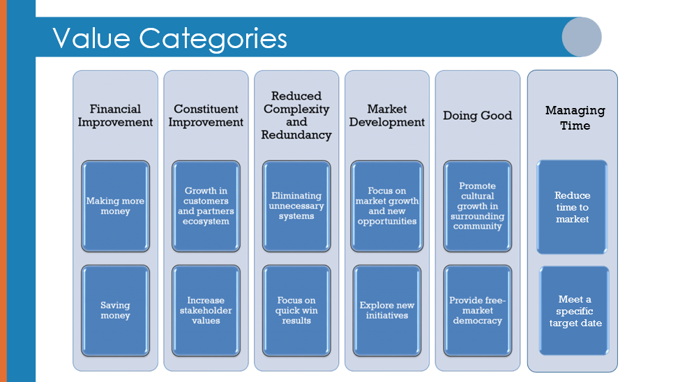
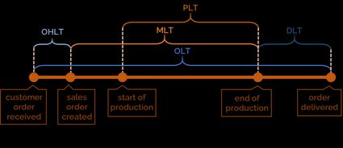
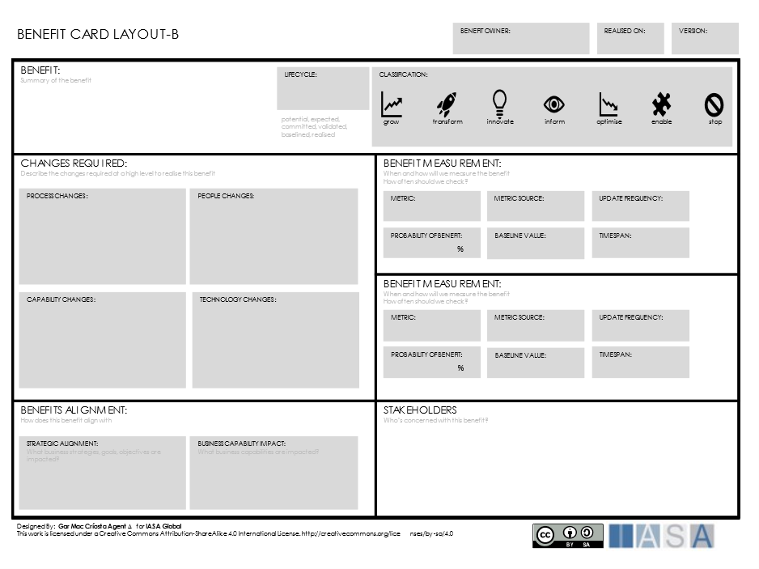
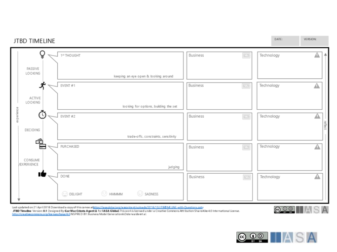
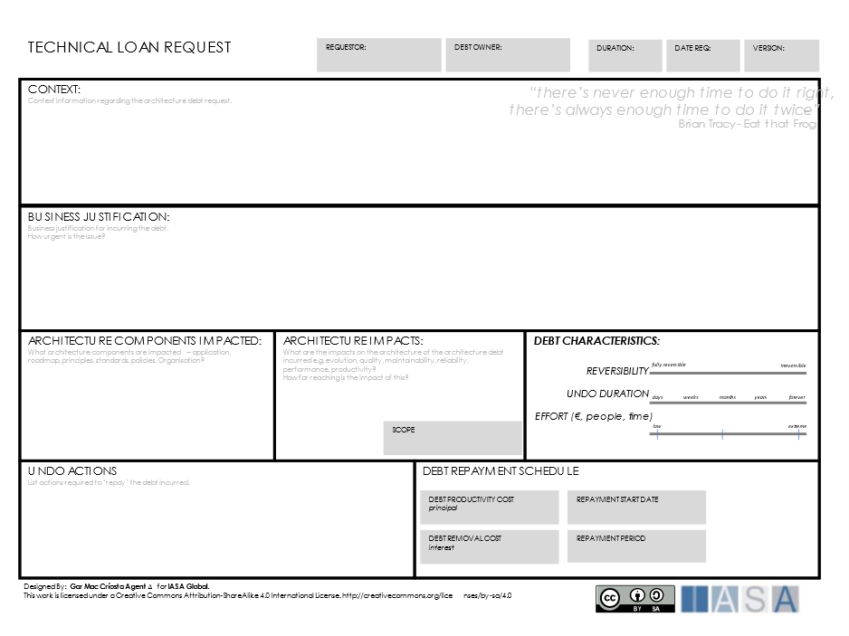

"Quote: People think the free market is a philosophy; they believe it is a creed. It is none of those things. The free market is a bathroom scale; it is a measuring tape; it's simply a measurement."

P. J. O'Rourke

What is Measurement
===================

Measure

1.  ascertain the size, amount, or degree of (something) by using an instrument or device marked in standard units. "the amount of water collected is measured in pints."
2.  assess the importance, effect, or value of (something). "it is hard to measure teaching ability."

The definitions of 'to measure' give a clear picture of why it is critical to an organization. Measurement is the act of understanding the standard units or value of anything. The measurement consists of agreements surrounding what is to be measured, what teams are used to measure it, and what the resulting measurement means or indicates. This process is neither easy nor exceptionally accurate. Even in common measurements like the kilogram and the pound, there has been considerable variation in methods and techniques, and meaning. However, no company or government agency could understand their product, service, or capabilities without measurement, much less set a plan for change and growth.

The basis for measurement is a set of commonly held beliefs about what a symbol or a particular unit of measure means and what it represents. For example, is the kilogram a unit of weight? How does it relate to a team of mass? And how are those two things related to developing a turbine engine or a bottle of cola? These tools, while initially appearing simple, are in fact regulated and debated around the world. This underlies the business companies do every day, from currencies to shipping. Thus understanding measurements are critical to understanding business. Business capabilities, value methods, and realization of benefits are all underscored by costs to lead time measurements. In one instance, a significant charity converted or compared all measures internally to a 'unit of a good,' allowing them to compare and contrast projects, programs, and proposals based on how good they would be for humanity.

Measurement as a Continuous Event
---------------------------------

Measuring is as natural to humans as breathing. Employees, owners, investors, journalists, employees are constantly measuring everything around them, from team satisfaction to payscales. To do this, they use a continuous set of internal measures, which are generally very 'fuzzy' and often quite personal. Job satisfaction, work effectiveness, and efficiency are all a part of these internal measures people use to understand how they fit in their environment and how well that environment is functioning.

Measuring often happens at drastically different scopes and is a continuous evolution and cycle. The company's profitability versus the customer satisfaction in a specif product is two very different measurements at significantly different degrees. This means that people must navigate fuzzy, subjective numbers and be able to compare two radically different concepts and find a unique and agreed meaning to those that can be rationalized into action. This process is challenging and ongoing and is subject to significant confusion.

Why is Measurement Important to Architects
==========================================

Each of the continuous events articles is linked to critical aspects of success in digital advantage. Measurement especially has a fundamental role in understanding how to select and produce value in digital initiatives. How should an investor (budget team, stakeholder, etc.) understand the importance of a cloud initiative in terms of return compared to a marketing initiative? The ability to make these measurements translations can be the difference between massive investment in technology or the opposite. For a long time, technologists have struggled with creating these kinds of arguments and making a case for investment. Measurement is the first step in the benefits realization and value methods activities which allow architects to hold their own in these discussions.

Measurement is also fundamental to achievement and progress. Velocity in digital operations is about measuring the speed of delivery, whereas digital mindsets are about measuring something less tangible. But even these measures are not clear. For example, velocity might be measured by the number of completed, accepted, and running in production, or it might be measured by how quickly a team can change course and deliver against a new pattern or architecture style. Even within the most common measures lies complexity.

Approach to Measurement
=======================

Understanding Measurements
--------------------------

Measurements are related to understanding what is valuable to measure. There are many sides to understanding measurements, but the value categories can be used to understand the measures applicable to an organization.

Figure 1 Value Categories in Measurement

The critical aspect of understanding measures are:

1.  The idea or object to be measured.
2.  The units of measurement.
3.  The outputs or correlations to the measurement.
4.  The translation between those items to meaning.

An excellent measurement includes a solid understanding of what is being measured. For example, in a value stream, lead time is a measurement that represents the total time it takes for an item to move forward, including both direct and wait time.

Figure 2 Lead Times (credit Omnicalculator.com)

However, there are multiple value methods for lead time.

The most common method is

Lead time = pre-processing + processing + post-processing

Another one is

Lead Time = Inventory/Daily Demand, which is correlated to inventory utilization.

Lead Time

Yet another is

Lead Time = Work In Progress * Cycle Time of Next Station, which is connected to concepts of consumption rate.

Obviously, different stakeholders may be interested in various aspects of measurement and may therefore understand the figures differently. In manufacturing, inventory may focus on a particular supply chain project. Continuous delivery may be the amount of time between code check-in and production that a person is interested in, both called lead time.

Make Measurement Central to the Practice
----------------------------------------

If architecture is centered around decisions, then decisions are centered around measurements. For example, in deciding between a product for use in supporting a set of business objectives or architecturally significant requirements, the comparison areas are a set of measures such as license cost, supportability, developer familiarity, etc. Note that only license cost is a direct and discrete number. The other comparison areas are subject to interpretation and to a discussion about what the measurement means. Even in license cost, there may be significant differences between a per-user or per-system deployment. Thus measurement agreements become a fundamental part of communication and collaboration with stakeholders.

Every architect should consistently practice measurement calculation and communication to build measurements into practice. Standard measures should be stored in the architecture repository alongside common value methods. The practice should regularly revisit the measurements used in architecture delivery and communicate their meaning among the architects and extended team. In effect, the architects become a translation point between standard measures and outcomes. This is a part of the overall benefits realization aspect of the value model.

In the following benefits realization view, measures are used for cost and benefits and those that can be considered technical debt versus technical investment.

Figure 3 Benefits Realization View

Collect Measurements Like Patterns
----------------------------------

Standard measures can be calculated and collected in the same way technologists use patterns. This should be done alongside value methods, as said before. The BTABoK is beginning to catalog standard value measures though it will not house specific measures by the industry as that is far beyond the scope. When engaging in value models with clients, the architect must gather as many measures as possible as they become the language of value for outcomes and objectives. The benefits card below lists some possible benefits measures and how they can be achieved.

Figure 4 Benefits Card

Build a Measurement Culture
---------------------------

All architects should be reviewed and aligned to a measurement culture. This refers to how opinion, decisions, and collaboration are commonly translated into measured outcomes. This culture needs to be fundamental to the overall advancement and hiring of architects in practice.

Measuring Technology Has Limits
-------------------------------

It should be noted that technology itself has its limits in current understanding, not the least of which is measuring architecture itself. For example, many measures are related to code, code quality, etc., but these are not fully understood in value creation or connection to outcomes. The more technical the investment is, say cloud computing, the more difficult it is to determine the measurements relevant to non-technical stakeholders. A company may have many avenues to understand investment in more traditional purchases but struggle to connect technology to outcomes. For example, an airline company might consider investing in new airplanes, which is costly. However, there are well-understood financial instruments and tools to facilitate this decision. Measures like impact on routes that could be supported, the number of passengers average on those routes, and average ticket prices can help understand the possible benefits of the purchase. These are so well understood that the company might take a loan or issue a bond to fund the purchase. However, a similar investment in the cloud will often struggle with connecting its common measurements (uptime, scalability, disaster recovery, etc.) with how they will impact customers, flights, and routes. This kind of problem in benefits realization is perfect for seasoned architects.

The benefits dependency network can often help to connect these technical measures with impacts to more common business measures allowing architects to help the organization understand these decisions.

Figure 4 JBTD Timeline Canvas

Figure 5 Benefits Dependency Network

Use Measurement in Technical Debt
---------------------------------

The technical debt metaphor has its roots in converting technology choices to measurements that can help deliver value. A team or product may implement features in a less desirable way to improve delivery time. But this must be translated into clear value measures to identify a payback period and amount for these decisions. This makes decisions related to technical debt ripe for measurement. The technical loan card can be used alongside measures to frame all technical debt as a financial payback problem.

Figure 6 Technical Loan Card

References and Further Reading
==============================

[Calculating Lead Times in a Value Stream Map | Harish's Notebook -- My notes... Lean, Cybernetics, Quality & Data Science. (wordpress.com)](https://harishsnotebook.wordpress.com/2015/03/01/calculating-lead-times-in-a-value-stream-map/){:target="_blank"}

[Lead Time Calculator (omnicalculator.com)](https://www.omnicalculator.com/everyday-life/lead-time#:~:text=Lead%20time%20%3D%20pre%2Dprocessing%20%2B,make%20or%20collect%20the%20order.){:target="_blank"}

[How To Calculate Lead Time? | ClickUp Blog](https://clickup.com/blog/lead-time-formula/){:target="_blank"}

BTABoK 3.0 by [IASA](https://iasaglobal.org/) is licensed under a [Creative Commons Attribution-NonCommercial 4.0 International License](http://creativecommons.org/licenses/by-nc/4.0/). Based on a work at [https://btabok.iasaglobal.org/](https://btabok.iasaglobal.org/)