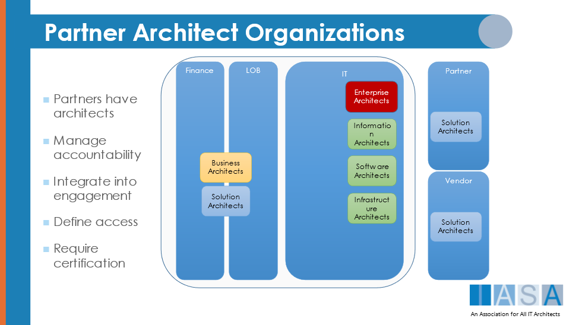
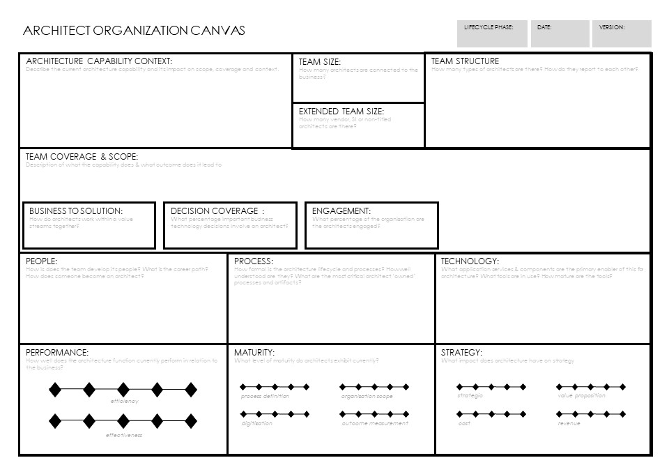
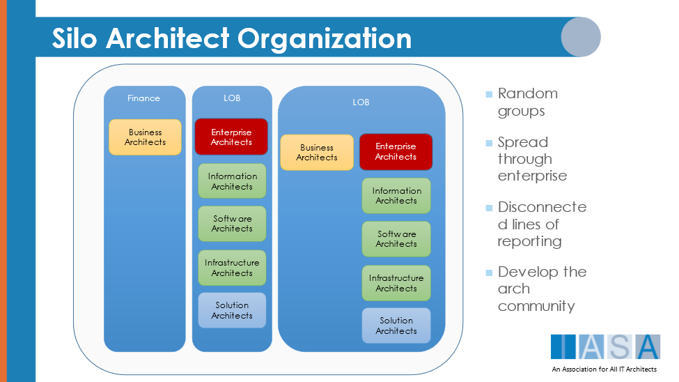
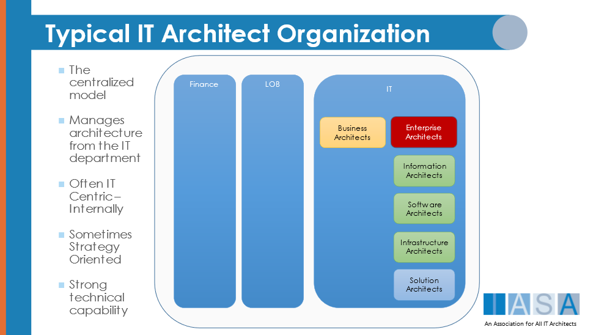
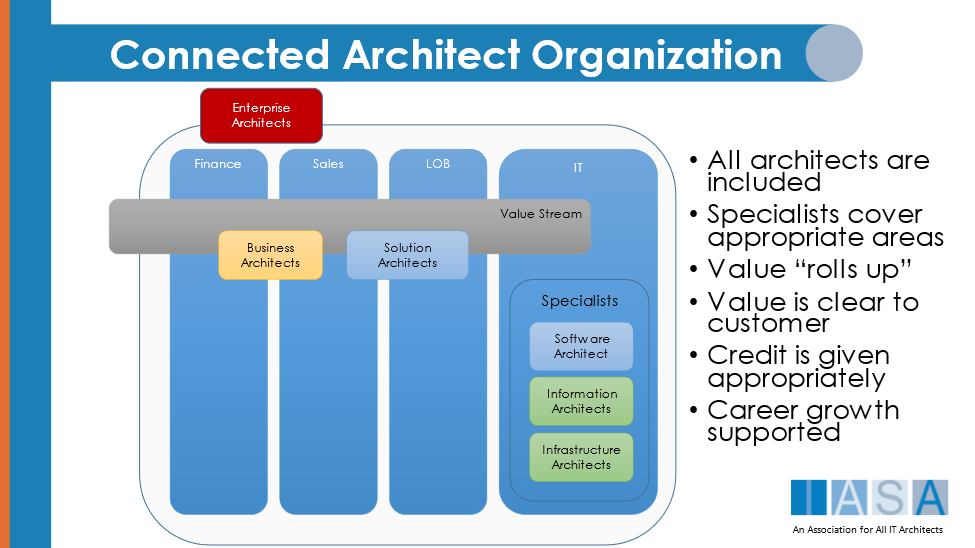
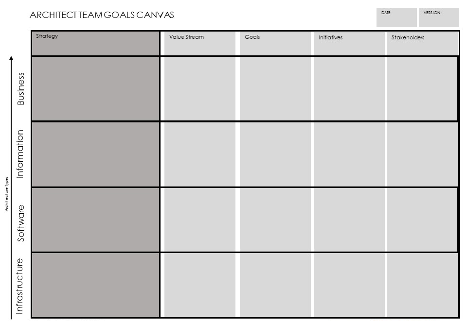

> "If you could get all the people in the organization rowing in the same direction, you could dominate any industry, in any market, against any competition, at any time."
> **Patrick Lencioni**

# What is Organization

> Noun -- "​an organized group of people with a particular purpose, such as a business or government department."
> **-- Oxford dictionary, definition of Organization.**

Organization in architecture is the structure, reporting, and administration and implementation of the group of internal architects, extended team members and external influences which shape an architecture practice. It also determines career path and deeply impacts the people in and related to the architecture organization.

## Organizations, Teams, and Practice

The terms organization, team, and practice can be used in extremely different ways and creates confusion within a company or group of people. All are used in both noun and verb forms to denote subtly different ideas. For the purpose of the BTABoK:

- The (an) organization is the entire group of architects within the company, how they organize themselves or are organized by the company whether non-profit or traditional.
- The (a) practice is the purposeful method and structure the architects use to connect their engagement model to the company (or companies). The concept of practice is thus similar to organization but denotes that it is more actively engaged in designing, leading and managing itself. Similar to the way practice is used with doctors, accountants, and building architects.
- A team is a loosely defined group of people that implies a much smaller size than the overall group of architects and may include or be entirely made up of either architects or non-architects.

# Why is Organization Important

Organization is one of the more important elements of an engagement model as it defines the reporting structure and career path of the architects within it. It is the primary relationship between the architects, groups like HR and choices like compensation, benefits and career growth. A well thought through organization method aligned with business and enhanced by the [community](community.md){:target="_blank"} of architects will be much more effective than a similar group of people without clear professional alignment.

## Opportunities in Business

Getting architect organizations right is essential to building business relationships with other business units. Architects who are too far away from customers may have difficulty relating their work to outcomes and value other than cost reduction. In addition, architecture teams that understand investment prioritization and [value methods](value_methods.md){:target="_blank"}, do so because they are closely aligned with the priorities of the company and the customer.

It is, however, essential that architects retain their value-add to the company independently or as a group so it is essential that they don't optimize for a single business unit while minimizing value to another. This means that [value stream](value_streams.md){:target="_blank"} structures and strong [community](community.md){:target="_blank"} are necessary to ensure that the entire customer experience is optimized.

## Opportunities in Communication

Communication is a major issue for architecture teams. By nature and by practice, architects often work long hours and do so in the midst of chaotic value delivery plans in partial isolation from other architects in the organization. This scenario will create a very loosely coupled practice and seems to create fractures quickly in organization. This in turn creates chaotic processes, deliverables and value in the [role](roles.md){:target="_blank"}.

When organizing the team it is essential that strong relationships and communication exist within the community of practice. Mentoring approaches, discussed below, as well as regular face to face sessions and rotation can offset significant portions of those difficulties.

## Opportunities in International Organizations

International organizations, government agencies and conglomerate business models often have shared service models in centralized locations which serve business units. In many cases this leads to different businesses having different views and delivery of architecture excellence. This is often the case in government agencies even in the same geography. There is both a risk and a reward to this kind of business technology strategy. The risk is that each company will treat a shared services department as essentially a vendor, creating distrust and difficulty in staff employed in the technology group. This creates a competitive environment with actual vendors as well. Instead the opportunity for effective architecture should be housed on both sides of the relationships with architects serving to look for innovation and shared opportunities for digital advantage for all companies involved.

## Opportunities in Consulting Companies

Consulting companies face serious issues in architecture activity. Each customer engagement is often an island of its own and yet the company faces constant challenges to innovate and differentiate their offering from other consulting groups. This scenario creates architecture 'mini-practices' either regionally or within the company by business or technical domain.

Another opportunity is the focus on vendor based relationships and hybrid centers of architecture excellence within client engagements. Vendors need to be able to adapt their architecture practices quickly to those of the client or to transfer knowledge if the vendors engagement model is drastically more sophisticated. There are numerous challenges in this model as multi-vendor engagements often lead to a significant amount of client confusion over architecture value if the vendors differ drastically in their engagement methods (for example, one vendors solution architects are senior programmers while another's are more like product managers). This situation makes building trusted advisor status essential in both types of organization models.

## Organization Versus Practice

> Noun -- "the carrying out or exercise of a profession, especially that of a doctor or lawyer."
> **Oxford dictionary.**

> Noun -- "the business or premises of a doctor or lawyer."
> **-- Oxford dictionary**

For the purposes of the BTABoK, the term organization is used to most often because a 'practice model' is not currently implemented in companies related to IT in general, and architecture specifically. To achieve a practice model a few basic principles have to be enforced throughout reporting and career growth.

## Why A Practice Model is More Effective than a Corporate Model

There are numerous elements to running an architect engagement model and they are often difficult to communicate to those not familiar with architecture. This difficulty is why almost all professions have practices, where there is bifurcated leadership, the professionals create and manage their practice while administration and even executive leadership control the company. This ultimately benefits the company in many ways.

The obvious answer to the question of practice vs organization is clear but requires a much larger commitment by the community of architects to stay equal to their profession.

# Organization Tenets

The follow tenets may help in the organizing of architects.

## Architect Organizations are like Herding Baby Lions

What it takes to be a great architect is vision, a willingness to work alone with strange and often angry [stakeholders](stakeholders.md){:target="_blank"} while people constantly question the value of the [role](roles.md){:target="_blank"} and still remain both positive and proactive. This is just a part of the job and is not a bad thing. However it does create and invite certain personality traits which can make getting architects to work together in the practice difficult. It is critical to adopt a set of shared cultural goals such as **servant leader mentality** and [community methods](community.md){:target="_blank"} to achieve true growth.

## Architects are Optimistic Pessimists or Pessimistic Optimists

To add to the previous Tenet, it is very important to build a culture of real data driven change, strong human dynamic skills, and positive approaches to stakeholder driven architecture. Architects have to be both pessimist and optimist at the same time. The practice must say no to the wrong things and say yes to the right things. One of the paradoxes that serve as a basis for the profession. This can and has been learned the hard way by many teams.

## Make Vendors a Part of the Practice

The assumption in a practice is different than a corporate organization. In a profession, external or internal is not a distinguishing factor except where access to sensitive information is concerned, which is common in medical research and similarly sensitive areas. A consulting doctor or a hospital doctor are equal in terms of treatment. However, as a general rule many organizations exclude their vendors from technology strategy. A solid architecture practice includes all external architects engaged with the company as they often impact the engagement model deeply. It is best then to align external vendor or SI engagement models with the organizations engagement model from the start. The BTABoK is written with that in mind.

# Organization Approach

To begin the development of the organization the team must define the elements to be resolved for this area of the BTABoK engagement model and how they relate to the overall people model. To begin it is important to describe the overall architecture capability desired and its current state. The architecture capability card can help understand what is currently happing and opportunities for improvement.

{:target="_blank"}

## Using the Canvas

The canvas is a thinking tool for the overall architecture capability. Capability is used when describing company capabilities, whereas competency is used to describe individuals skills. The tool provides standard capability evaluations and descriptions of the people, process and technology used to deliver the architecture capability of the organization.

## Team Size and Structure

One of the most important elements to know about the capability is the number of people it includes. **Note: this is not for a single group in the company unless the company is fully federated into separate businesses, as in many publishing companies or holding companies.** This can be used to determine many other aspects of the engagement model such as assignment and lifecycle involvement.

The information available to Iasa suggest that a common ratio of architects to overall technology staff is somewhere around 1%. That is architect comprise only 1% of the entire technology related staff. This appears to be very low.

In addition it is important to understand what types of architects work at the company. This should include anyone with the title architect regardless of reporting structure.

## Team Coverage and Scope

The canvas includes areas to describe coverage and scope of the team (refer to the scope and coverage article for more information). Use this to understand how the architects engage with the company. The architect engagement touchpoints canvas can be used to help identify the types and areas of engagement. And is included in that article.

{:target="_blank"}

## People, Process and Technology

Use these areas of the canvas to describe elements of the current people model, the process/lifecycle models and the supporting tools and technology which impact the architecture capability both positively and negatively. These areas are the most useful when describing elements in active terms, such as 'new architects receive basic and advanced architecture training', 'the architects get involved in projects very late'. Use this section to find opportunities for maturity.

## Performance, Maturity and Strategy

This area relates to the overall quality of the current/future capability. It describes efficiency of the practice (how lean and focused it is) versus its efficacy (how well it compares with architecture capability in the marketplace). These two ratings will allow the organization to target specific areas of improvement in the practice.

# Lines of Reporting and the Organization

One of the most difficult areas to achieve balance in an architecture organization is reporting structure. There are numerous types of reporting structures which impact the organization in both positive and negative ways.

Reporting in the context of the BTABoK is related to three primary areas; a) who assigns and assesses an architect, b) what is the primary community method and c) within what context work is delivered. It is possible for significant amounts of work to be performed within a business context yet report to an architect for assignment/career growth. The corporate vs practice methods discussed here can allow for both to co-exist, though it is difficult.

## Federated Reporting (Silos)

In a federated architecture model architects report directly into line of business owners or separate organizations. These reporting structures are very fragmented and variable so it is difficult to gather data on them. It is very common in these models for architects to be completely unaware of other architect groups that may sit near them in the same building. However, federated reporting structures can be a great benefit to coverage and scope if they are used in co-ordination with a rigorous and powerful community model like a center of excellence. Still practice based assessment and career advancement will likely be impacted by the line of business owner unless a practice based method like mentoring and rotation are used. If done wisely a federated reporting model will be more agile and be viewed by stakeholders and delivering a lot of value.

## Centralized Reporting (IT Centered)

Centralized reporting is the root of most architecture practices. In general because architects have strong technical knowledge, including most practicing business and enterprise architects, they report into a centralized IT group. This has been the dominant model for decades. It has distinct advantages for the technology quality of the organization. However it can create skill set gaps most notably in business technology strategy and human dynamics as the areas of focus tend to be on the other three competency pillars. In addition, centralized reporting structures are famous for their lack of access to other parts of the business. Still the benefits of a shared skill set, center of excellence and a strong focus on bottom up (practice based) processes can create a tremendously powerful group, if they grow their access to other areas of the company and focus on developing their BTS and HD competencies. One additional problem is that centralized groups tend to have significantly small numbers and are often challenged with assignment and value problems due to scarcity of architect resources.

## Value Stream Reporting

A somewhat new method of reporting has emerged from agile methods combined with the Practice Reporting methods highlighted by Iasa. Value stream reporting aligns all of the architects within a value stream to each other. The value stream architects are primarily made up of business and solution architects (note both must maintain their knowledge in the 5 pillars) who work with specialist architects on specific and course-grained domain areas. A value stream reporting structure retains enough individual architects that the practice can remain connected and yet deliver value consistently to the company. In this structure it is possible to align architects with strategy and delivery while retaining ownership qualities of dedicated architects. However it is extremely important that shared architecture value retain its focus and that is difficult in the high velocity areas of this method. Thus it is important that a strong community of excellence connect the architects to ensure there are both resources and cross cutting concerns and milestones affecting all value streams are addressed.

## Evaluate Impacts Example

In many organizations business architects report to a different management group than other architects. This has both positive and negative consequences and should be addressed in a truly robust organizational model.

Think about different reporting structure and use a rating system to determine impact. For example, the above scenario might result in (as seen in numerous Iasa corporate assessments) the following.

| Reporting Impact          | Rating     | Positive                                                                                         | Negative                                                                                           |
| ------------------------- | ---------- | ------------------------------------------------------------------------------------------------ | -------------------------------------------------------------------------------------------------- |
| Architect Communication   | Very low   | Clear roles and responsibilities can help mitigate communication issues.                         | Difficulty in communication and lack of shared language even where skillsets are similar.          |
| Community Involvement     | Very Low   | Potential for growth if community is established.                                                | No existing community support.                                                                     |
| Stakeholder Understanding | Medium Low | Stakeholders are generally informed and supportive.                                              | Low/Medium. The stakeholders seem independently ok with this but confusion arises commonly.        |
| Skillset Compatibility    | Low        | Opportunities for skill development and training to align team capabilities.                     | The groups have significant skill differences leading to communication problems.                   |
| Training                  | Low        | Opportunity to establish a structured training program.                                          | Lack of shared training programs.                                                                  |
| Shared Value Delivery     | Medium     | Both teams are delivering value and contributing to architecture.                                | Difficulty in aligning and sharing value goals.                                                    |
| Stakeholder Access        | High       | This arrangement allows access to business stakeholders unavailable to reporting to an IT group. | Possibly a negative in that the access is not delivering as much value as it could.                |
| Lifceycle/Process         | Very Low   | Opportunity to streamline and clarify processes to reduce confusion.                             | Constant disputes and reorganisation, leading to confusion about process touchpoints and handoffs. |
| Collaboration Tools       | Medium     | Implementation of collaboration tools can enhance communication and coordination.                | Lack of effective collaboration tools hinders communication.                                       |
| Performance Metrics       | Medium     | Establishing clear performance metrics can drive improvements and accountability.                | Inconsistent or unclear performance metrics can lead to confusion and lack of direction.           |

# Practice Based Methods

The following practice based techniques and methods will aid the organization in growing the recognition of value as well as the competencies of its practitioners. The team goals canvas is an interesting tool to help align a practice.

{:target="_blank"}

## Mentors, Administrators and Career Path

One of the most important elements of the organization model chose is how an individual becomes an architect and how they grow in their career (even at the most senior levels). There are numerous working methods for this in other industries with highly evolved competencies such as medicine and building architecture. In each of those professions the profession uses a combination of training, mentoring and administration to advance practitioners.

In a mentoring model, architects are assigned to a mentor. The mentor guides the individual from AN EXTERNAL mentoring methodology which is updated by the profession. This model is called other things as well. Guild models, apprentice models and the like. But its primary method is a that a recognized more senior architect guides the practitioner through ever more advanced experience and education (most provided outside of the mentor relationship) by working with them to assess current skills and guide in future skills. This model is used in all depth trades and professions where experience is much more important than only education.

While this method works, it only truly works where the competencies and mentoring goals are determined outside of the organization or organization priorities will fragment the competencies based on internal priorities. (This has been verified by Iasa in countless anecdotal and review based assessments of large architecture practices)

## Rotation and What It Means

Rotation is a critical component of architecture skill acquisition and shared value delivery. It is very common in competency based professions such as medicine and building architecture for a practitioner to rotate throughout many different experiences so that they become familiar, even if they will be seldom used in the practitioners specialization. Rotation happens almost naturally in a consultative organization, however architects often specialize too early, diminishing the effectiveness. A more methodical approach to architect mentoring would benefit the quality of the practice overall within the profession.

## Organization and a CoE

As automation takes over manual processes the need for human intervention decreases. This leads to a reliance on the automation and human knowledge about the processes can degrade. This can constitute a risk, especially if knowledge is not well managed. As time progresses knowledge may be lost completely, which results in the business being fully reliant on an automation which is not understood and difficult to change. In a worst case scenario the automation may fail, and people in the organization do not have the skills or knowledge to fix the automation, or the ability to execute the process manually.

# References and further reading

Bass, Len; Weber, Ingo; Zhu, Liming (2015). DevOps: A Software Architect's Perspective.
[ISBN](https://en.wikipedia.org/wiki/ISBN_){:target="_blank"}
[978-0134049847](https://en.wikipedia.org/wiki/Special:BookSources/978-0134049847){:target="_blank"}

BTABoK 3.0 by [IASA](https://iasaglobal.org/) is licensed under a [Creative Commons Attribution-NonCommercial 4.0 International License](http://creativecommons.org/licenses/by-nc/4.0/). Based on a work at [https://btabok.iasaglobal.org/](https://btabok.iasaglobal.org/)z
