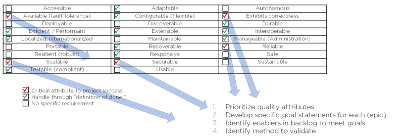
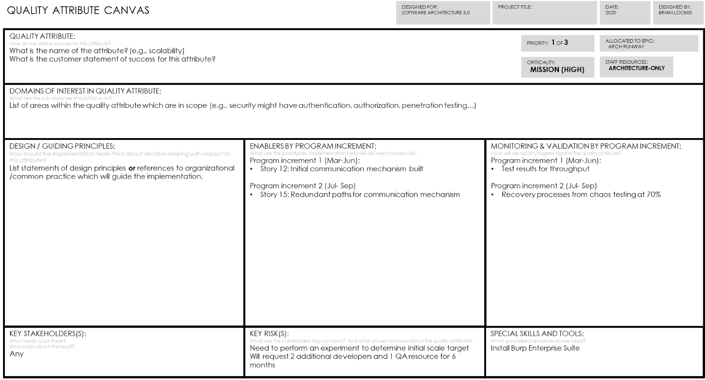
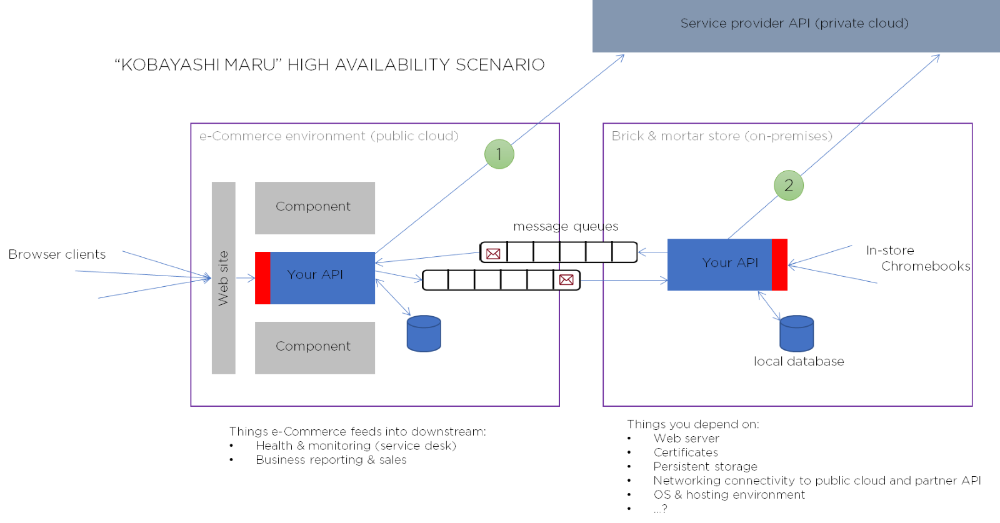

"Quality is never an accident. It is always the result of intelligent effort."

John Ruskin

What are Quality Attributes
===========================

In this article, we will examine design for software quality attributes, aspects of software systems which are visible to the end-consumer throughout the product or service, and usually across multiple (or all) functions.  These are often the most challenging for an architect to implement as they often start as directional statements instead of precisely worded requirements or fully specified functional flows, and require additional/specialized resources to validate.  Quality attributes are often architecturally cross-cutting concerns and may be more critical to stakeholders than even functional requirements (ASRs). 

For example, a functional requirement might be to provide a method for a user to authenticate into a system with their Google credentials, which can translate into an agile story for a particular web page to be developed, logic to perform the authentication against Google API's, and allowing further access into the application: all well-understood terms and easily testable.   

A quality attribute around security might be to prevent malicious code being added to the system through a plug-in developed by another organization^1^.  The set of tasks involved in a simple statement of requirements like this may well be an epic by itself or a large set of enablers in across multiple program increments.  Some stories might involve development of functionality (loading plug-ins), as well as design (confirming the other organization's credentials), testing (penetration testing of the plug-in interface), and the use of security domain-specific tools, for operational hardening or container scanning. 

This article will discuss the general process for naming relevant quality attributes, planning their implementation, and validation of the as-built system to show that we have met the business requirements.  The architect is responsible for defining these quality attributes in detail and developing a plan to address them within the backlog. 

We see examples of quality attributes throughout engineering disciplines -- see the image of the Roman aqueduct above, illustrating a simple and refined design to provide a capability resilient over hundreds of years.  These patterns from other engineering efforts, biology and sciences, and psychology supply analogies we can use as sources of patterns for software development efforts. 

The following table lists a partial set of quality attributes for software projects.  We use the adjective form for most of these, though often they are referred to as "-ilities" as the adjectives often have noun formats with that ending (e.g., accessibility). 

| Accessible  | Adaptable  | Autonomous  |
| Available (fault tolerance)  | Configurable (Flexible)  | Exhibits correctness  |
| Deployable  | Discoverable  | Durable  |
| Efficient / Performant  | Extensible  | Interoperable  |
| Localized, internationalized to culture  | Maintainable  | Manageable (Administration)  |
| Portable  | Recoverable  | Reliable  |
| Resilient (robust)  | Responsive  | Safe  |
| Scalable  | Securable (confidential, data integrity, available)  | Sustainable  |
| Testable (compliant)  | Usable  |   |

In practice 
============

We will show how to get started with analyzing a project for quality attributes and establishing the development effort as part of an architectural runway.  The software architect, by virtue of seeing most of the solution to be developed, can follow a process below for translating quality attribute statements (proto-requirements) into backlog and eventually a system which embodies these values. 

First, we will start by identifying a list of the attributes through conversation and workshops with the primary stakeholders and sponsors of the system.  With this list, we should identify one to five quality attributes which are critical to the system, which we can likely delegate to software developers through our "definition of done" (a shared understanding of how to make decisions and implement any functionality in the system), and which quality attributes are not challenging above standard practice for the project.  In the figure below, we identify five critical quality attributes for performing additional analysis on. 

I*dentifying and prioritizing quality attributes*

Next, we will refine each of these areas into specific goal statements, considering organizational standards, general practice, and program-specific needs.  This involves creating the scope of the epic -- a statement or few sentences defining the measurable outcome desired.  For example, the system should be deployable in both public cloud and private cloud implementations for customers X, Y, and Z.   

Thirdly, we will decompose these statements into design principles and enabler stories in the backlog.  Often these quality attributes will be represented as architectural runway to be initiated by, at least partially executed by, and monitored by the software architect.  The specific tasks may be to develop guidance, a mockup or prototype, or run an architectural "spike" to implement the story.  Often, leading up to the identification of these tasks, questions, risks or key concerns may need to be explored in parallel to the backlog as a series of experiments or alternative analyses. 

Next, we will complete the stories as they are accepted into sprints by identifying the method we will monitor and test the quality attribute in the epic.  Though we will see the quality attribute being fulfilled over multiple sprints, the actual tools, skills used and attainment of value often begins small and becomes more sophisticated over the course of several program increments.  For example, a performance target on one functional path may initially start as one QA team member using a tool like JMeter to verify performance, and by subsequent sprints, this may include developers and external users using a variety of tools across a wide variety of functional paths and with different, realistic mixes of workloads. 

Finally, the architect may need to provide guidance on what should happen in negative scenarios -- that is, how the system recovers from failures to meet the quality attribute.  This is especially important for systems with challenging availability, responsive, secure, and reliability targets. 

Here's how to do it
-------------------

So, if fundamentally, this is only five steps, how hard could it be? 

1.  Identify key quality attributes in a short list and prioritize them
2.  Develop epic scope statements for the top 1-5 quality attributes 
3.  Break these down for each into specific backlog enablers and guidance 
4.  Identify tools involved and method to monitor achievement across the program increments 
5.  Plan for negative scenarios 

Well, the best laid plans rarely survive first contact with the enemy.  This is an analytical strategy that assumes we have very good information about our environment, that the statements can be broken down into tasks which will cover all contingencies in those environments, and that nothing changes by the time we deploy.   

Does that mean that all hope is lost?  No.  But we need to watch a couple things as we go through our development: how our team is maturing to take on increasing levels of detail in the quality attribute domain (human dynamics), and how our measurements of quality reflect the actual operating environment.  We certainly can take advantage of the iterative nature of agile to change and grow throughout the development cycle.  By contrast, prior software development lifecycles often started from the premise that risk could be well understood at the start of an effort.  We may find that we need workshops at multiple points in the development to examine what we've learned about systems availability, or to review an analogous system's design as a possible direction.  In short, we'll tune the engine as we go along and we won't be shy about taking our go-cart off the test track onto the open road. 

For the first steps, we may use a canvas or card like the one shown below to capture our starting point: epic title, principles, enablers (suggested to be put in Backlog or Jira), and monitoring strategy. 

*A quality attribute planning canvas*

In the key risks area, we may propose experiments to understand the attribute better.  These may range from customer interviews, stakeholder consensus building (focused decisions), tradeoff analysis, or even numerical simulation (as in Python, R, Scala or other Monte Carlo techniques). 

Under design principles, we may start with some organizational standards or analogous system behavior, or well published guidance from a subject matter expert.  The software architect should validate the applicability of the guidance (for example, only take rules 1-8 of this expert's guidance on identity management) and translate external guidance into a form which is easily adopted by the project team. 

Filling in the enabler architecture runway also seems deceptively simple, so take a look at the sample below for a security epic for the number of sub-tasks identified through a series of meetings with the team, stakeholders, and outside security consultants on a relatively non-complex development.  This part of the card may involve a series of discussions and prioritization within the epic -- several whiteboards may be erased during the process. 

-   Define operational trust levels (3) for the application 
-   Define secure networking approach 

-   Firewalls and communication pattern monitoring 
-   Inter-site communications over TLS 
-   VPN and second factor for tunnels 
-   Data in flight encrypted from terminal/endpoint to destination service; intermediate services cannot decrypt traffic 

-   Define secure compute platform 

-   API authentication mechanism (user ID's from OAuth, JWT tokens) 
-   API roles and authorization in features 
-   Use of vault for secrets (passwords, certificates, credentials) 

-   Regular rotation of credentials 

-   Antimalware on platform 
-   Hosting platform controls 

-   Define secure storage platform 

-   Selection of a database supporting encrypted columns 
-   Database access controls (user ID's, roles, server-to-server tunnel) 
-   No direct database access (must be through API or components) 
-   Data at rest will be encrypted with XYZ standard; only certain PII will be retained (identify fields) 

-   Application development standards 

-   Code modules signed 
-   Containers and applications scanned 
-   Vulnerability testing plan with external test organization 

-   Integration standards with partners 

-   Regular operational reviews 
-   Rolling passwords 
-   Only certain partner methods in use; 1000-eyes reports from partner 
-   Registered endpoints with back-end partner 
-   Written standards for integration 

The monitoring and testing of the attributes goes through a series of maturity steps as the environment becomes more realistic.  For instance, we may start with virtual machines in an easily obtained environment to evaluate a first prototype.  Our testing may be limited to throughput on a performance aspect of the solution, testing whether the core algorithm or workflow is workable (in the right ballpark).  We may move to a second environment where we are distributed on different types of hardware that our customer may have; again, we will measure our performance attribute and may introduce other scenarios like diversity of workloads representative of the "real world."  Finally, we may get close to go-live with a pre-production replica in the customer's environment for more testing, adding the negative conditions -- timing interactions or other hard-to-simulate tests.   

Each environment may have its own tools, goals of testing, and resources assigned as we zero in on the quality attribute.  One of the references below points out the difference between software quality as compared to the construction of a bridge.  The civil engineer would be remiss if s/he did not initially plan for ten vehicles weighing half a ton each going at 60 MPH over the bridge simultaneously.  The sponsors of the bridge might not have trust in the architect if, after half of the construction had elapsed, it was found that the bridge would only support a handful of bicycles! Similarly, the software architect needs to have the end quality in mind while the implementation is going ahead and be mindful to evaluate in realistic environments.   

The architect or product owner should identify the method and regular reporting structure for how the system is meeting the quality attribute.  For example, a metric of number of websites certified out of a total population might be appropriate for a weekly status meeting on accessibility. 

Why do they matter to the architect?
====================================

Quality attributes are an area heavily influenced by our experience and ability to question what the attribute means in the context of its workload and external environment.  Many systems may **not** have stringent quality attributes initially or ever, which means that the practicing architect may have to seek out scenarios to learn and practice the skills of managing them.  The architect needs to make a good faith professional effort to understand and design for quality attributes expressed by the customer.   

QA failures happen in *all* organizations -- large ones with many resources and well-known names, ones with very smart technology architects, through to small organizations with big responsibilities.  When systems are moved into environments they were not designed for, or a quality attribute previously thought not important enough to design becomes acute, the results are often dramatic: 

-   Security failures leading to loss of revenue, loss of personal information or intellectual property, and breach of customer trust 
-   Accessibility failures leading to compliance violations and lost customers 
-   Safety failures in medical, aircraft and manufacturing equipment leading to loss of life or injury 
-   Performance failures on public sector web sites leading to inaccessible benefits 
-   Availability and reliability failures leading to late payment reconciliation, or worse all-night operational troubleshooting situations (yeah, you've been on those calls)! 

Certain quality attributes may seem to pair well together -- for example, reliability and availability -- while others may have natural tension between them: usability and security.  Some may have specific compliance requirements while others may be quality observations made by an actual or persona-driven customer.  Quality attributes are some of the most difficult system aspects for a software architect to balance. 

Quality attributes -- also known as software quality attributes/analysis (SQA) in the literature -- were broadly analyzed in the 1980's and 1990's but have recently become dormant in the practicing software architecture communities.  Combined with the complex layers of abstraction and platforms in modern software architecture, quality attributes are increasingly more difficult to specify, build and validate in systems.  Even evolutionary architecture talks about system fitness functions but leaves this to the practitioner to define.  Hopefully this article contributes to restarting the dialog between architects on how to improve overall software quality and moving it from an art to -- if not a science -- a practice and set of accountabilities software consumers can count on. 

A case study: an impossible situation
-------------------------------------

This section describes a case study for further practice with the concepts in this article.   

Let us say we are building a component which will be part of an eCommerce solution for a large retailer.  This component is called by other components, and only needs to make one function call out to a downstream service provider to re-order additional merchandise when stock gets low.  The retailer has an eCommerce web site, which will call into your API component, and some Chromebooks with customer service representatives in each of their 1,000 stores in North America.   

Both of these environments are displayed in the figure below.  In order to keep track of stock levels, each instance of your component (in-store and in the public cloud web site environment) keeps a small database, and any in-store component can talk to the eCommerce component via message queues.  The circles marked (1) and (2) are the "simple" function calls out to your re-order stock provider.  The only requirement functionally is that, if the in-store component calls the provider along path 2, that it also sends the same message to the eCommerce site to update the master stock quantity for all stores. 

The business sponsor says that your component needs to be 99.99% available (~53 minutes of unplanned downtime per year).  The two red boxes show where this availability is required -- where the clients call in to your API component in each environment. 

*Example system under analysis for high availability* 

In addition to listing some of the hidden dependencies in our solution (lower right) -- certificates that may expire, a Kubernetes host environment that might restart our program, hardware that might fail, networking connections which might be unavailable -- we must predict some of the threats to availability from our environment such as client disconnects, service provider being down, or even a store being destroyed by natural disaster.  We may have to do "chaos" testing -- knocking out pieces of the system randomly, to simulate failures.  To identify what happens as a result of each of these losses of capabilities, we will have to restore operations through architected use of retry logic, transactions, guaranteed persistence mechanisms (quorum), etc. -- even for a 2-node system like this.  Our business sponsor should certainly be made aware of the increased resources, costs, and complexity from the simple, initial statement! 

Next steps
==========

What are the pitfalls
---------------------

We have identified five primary pitfalls to successfully architecting quality attributes: 

1.  Edge conditions may not be obvious -- brainstorm and use the team's and the customers' experiences to build a list of tests or failure modes periodically 
2.  The gap between the test environment and the target (real-world) environment may miss some characteristics or it may be impossible to test situations without having the target environment 
3.  The conditions or definition of the attribute may change over time, revisit it on a periodic basis 
4.  The team may not have resources needed to implement the complete attribute scope, and  
5.  Decisions made inside the team may not be visible to the architect -- a developer may implement a feature in a certain way that detracts from quality and the impact may not be seen until later.  Agile refactoring and regular peer reviews can help catch these earlier. 

See also (other BTABOK articles):
---------------------------------

-   [Requirements](requirements.md){:target="_blank"}, elicitation 
-   Residual [design](design.md){:target="_blank"}, evolutionary architecture 
-   Testing [strategies](strategy.md){:target="_blank"}
-   [Agile process](agility.md){:target="_blank"}, architectural runway 

References and Further Reading
==============================

For quality attributes, please take a look at the following examples and sources:\
**Wikipedia list of QA's**\
<https://en.wikipedia.org/wiki/List_of_system_quality_attributes>\
and another perspective\
<http://www.softwarearchitectures.com/qa.html>  

**A short list of QA definitions**\
<https://medium.com/@nvashanin/quality-attributes-in-software-architecture-3844ea482732>\
A longer description by SEI on quality attributes\
<https://resources.sei.cmu.edu/asset_files/TechnicalReport/1995_005_001_16427.pdf>\
and the American Society for Quality\
<https://asq.org/quality-resources/software-quality>  

**Some questions to ask during QA elicitation**\
<https://flylib.com/books/en/2.843.1.40/1/>\
<https://docs.microsoft.com/en-us/previous-versions/bb402962(v=msdn.10)?redirectedfrom=MSDN>\
<http://www.guidanceshare.com/wiki/Application_Architecture_Guide_-_Chapter_7_-_Quality_Attributes>  

**Many articles exist on software performance engineering, including **\
<http://www.spe-ed.com/classic-site/papers/bestprac.pdf>\
<http://www.perfeng.com/papers/rtuml.pdf>  

**Examples of quality attribute failures are listed regularly**\
<https://www.computerworld.com/article/3412197/top-software-failures-in-recent-history.html>\
<https://www.tricentis.com/blog/real-life-examples-of-software-development-failures/>\
<https://www.cigniti.com/blog/37-software-failures-inadequate-software-testing/>\
<https://www.functionize.com/blog/worst-of-the-worst-the-biggest-software-fails-in-recent-memory/>\
<https://medium.com/fast-company/twitters-big-hack-raises-red-flags-in-political-circles-ahead-of-november-1fa303bfc72b>  

**Traditional availability calculations**\
<https://en.wikipedia.org/wiki/Availability>\
<http://www.eventhelix.com/RealtimeMantra/FaultHandling/system_reliability_availability.htm>\
and reliability analysis\
<https://en.wikipedia.org/wiki/Reliability_block_diagram>\
<http://www.eventhelix.com/RealtimeMantra/FaultHandling/reliability_availability_basics.htm>\
and fault tolerance\
<https://en.wikipedia.org/wiki/Fault_tolerance>  

**Security approaches under OWASP **\
<https://blog.threatpress.com/security-design-principles-owasp/>  

**Usability as well is a broad domain**\
<https://en.wikipedia.org/wiki/Usability>  

Standards which apply to quality attributes: IEEE 1061, ISO 9126, ISO 42010 

"Chaos" testing or deliberately removing parts of the running system to see how it reacts are a characteristic of residual systems theory, a part of complexity theory which we do not have time to discuss here but would encourage the reader to check back on this emerging trend. 

BTABoK 3.0 by [IASA](https://iasaglobal.org/) is licensed under a [Creative Commons Attribution-NonCommercial 4.0 International License](http://creativecommons.org/licenses/by-nc/4.0/). Based on a work at <https://btabok.iasaglobal.org/>