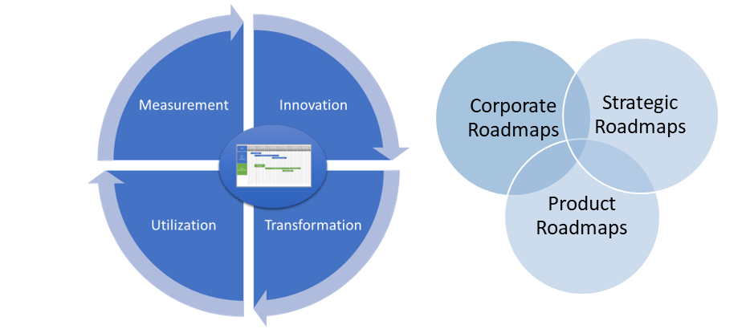
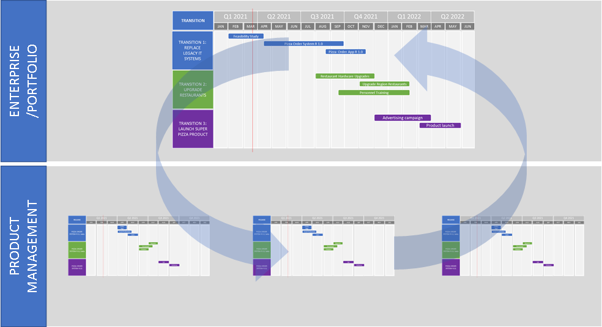
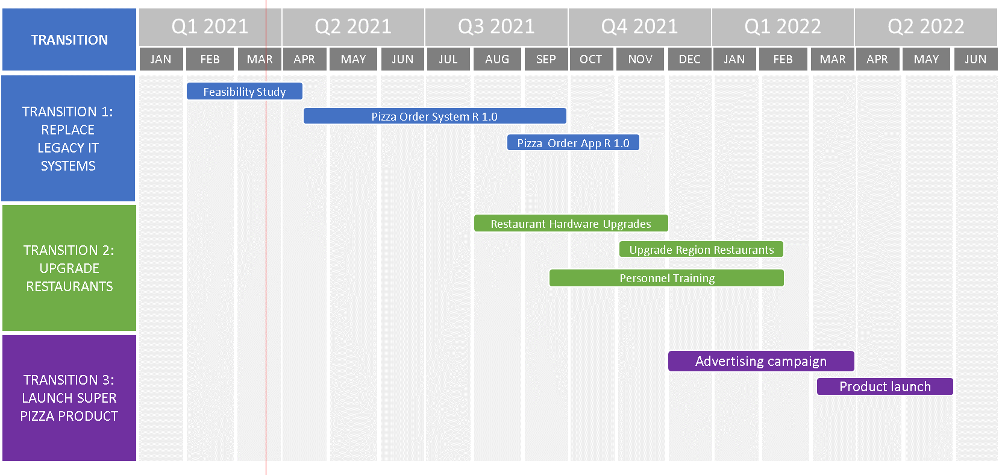
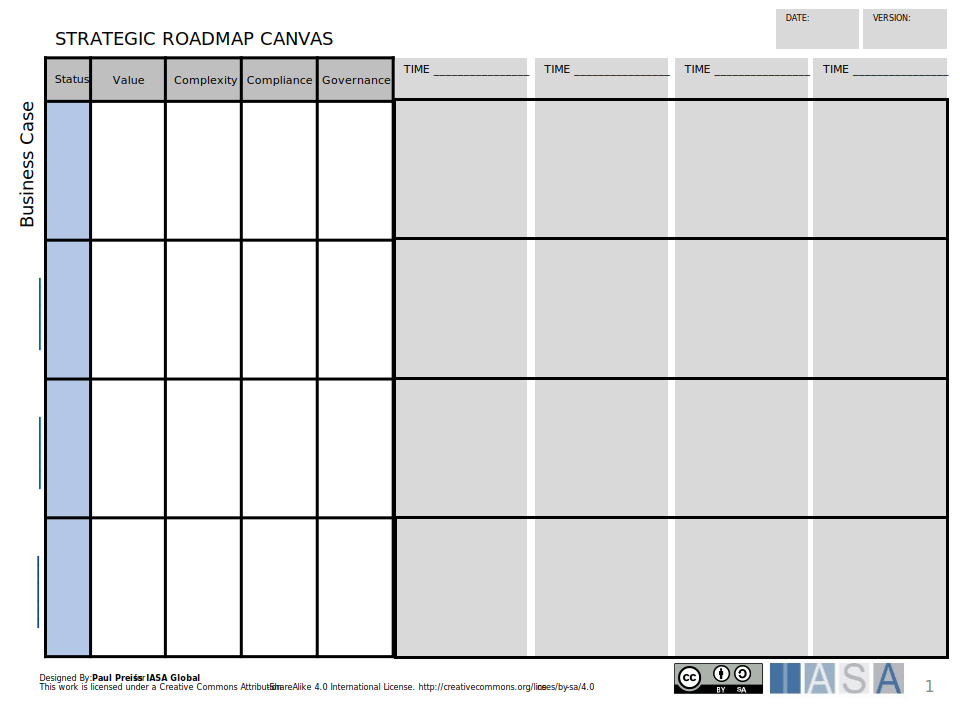
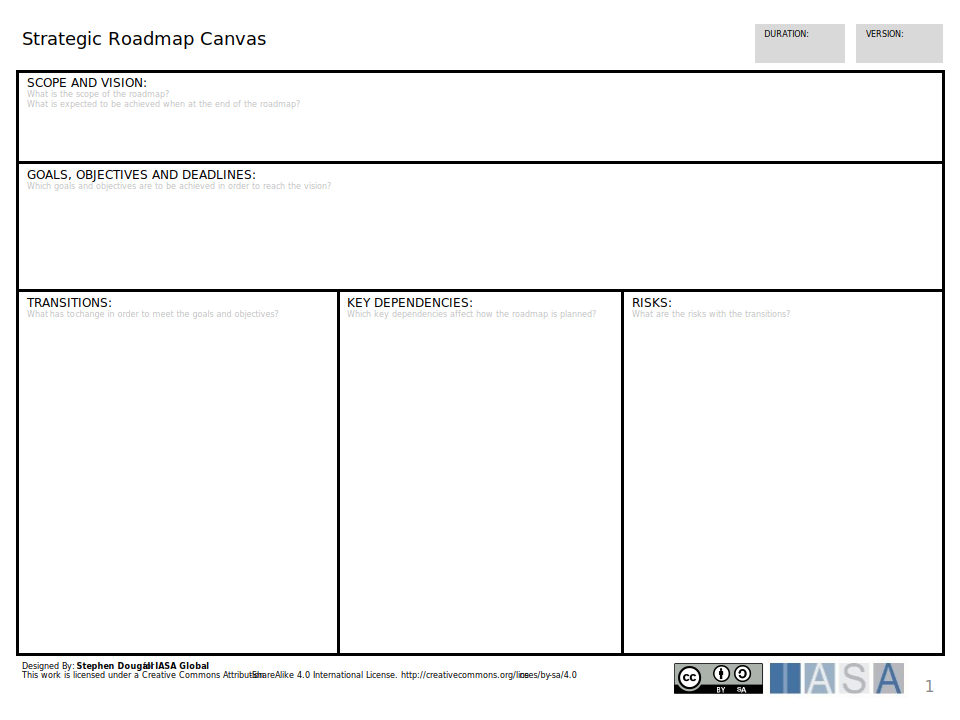
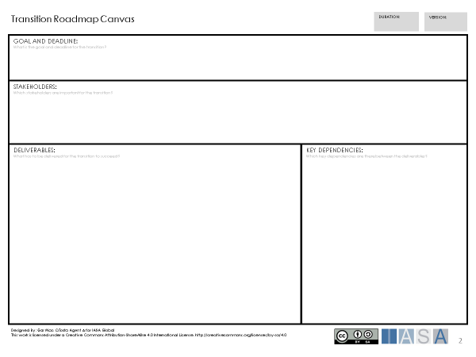
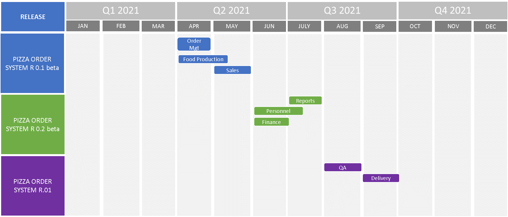
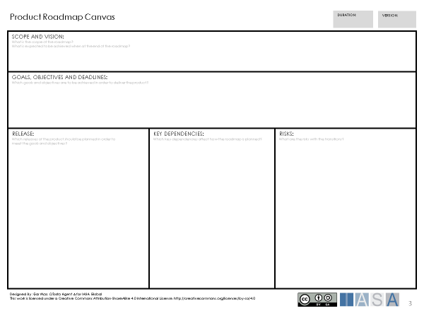
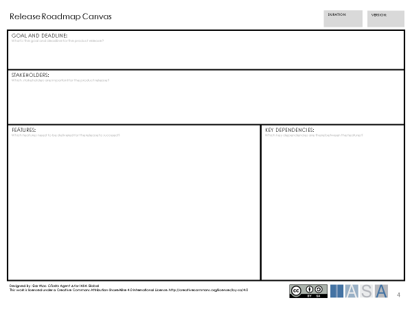

> "A plan for how to achieve something"
> **Cambridge Dictionary**

# What is a Roadmap

A roadmap is a visual description which shows a plan against time for achieving one or more goals or objectives. It is used to plan large
activities which deliver value to the enterprise. The roadmap can be used to synchronize [deliverables](deliverables.md){:target="_blank"} with important events and uncover important dependencies between deliverables.

 

Roadmaps are primarily used in the [Innovation](innovate.md){:target="_blank"} and [Transformation](transform.md){:target="_blank"} stages in the engagement model. Under the innovation stage the roadmap can be used to plan and assess feasibility of new initiatives and plan against existing initiatives. Under the transformation the roadmap can be used to track and update the progress of deliverables in work. The [Utilization](utilize.md){:target="_blank"} and [Measurement](measures.md){:target="_blank"} stages provide experience and feedback which
may alter the future planning on the roadmap.

Roadmaps are used broadly in business for many purposes but this article focuses on strategic roadmaps and product development roadmaps.

# Why we need Roadmaps

Assignment on the engagement model provides a way of identifying, assigning and prioritizing business initiatives. The roadmap provides a
way to plan these initiatives over time.

Roadmaps are important as they provide a common understanding for stakeholders regarding the current status of a business initiative and
also a broad plan for future deliverables, goals and objectives. Having a common understanding means that stakeholders will not only be pulling
together in the right direction using the business vision and [strategy](strategy.md){:target="_blank"}, but also coordinating the timing and
dependencies of deliverables.

Visualizing the dependencies between the deliverables significantly reduces the risk for deliverables being blocked by other
[deliverables](deliverables.md){:target="_blank"} , and supports the ability of stakeholders to prioritize deliverables.

The roadmap also gives a framework for making broad estimations regarding budget and resources, this can be used to assess the
feasibility of a business initiative before detailed planning starts.
This avoids spending valuable resources on detail planning of initiatives which lack business feasibility.

Being able to monitor progress and show that an initiative is moving forward is a highly motivating factor for [stakeholders](stakeholders.md){:target="_blank"}. The roadmap provides a tool which shows on a long-term scale how much progress has been made as deliverables are completed, as well as providing a view of the next deliverables to be addressed.

Roadmaps are important for the architect as they provide direction for the architecture against time. This allows the architect to balance
architectural decisions against which can be achieved in the given time period. Roadmaps are also a tool for the architect to communicate the
consequences of alternative architecture decisions. For example, delivering on a shorter time period may result in a compromise on
quality or features, but may be required for other business initiatives.
Alternatively extending the time period will allow for better quality or features but results in the delay of other business initiatives.

# Roadmap Approach

The following are some key principles which can help in developing good roadmaps.

## Make the scope of the roadmap clear

It is important for those who are developing the roadmap to have a common understanding of the roadmap [scope](scope_context.md){:target="_blank"}. This provides the boundaries for the changes to the enterprise that the roadmap will address. The scope provides an understanding for what is included in the roadmap but importantly also provides the basis for what should not be included. Having a clearly defined scope provides focus for all stakeholders and reduces the risks for misunderstanding.

## Business centric planning

The roadmap is defined by the business with the customer or market in focus and is a plan for how to achieve something of value to the
business. In the value model the [Objectives](objectives.md){:target="_blank"} and the [Business Case](../structured_canvases/business_case_sc.md){:target="_blank"} provide the drivers for goals and the objectives on the roadmap. The [operating model](operatingmodel.md){:target="_blank"} provides [Assignment](strategy.md){:target="_blank"}(assignment.md){:target="_blank"} for the initiatives that are prioritized for work and the the roadmap provides the time plan for when initiatives can be achieved.

Items on a roadmap should clearly contribute to partly or completely meeting a goal or objective which provides value for the enterprise. If
the item is not related to a roadmap [objective](objectives.md){:target="_blank"} or objective then the item may be out of the roadmap scope. On the roadmap it may be that many items contribute to the same goal or objective, and that one item can contribute to many goals and objectives.

## A Roadmap is long term

A roadmap is used as a basis for long term planning. This gives stakeholders a view of what is coming down the line and usually details significantly large changes. For long term planning a broad timeline is used which shows years, quarters and months, where months are the lowest unit of time.

## A Roadmap is not a project plan

A roadmap is used for planning large units of change which are driven against goals and objects. When planning a roadmap importance is placed
on what is to be done, and not how it is to be done. The roadmap does not consider detailed activities or resources. The roadmap details the
plan for what needs to be done and project plans (or other detailed plans) may be used to assess if items on the roadmap are feasible.
However, if the roadmap is not feasible then actions need to be taken to change the roadmap, or the change how deliverables on the roadmap are
planned (for example, increase resources, increase productivity, consider quality levels).

# Working with Roadmaps

Roadmaps are adaptable and can be applied to different scenarios and visualized in different formats. However roadmaps should at least have
the following common attributes.

**Scope** **and Vision**

The roadmap makes clear the scope that is being address, for example, a business area, a specific business initiative or perhaps a product. The
scope may include the vision and time period for the roadmap. The scope also determines timescale of the roadmap. A roadmap is a long-term plan
and the timescale of the roadmap determines the level of detail in the planning. Roadmaps are commonly scaled to years, quarters or months.

**Goals and objectives**

Each deliverable on the roadmap should have a clear goal or objective which will be met once the deliverable is completed.

**Deliverables**

Deliverables are the items on the roadmap which have a start date and an end date. A deliverable indicates something that will be achieved which
contributes to a stated goal or objective, for example a release of a software product, a skills enhancement package or a combination of a
series of deliverable packaged in a transition.

# Overview of Strategic and Product Roadmaps

In the following sections a description is given of how to work in practice with Strategic Roadmaps and Product Development Roadmaps. In
order to place these in context it is important to understand the relationship between these two types of roadmap.

 

Strategic roadmaps are concerned with planning change in enterprises or large portfolios of products and have a broad scope. These roadmaps are
aim at an audience of senior business persons in the organization. Within the strategic roadmap there are a number of deliverables which
are linked to product development. This provides the link between the strategic roadmap and each of the product development roadmaps within an
organization. This provides a cycle of information where changes in the strategic roadmap affect the product roadmaps and a change in a product
roadmap may affect the strategic roadmap. By effectively managing the strategic and product development roadmaps risks, consequences and
dependencies can discovered at an early stage and managed to reduce negative effects.

# Strategic Roadmaps

When working with strategic roadmaps we often require planning of a series of large deliverables in order to meet a strategic objective or
goal. Examples of such deliverables can be changes to the enterprise, business or infrastructure architectures. The strategic roadmap is
driven by the Strategy and Assignment in the engagement model, these provide the basis for creating transitions.

In order to organize strategic roadmaps, we can refer to a change as a Transition.

> "A change from one form to another, or the process by which thishappens"
> **Transition, Cambridge Dictionary**

A single Transition states clearly the goal or objective
to be satisfied as well as a broad description of the required change.
The Transition should itself contain a number of deliverables which are
required in order to perform the transition from the initial state to
the desired state. The initial state of the Transition may be expressed
by a baseline architecture while the desired state may be expressed by a
target architecture. Where there are a number of Transitions planned to
meet a target architecture, transition architectures may be described
for each Transition.

This diagram below uses a fictional pizza company as an example where
the roadmap shows the transitions required to launch a new Super Pizza
product.

Deliverables which are part of the Transition can take different forms
depending on the kind of change enterprise is going through. The
following are some examples of deliverables which are commonly found in
a Transition:

- business capability

- organization

- skills and competency development

- product releases

- IT infrastructure

# Working with a Strategic Roadmap

Planning a strategic roadmap starts with the [stakeholders](stakeholders.md){:target="_blank"}
who are responsible for the vision and scope of the initiative. These
stakeholders may form a steering committee for the initiative, and call
in other key stakeholders to support the creation of the roadmap.

Creating the initial roadmap is challenging as the vision and scope need
to be collectively agreed upon by the stakeholders. The goals and
objectives need to be defined and the transitions detailed. There may be
a large number of stakeholders with opinions regarding the strategy and
direction, and while there are many ways in which to construct a
roadmap, the following method may provide support.

## Building a Strategic Roadmap

The initiatives ongoing and upcoming are often displayed on a strategic roadmap. The primary information necessary to create one is based on the business case of the initiative (see investment planning) but also is included in the product roadmaps below. The goal of this is to align architects on the working direction of initiatives in terms of their importance and dependencies. The initial strategic roadmap often looks like a set of initiatives ([products/projects](product_project.md)) that are lined up on a timeline. 

There are two possible approaches to creating strategic roadmaps. In the first, a team of architects uses initiatives either in flight or coming up in the future and structures them according to strategic importance and dependencies, then breaks them down further into product roadmaps. In the other, a broader set of stakeholders is put together to structure objectives and goals into a set of transitions. 

### Workshop 1: Initiatives Strategy and Dependencies

This workshop is one of the first that architects use to better understand the relationship between technology work on-going, business drivers, and dependencies between initiatives. The strategic roadmap canvas can be used to create these interdependencies. 

#### Step 1: Preparing the Workshop

To run the strategic roadmap canvas workshop, first, bring all architects (or those involved in this area of business) together. Make sure it includes business, enterprise, solution, and any other types of architects interested but especially business and solution. 

Materials Needed for the Workshop:

- Business Cases for Initiatives: The best case would be to have lean business cases for each initiative to be considered. These should be no more than one page if possible. Use the [NABC method](../structured_canvases/business_case_nabc_card.md) from the BTABoK or Lean Business Case from agile frameworks if possible. 

- Strategic Roadmap Canvas: Have the business cases added to a version of the canvas or use a Sroad mapping tool. 

- Sticky Notes and Voting Cards: Using voting dots or sticky notes can radically simplify the process and help time-box the activity. 

Make sure each architect has had a chance to read and review the business cases privately before entering or starting step two. This way all architects are aware of the activities and initiatives coming up. 

#### Step 2: Rating and Prioritizing

In this portion of the workshop the initiatives are ranked according to a) their stated value and b) their perceived architectural complexity. While doing this describe any potential governance issues (such as external audits) or risks the initiative might face. 

> Architectural Complexity Note:
> 
> It is easiest to use a number from 1 - 10 with 10 being the most complex initiative the organization could EVER do. A retail company will have a much different level of complexity for things than a nuclear power facility. So this process will get architects used to rating systems and a shared basis for evaluations. If necessary use the checklist items from the Architecturally Significant Requirements card as the categories of complexity then map to a 1-10 figure, but often just letting people free-style creates wonderful conversation. 

Every architect in the workshop should have an equal opinion about the rankings and value of the project, no matter their specialization or seniority. This equality makes architect's opinions matter and empowers people to disagree. The debates should be handled with differing opinions given a timeframe to voice their reasoning and then a shared number declared. It is important not to devolve into getting the same perfect number or solution from everyone but use an averaging system to move the workshop along. 

#### Step 3: Finding Dependencies, Recommending Splinter Initiatives

In the final step of the workshop the architects work together to line up the initiatives on the timeline based on importance and target release dates. From this they should look for shared dependencies and shared capabilities, goals, or enabling technical services. For example, most solutions have an authentication and authorization requirement. This can be identified as a shared dependency and then implemented in the first initiative with the other depending on it. Optionally larger dependencies can be rolled out into a separate initiative or group effort so that the architects are depending on an enablement sprint or activity equally. 

### Workshop 2: Strategic Goals and Objectives Workshop

The second workshop is more of a business exploration workshop and is very valuable in describing how [capabilities ](business_capabilities.md)should be changed and managed. This workshop helps to define the relationship between transitions, the changes needed, and the goals of the transitions. 

**Step 1**

A workshop is held for the key stakeholders who have a broad knowledge of
the business which is affected by the change to the enterprise. The
workshop can be held for a maximum of a single day with 4-9
stakeholders. Larger groups of stakeholders will mean more effort in
communication and reaching decisions, this reduces the likelihood of the
workshop succeeding. A recommendation is to set a timeline of no more
than 3 years for the roadmap.

The following Strategic Roadmap Card can be used to support the
workshop. A simple method that can be used is to pin the canvas to the
wall and throughout the workshop, stakeholders can use sticky notes to
add information to the canvas.

The following describes a process that may be used to formulate the transitions in a roadmap.

1. Formulate the Scope and Vision
   The stakeholders who are responsible for the initiative should
   describe the scope and vision. Other stakeholders at the workshop
   have the opportunity to comment and suggest changes. The scope and
   vision are formulated in a way that all stakeholders agree on.

2. Define the Goals, Objectives, and Deadlines
   The stakeholders define important goals and objectives which shall
   be met by the initiative. These goals and objectives shall adhere to
   the scope and vision and are given expected delivery dates or
   deadlines.

3. Define the transitions
   The stakeholders start to define the major changes which are needed
   to transform the business into a state which will meet the vision.
   Each transition should contribute partly or completely to the
   achievement of the defined goals and objectives. As the transitions
   are defined stakeholders can also note key dependencies for the
   transitions and any risks that are identified.

The result of the workshop is information structured on the canvas which
can be used to create a broad roadmap plotting the transitions required
to achieve the goals and the objectives.

**Step 2: Transitions Workshops**

Using the transitions from the Strategic Roadmap Canvas, key
stakeholders are called to a series of transition workshops where each
workshop focuses on a single transition. Similar to the Strategic
Workshop, the recommended number of stakeholders is 4-9 persons. The
transition workshop is held for a period of 2-4 hours depending on the
complexity of the transition.

The following canvas can support the workshop by placing the canvas on a
wall where the stakeholders can visualize the details of the transition.
A recommendation is to use sticky notes method.

The following describes a process which may be used to formulate the
details of a transition in a roadmap.

1. Using the results from the Strategic Roadmap Workshop state the goal
   and deadline of the transition, and then refine this as required to
   gain agreement from the key stakeholders.

2. Define the stakeholders in the enterprise who are likely to be
   affected by the transition. This will aid communication of the
   roadmap and identify stakeholders who may actively affect the
   roadmap.

3. Consider the details of the transition and changes which will occur
   in the transition. Express these in terms of deliverables. Some
   examples of deliverables are, changes to the business process,
   training, software release or infrastructure upgrades. Each
   deliverable should be detailed with a start and delivery date.

4. Consider the dependencies between deliverables which will affect how
   the roadmap is planned.

During the workshop the different areas of the canvas may be revisited,
for example new stakeholders may be uncovered when considering
deliverables, or new deliverables may be uncovered when considering key
dependencies.

The result of the workshop is detailed deliverables which can be added
to the roadmap using key dependencies to prioritize the deliverables.
The detailing of stakeholders also helps to form an organization for
communication of the roadmap and reporting channels for information.

# Product Development Roadmaps

Product development roadmaps are used for long term planning of a single
specific product. Product development roadmaps are focused on releases,
features and events. A release is a version of the product
which contains a set of features that can be delivered to stakeholders.
Each release has a clear scope, stakeholders, goals and objectives. If
the release is part of a Transition these may already be defined in the
Transition Roadmap Canvas.

The Product Roadmap Canvas helps to organize the product releases into layers of organized components. The layers are events, which represent outcomes in the product, business visible components such as features and the underlying enabling technology. For example, we might have Oauth available after two weeks (technology), then build a login screen (business) and then show an event of login available as an event. 

{:target="_blank"}

*"A product release is the process of launching a new product for a
specific market or user base. In software development, a product release
is sometimes done with a beta version so that core developers/users can
assist with debugging and feedback prior to the release of the actual
software."* -- **Definition of Product Release**, **www.techopedia.com**

The product development roadmap provides a common plan and direction for
product management and the development teams. Major releases may appear
as deliverables on a strategic roadmap, this provides alignment with
stakeholders working with the enterprise strategy.

*"A function of an item which is capable of gratifying a particular
consumer need and is hence seen as a benefit of owning the item."* --
**Definition of Feature,** **www.businessdictionary.com**

Each release on the roadmap contains a set of features. Features in the roadmap are deliverables within a release and provide a way for product management and the development team to organize and prioritize the content of a release. A feature is a substantially large function which partly or completely fulfils a requirement on the product. In agile methods a feature is often defined as an Epic. Releases may also contain major events in the development cycle such as final QA ([quality assurance](quality_assurance.md){:target="_blank"}) or delivery.

The diagram below illustrates a fictional roadmap for the Pizza Order System previously described in the example strategic roadmap. It shows
the features and events related to each release.

The product development roadmap provides the basis for detailed planning. This gives a framework for product management and the development teams to plan activities, resources and budgets in detailed plans.

# Working with a Product Roadmap

The planning of a Product Roadmap begins with the Product Management stakeholders. Product Management stakeholders provide the link between
the deliverable in the Strategic Roadmap and the more detailed planning which gives the Development Team scope and direction.

When starting a new product development or in the event of major product changes the following method may support the creation of a Product
Roadmap.

**Step 1: Product Planning** **Workshop**

In order to plan the roadmap, the Product Management stakeholders call key stakeholders to a workshop. The workshop may be held for 2-4 hours
and the number of stakeholders should be between 4-9 persons. As a recommendation, set a timeline of no more than 2 years for the roadmap.

As an input to the workshop a number of product releases may already be defined in the Strategic Roadmap as deliverables to transitions.
However, it is also reasonable to expect that releases may be planned which are not connected to a transition.

The following Product Roadmap Canvas can be used to support the workshop. The canvas can be pinned to the wall and sticky notes used to
visualize information on the canvas.

The following describes a process which may be used to formulate the product roadmap.

1. The Product Management stakeholders describe the scope and vision for the product. This sets the context for content and features.
   This is important to ensure that only relevant features are placed in the product. Scope and vision for the product is refined until
   key stakeholders are in agreement.

2. Product Management and key stakeholders then define the goals and objectives for the product, observing the scope and vision. The
   goals and objectives for the product may be associated with goals and objectives in the Strategic Roadmap. Deadlines should be given
   for each goal or objective.

3. Releases are then planned from the goals and the objectives on the product. A broad description of the content of the release is given.
   As the releases are discussed key dependencies between releases may be identified as well as risks.

The result of this workshop acts as input for creating releases on the roadmap. Each release can be planned to a deadline and have a clear goal
or objective. Key dependencies aid the prioritization of releases on the timeline, while mitigation can start on identified risks.

**Step 2: Release Planning Workshop**

After the Product Planning Workshop, a roadmap now shows the planned releases for the product, with goals, objectives and deadlines. The next
challenge for Product Management stakeholders is to plan the development of features in a release.

This involves Project Management stakeholders and the Development Teams. How this planning takes place depends very much on the product
development method. Some products run release cycles of from 6 months to 1 year, others have a release cycle of 6 weeks, some releases run in
parallel. This affects the way the product releases are planned and how Release Planning workshops will be used.

The aim of the Release Planning Workshop is to involve the Project Management stakeholders and the Development Teams in planning the
features for a single release.

The following Release Roadmap Canvas can be used to support the workshop. As with the other workshops the canvas can be pinned to the
wall and sticky notes used to visualize information on the canvas.

{:target="_blank"}

The following process may be used to formulate a release.

1. The Product Management stakeholders state the goal and deadline for the release.

2. The Product Management stakeholders and Development Team identify stakeholders that have a vested interest in the value the release provides. These are stakeholders who will benefit from the release.

3. The Product Management stakeholders and Development Team define the features of the release. These may be based on an existing requirements specification, or they may be an initiative of the team. Features are aligned with the goal of the release and provide a stated value and should have a deadline.

4. Key dependencies between features are identified by the team.

The result of the workshop is a series of features which can be plotted on the Product Development Roadmap according to deadlines and with
respect to key dependencies.

# References and further reading

**UK Government**
[UK Government](https://www.gov.uk/service-manual/agile-delivery/developing-a-roadmap){:target="_blank"}

**TOGAF ( section 32.2.7)**
[TOGAF](https://pubs.opengroup.org/architecture/togaf9-doc/arch/chap32.html#tag_32_02_07){:target="_blank"}

**Roman Pichler**
[Roman Pichler](https://www.romanpichler.com/blog/category/product-roadmap/){:target="_blank"}

BTABoK 3.0 by [IASA](https://iasaglobal.org/) is licensed under a [Creative Commons Attribution-NonCommercial 4.0 International License](http://creativecommons.org/licenses/by-nc/4.0/). Based on a work at [https://btabok.iasaglobal.org/](https://btabok.iasaglobal.org/)
