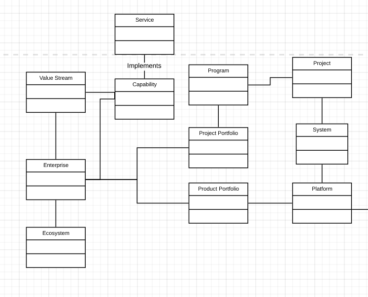
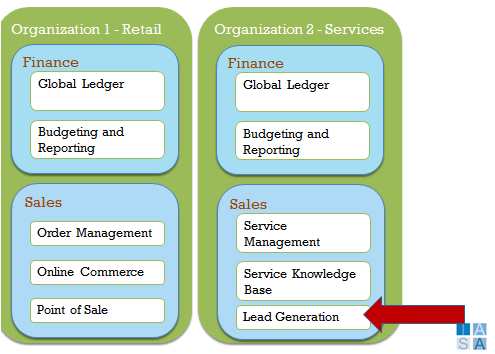
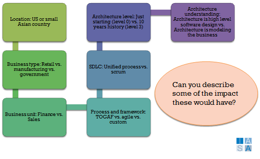

"I saw in details while she saw in scope. Not seeing the scope is why I am here and she is not. I took each element spearately and never looked to see that they never did fit together properly."

Erin Morgenstern, The Night Circus

Scope and context are the dual sides of understanding an architecture engagement based on its level of impact and the environment within which it occurs. The clarity of scope and context can save an architect or a team a great deal and are as important as any document or technology technique. Without them the architect

In architecture, scope refers to the amount of business technology strategy impacted by the set of architectural decisions made. Architecture context refers to the surrounding influencers on the set of decisions.

For architecture to be successful it must be effective in both the scope it engages in as well as the contexts in which it occurs. This means that the architecture team must make clear scoping decisions about its engagement.

Levels of Scope in the BTABoK 
-----------------------------

The BTABoK contains many references to scope. The following diagram depicts the relationships within the meta-model and the glossary defines them for their use in practice.

| **Scope** | **Definition** |
| --- | --- |
| Ecosystem | The [ecosystem](ecosystem.md){:target="_blank"} is the surrounding and connected environment to the enterprise. It includes partners, competitors, suppliers, regulators, customers and other participants which directly influence the health and activities of the enterprise. |
| Enterprise | The enterprise or organization is the entirety of the company or legal entity. It includes all forms of business and organizational models. |
| Value Stream | [Value streams](value_streams.md){:target="_blank"} allow the team to organize around customer or constituent facing flows through the organization. Beyond portfolio they are becoming extremely common methods of organizing work and architecture practice. |
| Domain | Domain scope has been a loose term and is often also used in conjunction or as a synonym for platform. The domain scope is used to denote a depth area of technical or business. Thus there may be a focus on the data domain, the integration domain or the security domain or the accounting domain.   |
| Capability | Capability scope are all of the elements including in a business capability or a service as defined in the itabok. They are the 2^nd^ and 3^rd^ level activities that a company executes to perform its mission. |
| Application/Product Portfolio | The product portfolio contains the applications, products and tools within the enterprise. This is most commonly used to understand the number of customer, purchased or rented products the enterprise uses to deliver its mission. |
| Project Portfolio | The project portfolio contains the current and future work streams or change projects for the enterprise. It may overlap the product portfolio in custom applications by aligning with a teams work product. |
| Program | A program is a grouping of teams or projects into a similar or linked group of work. Programs are contained within portfolios. |
| Service | A business service is an implementation of a capability at similar levels of scope. A technical service is at the same level of scope as a product/project. |
| Product/Project | Products and projects are used synonymously within a group of architects when they apply team dynamics to its delivery. The project is the grouping of work to be done and the product is the output. |
| Implementation/Code | The lowest level of scope is related to code or implementation levels. At this level the architect or team is dealing with patterns, structural concerns, quality attributes, code quality and similar concerns. |

Context
-------

Context is "The set of circumstances or facts that surround a particular event, situation, etc."

Put in the architecture context, this is the primary set of circumstances or facts that affect the nature and execution of architects within an organization. Things that affect context can generally be classified using a matrix of influences such as business size, type, and business unit. For example, large financial institutions tend to have certain character-of-architecture context when compared with similarly sized retail organizations.

Additional contextual influences are location, including geography, language, and culture; process; framework and SDLC levels; and current architecture level as well as understanding. Because context affects everything about architecture internally, it is important to accurately map these influencers when considering an engagement model.

-   Business size
-   Business type
-   Business unit
-   Location---geography, language, culture
-   Process and framework
-   SDLC
-   Architecture level
-   Architecture understanding
-   Context has an impact on architecture capability and role

Here's an example mapping of an organization's context.

-   The difference between a US- or small Asian country--based business
-   A retail versus a manufacturing company
-   A finance-related business unit versus sales
-   A TOGAF versus Agile process
-   Unified process versus Agile SDLC
-   A company that is just starting to understand and use architecture versus one with ten years of history

Let's look at this a little closer. Most companies have very similar operations and business units. They have a finance group that handles the global ledger, accounting, budgeting, and reporting.

There will be some differences based on their organization type. However the sales group may differ drastically The architect will have to understand where you fit into this equation. Are you externally or internally focused? Service firms often provide external architecture to their clients but often fail to adopt it formally for themselves---a situation we like to call "eating their own dog food." What other differences might exist based on these two particular architecture contexts?

So a general framework for understanding context is based on a series of Q/A sessions. How many employees does the business have (this will generally limit the size of the architect team and engagement)? How much revenue does it bring in annually? Quarterly? What type of business is the company in? What are the customers like? What is the key differentiator of the business model? How is strategy developed? How does the budgeting process work? What is IT spending per year and per quarter? What percent is maintenance versus new development? Has architecture ever been tried there before? If so, by whom and when? What happened? What are the processes for SDLC, procurement, and project selection?

The answers to these questions defines the context.

BTABoK 3.0 by [IASA](https://iasaglobal.org/) is licensed under a [Creative Commons Attribution-NonCommercial 4.0 International License](http://creativecommons.org/licenses/by-nc/4.0/). Based on a work at [https://btabok.iasaglobal.org/](https://btabok.iasaglobal.org/)