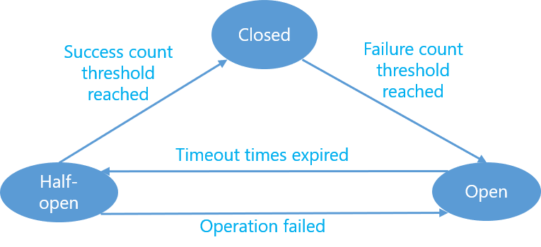

The Circuit Breaker pattern is used to check the availability of an external service, detect failures and prevent them from happening constantly. 

For example, if an application needs to retrieve data from an external service 100 times per second, and the service is unavailable (e.g., down for maintain ace or because of a hardware failure), the application should be able to handle this problem quickly and gracefully, without waiting for each service request to time out.

The Circuit Breaker acts as a proxy for operations that could potentially fail. It should monitor the number of recent operation failures, and use this information to decide whether to allow the operation to proceed, or immediately return an exception.

The Circuit Request pattern could be implemented as a state machine that mimics the states of an electric circuit breaker.

**Closed:** The operation is executed normally. The Circuit Breaker maintains a count of the recent failures. If the number of recent failures exceeds a threshold within a given time period, the proxy is placed into the Open state. At this point the proxy starts a timeout timer, and when this timer expires the proxy is placed into the Half-Open state.

**Open:** The request from the application fails immediately and an exception is returned to the application.

**Half-Open:** The state used to prevent a recovering service from being hit with a large number of requests. As a service recovers, it may be able to support a limited volume of requests until the recovery is complete, but while recovery is in progress a flood of work may cause the service to time out or fail again.

Circuit Breaker pattern should be implemented asynchronously to offload the logic to detect failures from the logic to execute the actual operation. The implementation requires some form of persistence (to record the number of successful and unsuccessful operation execution). The persistence could be implemented using distributed cache such as [Memcached](http://memcached.org/){:target="_blank"} or [Redis](http://redis.io/){:target="_blank"}, or local (in memory or disk) cache.