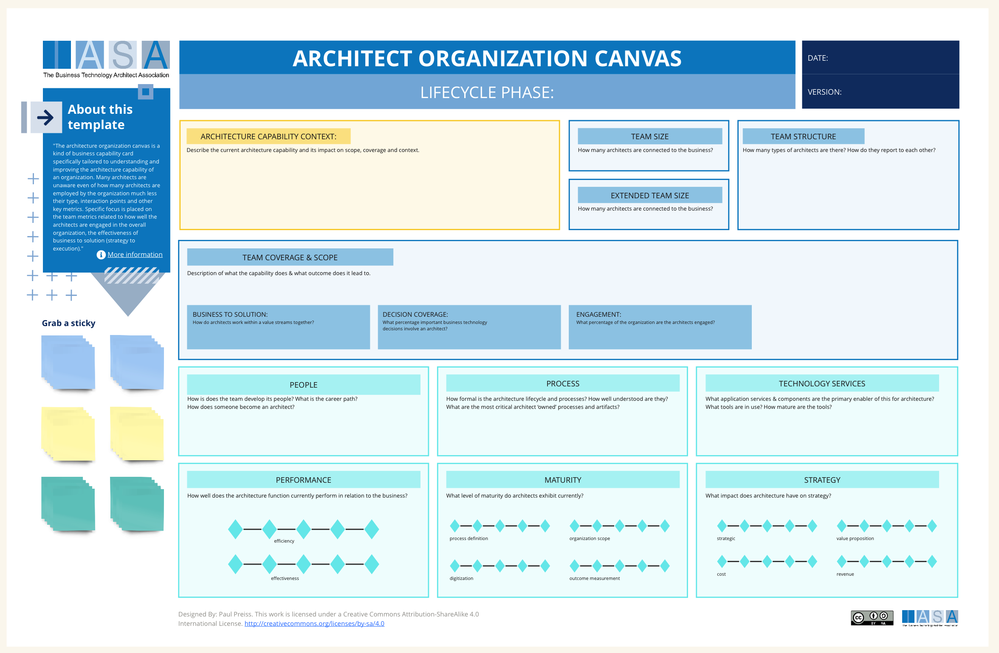

# Overview

The architecture organization canvas is a kind of business capability card specifically tailored to understanding and improving the architecture capability of an organization. Many architects are unaware even of how many architects are employed by the organization much less their type, interaction points and other key metrics. Specific focus is placed on the team [coverage and scope](../engagement_model/coverage.md) which defines metrics related to how well the architects are engaged in the overall organization, the effectiveness of business to solution (strategy to execution), the percentage of important decisions which are being made with thorough decision records as well as the overall stakeholder engagement. In addition, the people, process, and technology sections allow the architecture practice to reason about how and with who, and with what technology they work. Finally, a maturity estimation is provided to allow the team to estimate their current maturity and performance as well as link to goals for improvement.  

## How to use this Canvas

**Sections of the Architecture Capability Canvas**

- **About this Template:** This section provides a brief overview of the purpose of the template and how to use it.
- **Architecture Capability Context:** This section focuses on the overall context surrounding your architecture capability. Here, you'll note the team size (number of people involved in architecture activities), team structure (how the architecture team is organized), and any extended team size (including external consultants or resources).
- **Business to Solution:** This section bridges the gap between the business strategy and how your architecture capability translates that strategy into solutions. Here, you'll outline your decision coverage (the range of architectural decisions your team makes), how you engage with stakeholders (communication and collaboration methods), and the types of business needs your team addresses (e.g., innovation, cost reduction).
- **People, Process, Technology Services:** This section details the core elements required to deliver your architecture capability. You'll identify the skills and expertise of your team members (People), the processes you follow to create and maintain architecture artifacts (Process), and the technology services that support your architecture activities (Technology Services).
- **Performance & Maturity:** This section focuses on measuring and improving your architecture capability. You'll outline how you measure your performance (performance metrics), and the level of maturity you've achieved in each capability area (maturity assessment).
- **Strategy:** This section captures your overall architecture strategy. Here, you'll outline your strategic goals for your architecture capability and how it aligns with the broader business strategy.

**Why Defining Best Practices for Architecture Organizations Matters**

Having a well-defined architecture capability is essential for any organization that relies on technology to achieve its business goals. Here's why establishing best practices for your architecture organization is important:

- **Improved Efficiency and Effectiveness:** By understanding your current architecture capability and setting clear goals for improvement, you can streamline processes, optimize resource allocation, and ensure your architecture activities are directly contributing to business objectives.
- **Enhanced Communication and Collaboration:** A well-defined architecture capability promotes a shared understanding of architectural practices across the organization. This fosters better communication and collaboration between architects, business stakeholders, and IT teams.
- **Reduced Risks and Errors:** Clearly defined best practices can help minimize errors and mitigate risks associated with architecture decisions.
- **Alignment with Business Strategy:** By ensuring your architecture capability aligns with your business strategy, you guarantee that your technology infrastructure and solutions support your overall business goals.
- **Scalability and Adaptability:** A well-defined architecture capability allows your organization to adapt and scale more effectively as your business needs evolve.

The Architecture Capability Canvas provides a framework to not only define your current state but also identify areas for improvement and establish a roadmap to achieve your desired future state for your architecture capability.

## Downloads

[Download PPT](media/ppt/architect_organization_canvas.ppt){:target="_blank"}

| Area                            | Description                                                                                                                                                                                                                                  | Links To                     |
| ------------------------------- | -------------------------------------------------------------------------------------------------------------------------------------------------------------------------------------------------------------------------------------------- | ---------------------------- |
| Architecture Capability Context | In this area describe the overall architecture practice in terms of the organization and leadership.                                                                                                                                         |                              |
| Team Size                       | This should included all titled architects both FTE as well as contractors in the practice.                                                                                                                                                  |                              |
| Extended Team Size              | This should include all non-titled architects who are filling in critical aspects of the desired architecture practice as well as aspiring architects.                                                                                       | Extended Team                |
| Team Structure                  | How is the team structured? Where does it report? What types of architects are employed?                                                                                                                                                     | Organization Chart           |
| Team coverage & Scope           | This section is one of the most difficult to understand and employ as this describes the amount of decision coverage handled by or directly influenced by the team. However this is not a governance concept but a design and mentoring one. |                              |
| People                          | The people involved in the architecture teams capabiility, this may include many more people than just titled architects.                                                                                                                    | Architect Stakeholder Canvas |
| Process                         | The architecture lifecycle and processes.                                                                                                                                                                                                    | Engagement designer          |
| Technology                      | The tools                                                                                                                                                                                                                                    | Engagement designer          |
| Performance                     | How efficient and excellent are the team.                                                                                                                                                                                                    | Architect Lifecycle          |
| Maturity                        | How mature are the architecture processes                                                                                                                                                                                                    | Maturity Model               |
| Strategy                        | How strategically aligned is the architect capability?                                                                                                                                                                                       | Objectives                   |

## Use this in Miro

We in the BTABoK are so very excited about the native support for architecture canvases in Miro! Find this canvas in the Miroverse!

