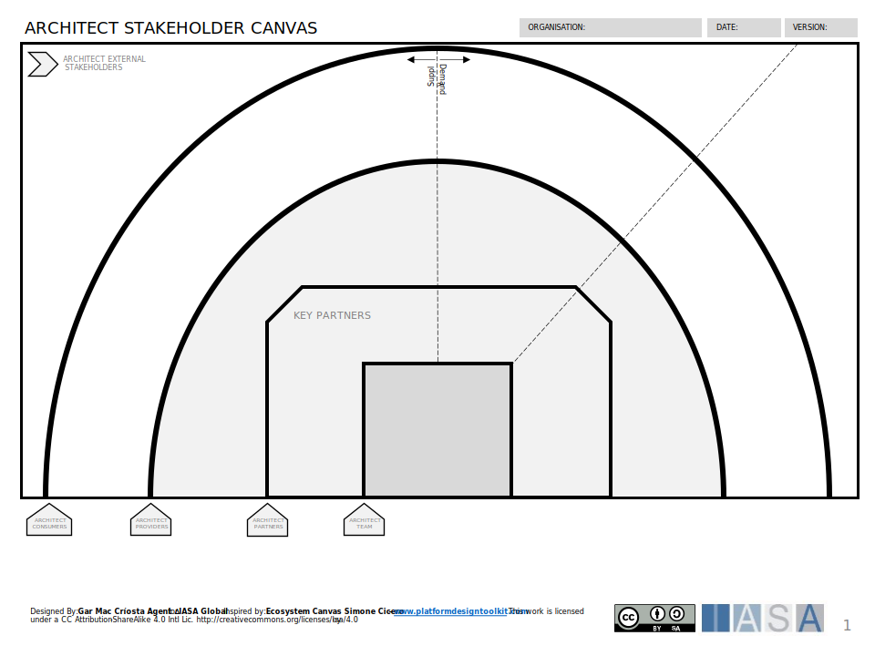

The architect stakeholder canvas is a very powerful stakeholder tool. However it can be a bit confusing at first. The canvas is used to understand stakeholder relationships to any given architect, or architecture team. It can be used at multiple levels of scope. It works best to when used in a team environment and an informal setting. It is used to decern stakeholder relationships and can be used for deliverables as well. 

[Download PPT](media/ppt/architect_stakeholder_canvas.ppt)

The stakeholder canvas is divided into two broad categories, demand, and supply. These categories are based on the concept that there is demand for arhitect(ures) and there is the supply of architecture. This normally translates to Demand = Business Partners and Supply = Technology Partners, but not always (as is often the case with infrastructure architecture teams). That means a VP of marketing would go on the right and the CIO on the left. However, feel free to play. In addition, the extra dotted line on the right is a divisor meant to help group stakeholders into sections related to the org chart, the operating model or other useful divisors. 

| Area                            | Description                                                                                                                                                                                                              | Links To                                               |
| ------------------------------- | ------------------------------------------------------------------------------------------------------------------------------------------------------------------------------------------------------------------------ | ------------------------------------------------------ |
| Architect External Stakeholders | External stakeholders such as vendors or suppliers can go on the outside of the circles. However, this is optional and can be placed like any other stakeholder.                                                         | Stakeholder Planning Sheet                             |
| Architect Consumers             | Consumers are those who are primarily interested in receiving information, collaboration, or outputs from architecture.                                                                                                  | Stakeholder Planning Sheet, Stakeholder Engagement Map |
| Architect Providers             | Providers are those stakeholders who primarily give information or inputs to the architecture. This might include developers or operations or other line employees.                                                      | Stakeholder Planning Sheet, Stakeholder Engagement Map |
| Architect Partners              | Key partners are stakeholders who are essential to the deliver of the architecture. In solution architecture these might be product owners or technology leads. In business they may be specific business partner roles. | Stakeholder Planning Sheet, Stakeholder Engagement Map |
| Architect Team                  | The team, architect or other primary architecture providers.                                                                                                                                                             | Stakeholder Planning Sheet                             |