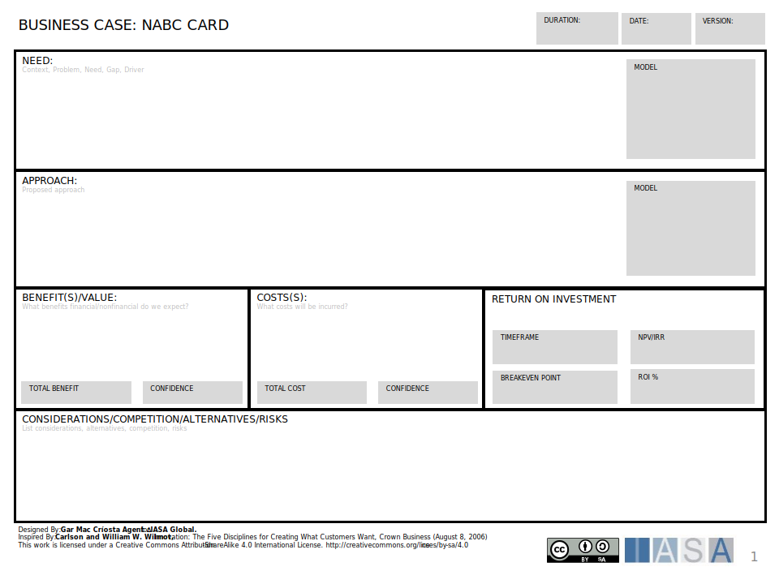

The Business Case has many names and uses. However, it primarily provides the details of a certain amount of work and it's expected benefits and costs. The BTABoK uses the NABC template (Need, Approach, Benefits, Considerations) as a Lean Business Case template which can be seen on a single page. It may still be necessary to use a larger document which will be added as another 'canvas' to the BTABoK though it will be in document formats.

[Download PPT](media/ppt/business_case_nabc_card.ppt){:target="_blank"}

| Area                                             | Description                                                                                                                                                      | Links To                |
| ------------------------------------------------ | ---------------------------------------------------------------------------------------------------------------------------------------------------------------- | ----------------------- |
| Need                                             | The need is a description of the drivers for the project. It should be driven from OKRs and should not include any of the approach section or proposed solution. | OKRs (derived from)     |
| Approach                                         | The approach is the proposed solution to the need. It would contain a description of the product, project, or other proposed solution.                           |                         |
| Benefit(s)/Value                                 | The measured or expected benefits of the solution.                                                                                                               | Benefits Card (may use) |
| Costs(s)                                         | The expected costs of the solution, product or project.                                                                                                          |                         |
| Return on Investment                             |                                                                                                                                                                  |                         |
| Considerations, Competition, Alternatives, Risks |                                                                                                                                                                  |                         |
