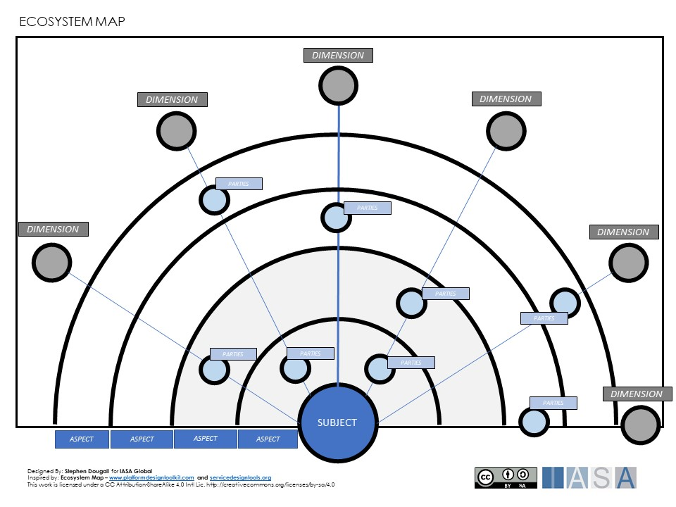

An ecosystem can be viewed from many different perspectives, and each organization will have its own set of interests in the ecosystem. Therefore, the model used for analyzing the ecosystem is flexible and can be used with different types of organizations, and different types of customers. The Ecosystem Map Canvas shows an ecosystem, rather like a universe of different parties organized around a particular

Subject.​

[Download PPT](media/ppt/ECOSYSTEM-MAP.pptx)

| Area | Description | Links To |
| :-- | :-- | :-- |
| The Subject | This is the perspective from which the ecosystem is seen, for example, Customer Journey​\
the customer, the organization, or part of an organization.​ |\
 |
| Parties | These are the different parties which are active in the ecosystem, for example, Stakeholder, Collaboration​ actual companies, customers or suppliers. |\
 |
| Dimensions | This groups parties together based on a common characteristic, for example, Strategy, PESTEL​ industry or market sector. |\
 |
| Aspects | These are the rings in the diagram and are how the subject perceives the parties, Customer Journey, Strategy, SWOT​ for example, provider, consumer or partner. The rings can be used to indicate the ​strength of the relation, from the inner most ring out. |

