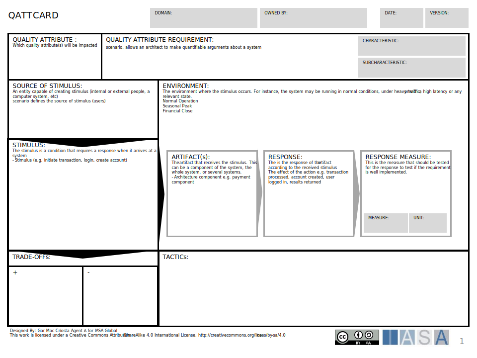

The Quality Attribute Card is built to create ATAM scenarios to test the architecture decisions and approaches of a particular architecture. It is based on the notion of taking quality attribute requirements and then testing them with scenarios. The scenario includes a source of a 'stimulus' which is something the architecture must respond to and is generally taken from requirements. These stimuli can be planned or unplanned but include anything that might happen which would impact the final system. It can include both business and technical stimuli. For example, if our competitors change their prices or if we receive twice the number of requests per minute than we planned to handle. Use the QATT cards to 'test' the architecture for its' effectiveness and look for tradeoffs, tactics and risks. 

[Download PPT](media/ppt/qat_card.ppt){:target="_blank"}

| Area               | Description                                                                                                                                                                | Links To          |
| ------------------ | -------------------------------------------------------------------------------------------------------------------------------------------------------------------------- | ----------------- |
| Quality Attribute  | What quality attribute are we testing? Ex Performance, Security, etc.                                                                                                      | ASR Card          |
| Requirement        | This is generally the QATT requirement.                                                                                                                                    | ASR Card          |
| Source of Stimulus | An entity capable of creating stimulus (internal or external people, a computer system, etc) scenario defines the source of stimulus                                       |                   |
| Environment        | The environment where the stimulus occurs. For instance, the system may be running in normal conditions, under heavy traffic, or with a high latency or any relevant state | Context View      |
| Stimulus           | The stimulus is a condition that requires a response when it arrives at a system                                                                                           |                   |
| Trade Offs         | The trade offs include the positives and negatives that will come from the particular tactics chosen.                                                                      |                   |
| Tactics            | The set of architecture decisions and techniques which will be used to create the desired result.                                                                          | ADR, Context View |