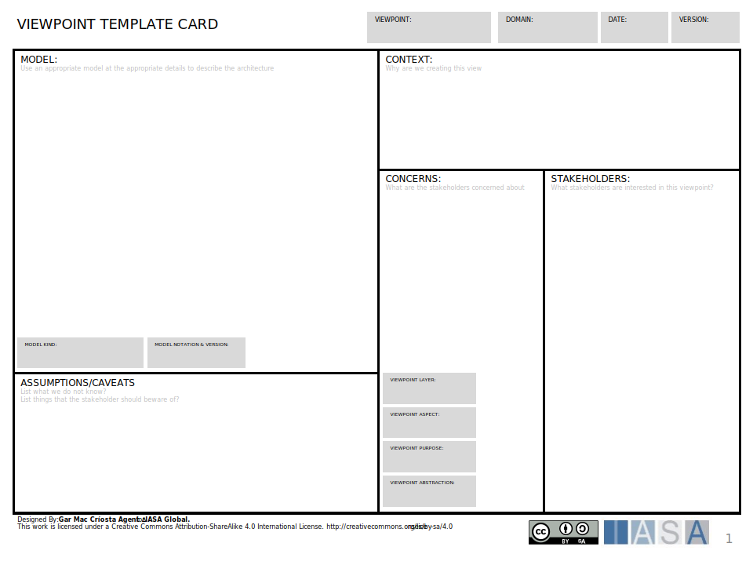

The viewpoint template card is used to describe a viewpoint used by an architecture practice. The viewpoint concept [see views article](../engagement_model/views.md){:target="_blank"} is used to help in describing an architecture and is based on ISO 42010.

[Download PPT](media/ppt/viewpoint_template_card.ppt){:target="_blank"}

| Area | Description | Links To |
| --- | --- | --- |
| Model(s) | Views contain models and this area describes which model(s) are used within the viewpoint. | [Design](../engagement_model/design.md){:target="_blank"} (article) |
| Context | Why are we creating this viewpoint, in what context should it be used. What problems does it solve. | [Scope and Context](../engagement_model/scope_context.md){:target="_blank"} (article) |
| Concerns | The areas of interest to stakeholders or the architect which this viewpoint addresses. | Not Applicable |
| Stakeholders | The list of stakeholders who are impacted or interested in seeing and architecture view for this viewpoint. | [Architect Stakeholder Canvas](architect_stakeholder_canvas.md){:target="_blank"} (describes) |
| Assumptions/Caveats | Areas which when working with the viewpoint are particularly difficult or assumed to exist. | Not Applicable |

